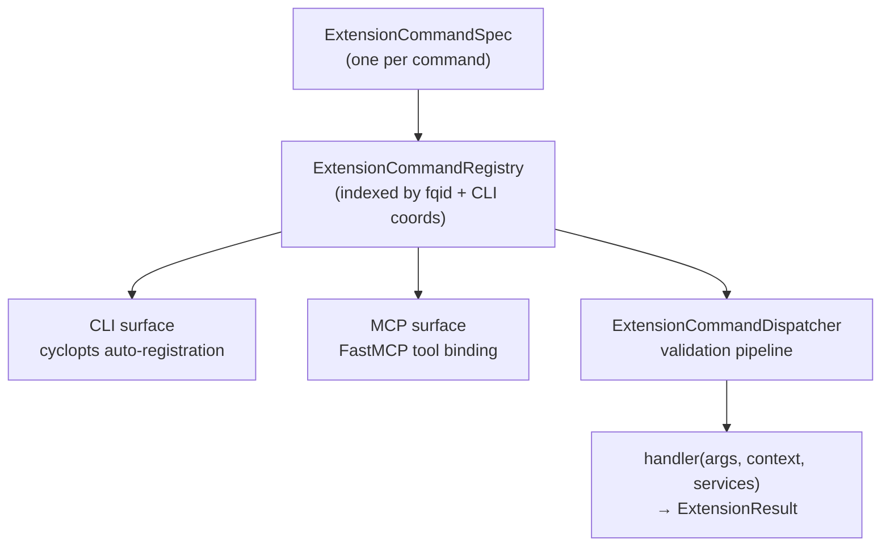
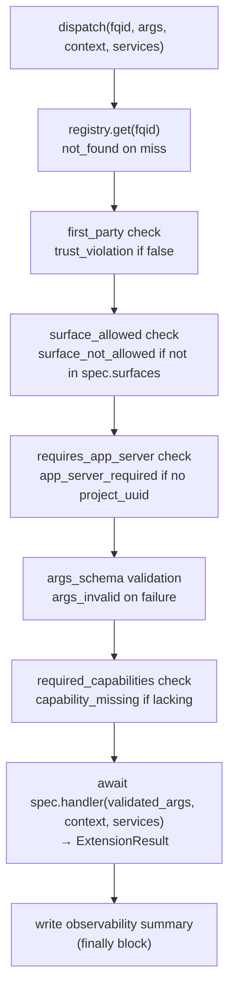

# Extension System

Every user-visible Meridian command — `spawn list`, `work start`, `session log`,
`config set` — is defined as an `ExtensionCommandSpec` in a single registry.
CLI and MCP read from the same registry. There is one place to add a command,
and it appears on every active surface it belongs to.

The prior model had CLI commands and HTTP API endpoints implemented in parallel
with separate specifications, and MCP tools as a third track. The extension
system unified all three behind one spec. The HTTP app server has since been
archived; CLI and MCP are the active surfaces.

---

## The Core Model

A command's spec defines:
- Its **fully-qualified ID** (`extension_id.command_id`, e.g., `meridian.spawn.list`)
- Its **args schema** (Pydantic model)
- Its **result schema** (Pydantic model)
- Which **surfaces** it's reachable from (`CLI`, `MCP`, or both)
- Its **handler** — the async function that executes the command
- A **sync handler** — for CLI paths that don't use async

---

## Why One Spec Instead of Three

Before the extension system, commands existed in two tracks:
- `OperationSpec` in `ops/manifest.py` — fed CLI and MCP
- HTTP endpoints in the app server — parallel implementation, separate code

This caused real problems:
- HTTP endpoint behavior diverged from CLI behavior over time
- New commands had to be implemented twice
- There was no single place to see "what commands does Meridian have?"

The extension system makes `ExtensionCommandSpec` the single representation.
Adding a command = writing one spec in `ops/manifest.py` (or `extensions/first_party.py`)
and registering it. All surfaces pick it up automatically.

---

## Surface Allocation

The extension system defines three surfaces: CLI, MCP, and HTTP. The HTTP
app server has been archived; HTTP-surface commands exist in the registry but
have no active host. CLI and MCP are the active surfaces.

Not all commands appear on all surfaces. Surface assignment reflects the
intended consumer:

| Pattern | Surfaces | Rationale |
|---------|---------|-----------|
| `spawn.create`, `spawn.continue` | MCP | Agent-facing ops; CLI users use the full `meridian spawn` command |
| `spawn.list`, `spawn.show` | CLI, MCP | Useful everywhere |
| `config.*`, `workspace.init` | CLI | Human-managed configuration |
| `session.log`, `session.search` | CLI | Transcript access is human/CLI concern |
| `hooks.resolve` | MCP | Agent-facing hook resolution |
| `work.*` | CLI | Work lifecycle is CLI-managed |

The security constraint: **non-first-party commands cannot expose CLI or MCP
surfaces.** First-party means registered via `first_party.py:register_first_party_commands()`.
This prevents third-party extension injection into trusted CLI or MCP surfaces.

---

## The Dispatcher Validation Pipeline

The `ExtensionCommandDispatcher` runs a validation pipeline before every
command execution:

Error codes from the pipeline: `not_found`, `trust_violation`,
`surface_not_allowed`, `app_server_required`, `args_invalid`,
`capability_missing`, `handler_error`.

The observability summary is written in the `finally` block regardless of
success or failure — every invocation is recorded.

---

## Invocation Context and Capabilities

`ExtensionInvocationContext` carries caller identity and granted permissions:

- `caller_surface` — which surface invoked this command
- `project_uuid` — set for app server (HTTP); `None` for MCP/CLI
- `work_id`, `work_path` — active work item context
- `spawn_id` — spawn context if applicable
- `capabilities` — what the caller is allowed to do

`ExtensionCapabilities` applies surface-aware defaults:
- CLI and MCP surfaces → `denied()` (no subprocess/kernel/hitl by default)

The HTTP surface historically granted `elevated()` capabilities; with the app
server archived, CLI and MCP are the only active callers.

---

## The `requires_app_server` Flag

Some commands were designed for a now-archived HTTP app server and are marked
`requires_app_server=True`. The app server (`lib/app/`) has been removed; these
commands now return `app_server_archived` when invoked from CLI or MCP. Only
in-process commands (`requires_app_server=False`) execute.

---

## Adding a New Command

1. Define a Pydantic args model and result model
2. Write the handler function (async, takes `(args, context, services)`)
3. Write a sync handler (for CLI)
4. Create an `ExtensionCommandSpec` (or use `ExtensionCommandSpec.from_op()`
   for op-style handlers)
5. Register in `ops/manifest.py:get_all_op_specs()` (most commands) or
   `extensions/first_party.py` (extension-specific commands)

The spec appears in CLI and MCP automatically based on the `surfaces`
set. No separate routing code needed.

---

## Observability

Every dispatch writes an `ExtensionInvocationSummary` to
`extension-invocations.jsonl` in the runtime root. The summary includes:
- `fqid` and `surface`
- `started_at` and `duration_ms`
- `success` and `error_code`
- Redacted args and result (secrets stripped, strings truncated at 512 bytes)

Write failures go to stderr — they never raise and never block the command.

---

## Related Pages

- `../codebase/core-primitives.md` — the ops handler implementations that
  become extension commands
