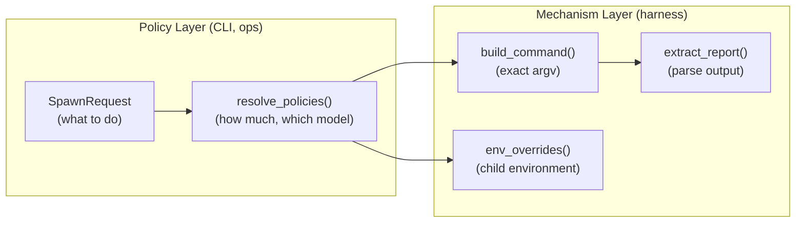

# Harness Abstraction

A **harness** is the mechanism that translates a resolved spawn request into an
executable process (or in-process call) and extracts results from its output.
Claude, Codex, OpenCode, and Pi are harnesses. The Direct adapter is a harness.

The harness layer embodies Meridian's policy/mechanism split: the CLI and ops
layer decide **what** to run and **why** (policy). The harness adapter knows
**how** to run it for a specific tool (mechanism). Policy changes often.
Mechanism stays stable.

---

## The Policy / Mechanism Split

The policy layer produces a `SpawnRequest` — an intent DTO with model name,
prompt, skills, permissions, budget. The harness adapter turns that intent into
concrete subprocess arguments, environment variables, and output parsing logic.

**Consequence:** adding a new harness means writing one adapter file and
registering it. No existing code changes. This is the Open/Closed Principle
applied to execution backends.

---

## Two Adapter Protocols

### SubprocessHarness

Used by Claude, Codex, and OpenCode. Launches the harness as an external
subprocess and communicates via its CLI interface and output streams.

Key methods:

| Method | Purpose |
|--------|---------|
| `build_command(run, perms)` | Produce the full argv including model, session flags, permissions |
| `env_overrides(config)` | Harness-specific environment variables for the child process |
| `blocked_child_env_vars()` | Variables to strip from the child environment (security) |
| `project_content(content)` | Map semantic IR to harness channel assignments (see [Composition Pipeline](composition-pipeline.md)) |
| `extract_usage(artifacts, spawn_id)` | Parse token counts from output |
| `extract_session_id(artifacts, spawn_id)` | Recover the harness session ID from output |
| `extract_report(artifacts, spawn_id)` | Parse the agent's run report from output |
| `seed_session(...)` | Compute session continuity flags (resume, fork) |
| `detect_primary_session_id(...)` | Post-launch scan for the primary session's ID |

`BaseSubprocessHarness` provides no-op defaults for all optional methods.
Adapters only implement what they support.

### InProcessHarness

Used only by the Direct adapter. Executes the prompt in-process via a library
call rather than a subprocess. Single method: `execute(prompt, model, ...)`.
Primarily for testing and programmatic tool calls.

---

## Capability Flags

Every adapter declares its feature flags via `HarnessCapabilities`. These flags
let the launch layer make harness-sensitive decisions without writing
adapter-specific conditional branches in shared code.

| Capability | Claude | Codex | OpenCode | Pi | Direct |
|-----------|:------:|:-----:|:--------:|:--:|:------:|
| `supports_stream_events` | ✓ | ✓ | ✓ | ✓ | ✗ |
| `supports_stdin_prompt` | ✓ | ✓ | ✓ | ✓ | — |
| `supports_session_resume` | ✓ | ✓ | ✓ | ✓ | ✗ |
| `supports_session_fork` | ✓ | ✓ | ✓ | ✓ | ✗ |
| `supports_native_skills` | ✓ | ✓ | ✓ | ✗ | ✗ |
| `supports_native_agents` | ✓ | ✗ | ✗ | ✗ | ✗ |
| `supports_programmatic_tools` | ✗ | ✗ | ✗ | ✗ | ✓ |
| `supports_primary_launch` | ✓ | ✓ | ✓ | ✓ | ✗ |
| `supports_native_file_injection` | ✗ | ✗ | ✗ | ✗ | ✗ |

Notable: no harness currently supports `supports_native_file_injection`. All
reference files are either rendered inline into the prompt or omitted. This
routing decision lives in `project_content()` — not in shared composition code.

`supports_native_agents` is Claude-only. This means agent profile bodies are
delivered via `--agents` payload for Claude, but injected into the system
prompt for Codex, OpenCode, and Pi.

`supports_native_skills` is deferred for Pi — Pi has a native skills system but
Meridian does not yet project skills into it. Pi spawns currently receive skill
content via the system prompt channel instead.

---

## Command Assembly: The Strategy Map

Each adapter defines a `STRATEGIES` dict mapping every `SpawnParams` field
name to a `FlagStrategy` rule. This is not optional — it's an enforced
invariant.

A `FlagStrategy` has an `effect`:
- `CLI_FLAG` — append `[flag, value]` to argv
- `TRANSFORM` — call a custom function to modify the args list
- `DROP` — silently skip this field (explicitly acknowledged)

**The invariant:** every `SpawnParams` field must appear in `STRATEGIES` or in
a `_SKIP_FIELDS` set. A missing mapping raises `ValueError` at build time.

Why does this matter? When `SpawnParams` gains a new field (say, a new
reasoning-effort level), every adapter is forced to decide what to do with it.
There's no way to silently ignore a new field — either map it to a flag,
transform it, or explicitly mark it as dropped. Adapter drift is caught at
build time, not at runtime.

---

## Content Projection: `project_content()`

The `project_content()` method is how each harness adapter claims ownership of
content routing. It takes a `ComposedLaunchContent` (harness-agnostic semantic
IR with three categories: system instruction, user task prompt, task context)
and returns a `ProjectedContent` with harness-specific channel assignments.

This is the primary extension point for new harnesses. Adding a harness means
implementing `project_content()` — not adding conditional branches in
composition code. See [Composition Pipeline](composition-pipeline.md) for the
full pattern.

Current projection behavior at a glance:

| Content category | Claude | Codex | OpenCode | Pi |
|-----------------|--------|-------|----------|----|
| SYSTEM_INSTRUCTION | `--append-system-prompt-file` | Inline (first) | Inline (first) | `--append-system-prompt` (inline text) |
| TASK_CONTEXT | User-turn channel | Inline (second) | Inline (second) | User-turn channel |
| USER_TASK_PROMPT | User-turn channel | Inline (last) | Inline (last) | User-turn channel |

**Pi vs Claude system prompt channel:** Claude writes the system instruction to a temp file and passes the path via `--append-system-prompt-file`. Pi takes the text inline via `--append-system-prompt <text>`. Same semantic, different channel — the projection layer handles the difference transparently.

---

## The Registry

`HarnessRegistry` maps `HarnessId` to adapter instances. The default registry
registers Claude, Codex, OpenCode, Pi, and Direct via `with_defaults()`.

Adding a harness = one adapter file + one `register()` call. No other changes.

---

## Connections: Bidirectional Mode

Beyond one-shot CLI invocations, some harnesses support **bidirectional
connections** — persistent subprocess relationships where Meridian communicates
with the harness via WebSocket or HTTP rather than one-shot CLI invocations.

This is used by:
- The REST app server (streaming spawns)
- The primary attach flow (Codex, OpenCode interactive sessions)

The connection layer lives in `harness/connections/` and defines a
`HarnessConnection` ABC with lifecycle methods (`start`, `send`, `stop`) and
a `ConnectionCapabilities` struct for mid-turn injection, steering, interrupt,
and runtime model switching.

Claude's primary launch still uses a black-box PTY/pipe path, not the
connections layer. Codex primary always uses `CodexConnection` via the managed
attach flow. Pi spawned sessions use `PiRpcConnection`, which drains a JSONL
event stream from `pi --mode rpc` over subprocess stdin/stdout — a third
connection model distinct from Claude's PTY and Codex's WebSocket. Prompt
delivery happens by writing prompt JSON to Pi's stdin; events arrive on stdout.

Pi also introduces **extension injection**: Meridian-owned TypeScript extensions
are loaded into the Pi process via `-e <path>` flags. Two managed extensions ship
as package data under `src/meridian/pi_runtime/extensions/`:

- **`managed-bash`** (mechanism) — overrides Pi's bash builtin. Registers the
  `bash` tool (with `background?: boolean` and `timeout_min?: 1-59` parameters)
  and `bash_manage` ops tool. Owns the b-* bash registry and injects
  `MERIDIAN_PI_BASH_ID` into every child process's env for spawn correlation.
  Slash commands: `/ps` (with stream filters), `/ps:b` (alias `/ps:background`), `/ps:kill`, `/ps:logs`, `/ps:clear`.
  Writes bash records to `pi-bash/<spawn-id>/bash-records.json`.
- **`meridian-spawn-watch`** (policy) — watches spawn records and bash records on disk
  via `PiDiskWatcher` (`watchfiles`-based, cross-platform). Emits implicit-wait
  completion notifications to the agent when tracked spawns or tracked bash bg records
  terminate. Writes `last-notification.json` marker for Python quiescence tracking.
  Slash commands: `/spawn`, `/spawn:wait`, `/spawn:cancel`, `/spawn:show`, `/spawn:log`, `/spawn:clear`.
  **`/mspawn` was renamed to `/spawn` — no compatibility alias.**
  This is the redesign successor to the earlier Pi lifecycle policy extension.

Spawned Pi sessions load both extensions (`--no-extensions -e managed-bash.js -e meridian-spawn-watch.js`).
Primary Pi sessions load meridian-spawn-watch only (`-e meridian-spawn-watch.js`). See
[../architecture/pi-lifecycle.md](../architecture/pi-lifecycle.md) for the
quiescence model, env-var correlation contract, and new disk-watch mechanism.

---

## Claude Native Agent Routing

Claude Code exposes a native `Agent` tool that lets it create subagents outside Meridian's
coordination model. Meridian applies a two-tier policy:

- **Built-in subagents are always denied.** `Agent(Explore)`, `Agent(Plan)`,
  `Agent(General-purpose)`, and `Agent(general-purpose)` are injected into
  `--disallowedTools` unconditionally. No config toggle.

- **Generic `Agent` follows the Mars agent-copy boundary.** Meridian reads `mars.toml`
  (and `mars.local.toml`) for `[settings.agent_copy]`. When `harnesses = ["claude"]` AND
  `.claude` is in `targets`, generic `Agent` is allowed — Claude's native agent surface is
  Meridian-owned through materialized agent copies. Otherwise, generic `Agent` is denied
  and delegation must route through `meridian spawn`.

The detection (`project_has_claude_agent_copy()` in `permissions.py`) runs in
`bind_launch_context()`. The result flows into `ResolvedLaunchSpec.claude_native_agents_enabled`,
which is consumed by `project_claude.py` at projection time. When disabled, the projection
strips `Agent` and `Agent(...)` from all allowed-tool sources (permission-derived,
parent-inherited, and passthrough).

**Nested Claude spawns** receive the same boundary. `resolve_nested_claude_permission_request()`
applies per-spawn deny entries for both `agent` and `task` capabilities. Agent profiles can
explicitly opt out per-capability via `tools: {agent: allow}` in their frontmatter.

This is a platform policy (harness adapter injection), not a per-agent `tools:` field.
Agent profiles do not need to carry `agent: deny` — the denial is inherited from the harness
adapter when agent copy is absent.

See also: the delegation preference guidance injected into the agent inventory prompt
(`with_agent_inventory_guidance()` in `prompt.py`), which tells primary Claude sessions
to use `meridian spawn` for subagent work and reserve native `Agent` only for explicit
Claude-native/model-specific cases.

---

## Adding a New Harness: Mental Checklist

1. Create `src/meridian/lib/harness/<name>.py` implementing `SubprocessHarness`
2. Declare `CAPABILITIES` with accurate feature flags
3. Define `STRATEGIES` covering every `SpawnParams` field
4. Implement `project_content()` to route content categories to the right
   harness channels
5. Implement extraction methods (`extract_usage`, `extract_session_id`,
   `extract_report`) for your output format
6. Register in `HarnessRegistry.with_defaults()`
7. Add a model alias entry in mars package config so `resolve_model()` can
   route to your harness

No other files need changing. This is the mechanism — policy picks it up
automatically once registered.

---

## Related Pages

- [Composition Pipeline](composition-pipeline.md) — the Semantic IR +
  `project_content()` pattern in depth
- [model-resolution/overview.md](model-resolution/overview.md) — how harness
  assignment is resolved from a model name or alias
- `../architecture/launch-system.md` — how the launch factory invokes the
  harness adapter
- `../codebase/harness-adapters.md` — per-harness notes and known quirks
- `../architecture/pi-lifecycle.md` — Pi's quiescence-based completion model and extension architecture
