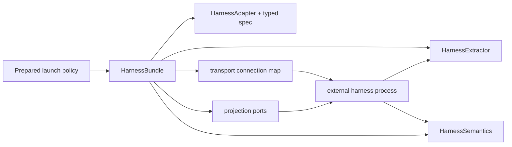

# Harness Abstraction

A harness is an external AI runtime integrated through one validated
`HarnessBundle`. Launch policy decides what to run; the bundle projects that
resolved intent into a harness command, transport, event semantics, and result
extraction. Every current harness is subprocess-backed.

Built-in bundles are Claude, Codex, Cursor, OpenCode, and Pi. There is no Direct
or in-process adapter.

## The Bundle Is the Extension Unit

```mermaid
graph LR
    P["Prepared launch policy"] --> B["HarnessBundle"]
    B --> A["HarnessAdapter + typed spec"]
    B --> X["HarnessExtractor"]
    B --> C["transport connection map"]
    B --> J["projection ports"]
    B --> S["HarnessSemantics"]
    J --> R["external harness process"]
    C --> R
    R --> X
    R --> S
```

`HarnessBundle` binds:

- a stable `HarnessId` and `HarnessAdapter`;
- the typed `ResolvedLaunchSpec` subclass the adapter consumes;
- an extractor for session IDs and reports;
- a map from `TransportId` to `HarnessConnection` classes;
- subprocess and optional managed-primary projection ports; and
- per-harness event semantics.

Registration validates extractor and semantics types, transport IDs against the
adapter contract, projection spec alignment, managed-primary port requirements,
and duplicate harness IDs. This makes bundle construction—not a downstream
launch—the failure point for an incomplete integration.

## Policy / Mechanism Boundary

The launch prepare phase resolves model routing, effort, approval, sandbox,
prompt composition, work/task directories, and capability-dependent content.
Binding selects the bundle and produces its typed spec. The harness layer may
translate resolved values into native flags and channels; it must not re-run
policy precedence or model routing.

Adapters expose a typed `HarnessContract` for bootstrap, transport, projection,
and feature support. Spawn-field coverage is checked against the union of each
adapter's `handled_fields`; there is no per-adapter `STRATEGIES` map or
`FlagStrategy` table.

## Projection and Connections

`HarnessProjectionPorts.subprocess_cli_args` turns the typed spec into argv.
Bundles whose bootstrap mode is `managed_primary_attach` also register backend
command and bootstrap-payload projectors.

A connection owns live communication with a launched process. Different bundles
can use stream JSON, WebSocket JSON-RPC, HTTP/SSE, or another registered
transport without changing launch policy. Extractors recover stable session and
report data; connections provide live events and injection where supported.

## Event Semantics and Terminal Outcomes

Raw event names stay harness-specific. Each bundle's `HarnessSemantics` maps
those events into shared descriptors such as activity, usage, report candidate,
or terminal candidate. Normalization happens once; shared state and drain code
consume the descriptor rather than branching on harness event names.

A terminal outcome must satisfy the shared invariant: `succeeded` requires exit
code zero and no error. Harness payload resolvers translate native status
ladders—for example Codex completed/failed/interrupted turns—before the outcome
reaches shared finalization.

The stream's **primary event scope** distinguishes parent activity from nested
child activity. Child events may remain in history, but they do not complete or
supply the report for the parent spawn.

Cross-harness death and injection contracts are behavioral: a connection close
must carry the best available exit/error evidence, and a successful injection
result must mean the harness acknowledged or durably accepted the input. Fakes
must model these contracts rather than returning universal success.

## Adding a Harness

1. Define the typed launch spec and adapter contract.
2. Implement the adapter plus subprocess projection.
3. Implement an extractor and at least one connection transport.
4. Define the bundle's event-semantics table.
5. Add managed-primary projection ports only when the declared bootstrap mode
   requires them.
6. Register the bundle during harness bootstrap and add its adapter to the
   default registry.
7. Exercise the real process for startup, terminal failure, report extraction,
   injection (if supported), and cleanup.

The exact extension touchpoints are listed by
`meridian.lib.harness.HARNESS_EXTENSION_TOUCHPOINTS`; use that list rather than
assuming one-file registration.

## Claude Native Agent Routing

Claude's bundled agents are denied by default. When Mars materializes
Meridian-owned agent copies into Claude's native surface, launch policy may
allow the generic native agent tool according to the recorded ownership
contract. Inventory text still comes from Mars; the adapter does not invent an
independent agent catalog.

## Related Pages

- [Launch System](../architecture/launch-system.md)
- [Harness Adapters](../codebase/harness-adapters.md)
- [Composition Pipeline](composition-pipeline.md)
- [Spawn Finalization](../architecture/spawn-finalization.md)
