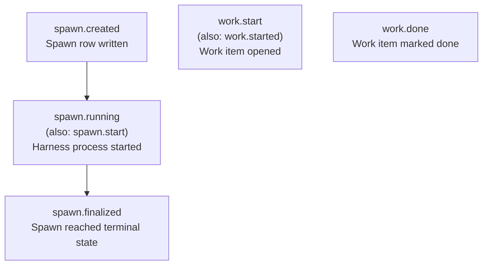

# Hooks and Plugins

Hooks are user-defined callbacks that fire at spawn and work lifecycle events.
They're the extension point for automation that should happen around agent
activity — syncing state to a remote repo, sending notifications, triggering
downstream pipelines.

The plugin API is what hooks (including built-in hooks) use to interact with
Meridian's state. It's a stable, narrow boundary that built-in hooks are
required to use — even though they live in the same codebase as everything else.

---

## What Hooks Are For

Hooks answer the question: "What should happen every time a spawn completes?"
or "What should happen every time I switch work items?"

They're not for modifying agent behavior — the agent is already running when
hooks fire. They're for **side effects** triggered by lifecycle events:
syncing, notifying, logging, triggering external systems.

---

## Event Taxonomy



The aliases (`spawn.start`, `work.started`) exist for backward compatibility and
are treated identically to their canonical forms.

---

## Hook Configuration

Hooks are configured in TOML files under `[[hooks]]` arrays. Each row
configures one hook, identified by the combination of `(name, event)`.

```toml
# Built-in hook — fires on all default events
[[hooks]]
builtin = "git-autosync"
remote  = "git@github.com:org/meridian-context.git"

# Custom shell hook — fires on spawn finalized
[[hooks]]
name    = "notify"
event   = "spawn.finalized"
command = "scripts/notify.sh"
failure_policy = "warn"
```

**Built-in vs command hooks:**
- `builtin` — a registered built-in handler by name; mutually exclusive with `command`
- `command` — a shell command string executed as a subprocess

Key configuration fields:

| Field | Purpose |
|-------|---------|
| `event` | Which event to fire on; omit for built-in defaults |
| `enabled` | Default `true` |
| `priority` | Lower runs first |
| `failure_policy` | `"fail"` \| `"warn"` \| `"ignore"` |
| `interval` | Throttle: `"30s"`, `"5m"`, etc. |
| `when.status` | Filter by spawn outcome (e.g., only fire on `succeeded`) |
| `when.agent` | Filter by agent profile name |

### Config Layering

Hook configuration is layered with an override model:

```
builtin defaults  (lowest priority)
  ↑
context config
  ↑
user config (~/.meridian/config.toml)
  ↑
project config (meridian.toml)
  ↑
local config (meridian.local.toml)  (highest priority)
```

A hook row in a higher-priority source with the same `(name, event)` key
replaces the lower-priority row entirely. This lets teams set project-wide
defaults and individual machines override them locally without committing
machine-specific config.

---

## Hook Context

When a hook fires, it receives context about the triggering event:

| Field | Meaning |
|-------|---------|
| `event_name` | Which event fired |
| `spawn_id` | Spawn that triggered the event (if spawn event) |
| `spawn_status` | Terminal status (`succeeded`, `failed`, etc.) |
| `spawn_agent` | Agent profile name |
| `spawn_cost_usd` | Spend for this spawn |
| `work_id` | Active work item |
| `work_dir` | Path to work scratch directory |
| `repo_root` | Project root |

**Command hooks** receive context as `MERIDIAN_*` environment variables and as
JSON on stdin.

**Built-in hooks** receive a typed `HookContext` object directly.

---

## The Plugin API Boundary

Built-in hooks (like `git-autosync`) are required to import **only** from
`meridian.plugin_api` — zero imports from `meridian.lib.*`.

This is an enforced discipline, not just a convention. The reasoning:

> A built-in hook that imports from internal library code is coupling itself to
> implementation details that can change at any time. The plugin API is a stable
> surface that external plugins can also use. By requiring built-ins to use it,
> we ensure the plugin API stays adequate — if a built-in needs something
> that's not in the API, that's a signal to extend the API, not to break the
> boundary.

The plugin API surface includes:
- State helpers: read spawn records, list work items, resolve paths
- Git helpers: run git commands with proper error handling
- File locking: coordinate concurrent access via the Meridian lock primitives
- Path utilities: `generate_repo_slug()`, context root resolution

---

## Git-Autosync: The Primary Built-In

`git-autosync` is the built-in hook that keeps a git-backed remote in sync
with local Meridian state (KB, work directories, etc.). It works on any
configured sync root — KB, work, strategy, or other contexts — and does not
require an active work item.

**Default events**: `spawn.start`, `spawn.finalized`, `work.start`, `work.done`
— all four fire by default when no `event` is specified.

### What It Does

On each event, git-autosync:

1. Ensure `.git/info/exclude` contains default ignores (`.git`, `**/.git`, `.meridian/autosync/`)
2. Abort any in-progress merge or rebase (when `conflict_policy = "abort"`, the default)
3. `git add -A` — stage all changes, including deletions and renames
4. Apply exclude patterns (`git reset -- <excluded>`)
5. Stash any excluded dirty files before integration
6. If staged: `git commit -m "autosync: <ISO timestamp>"`
7. `git fetch origin` (60s timeout)
8. Check divergence with fallback when `rev-list --left-right` fails
9. If behind: `git merge origin/<branch>` — on conflict: abort, local-wins, record conflict
10. If ahead: `git push`
11. Unstash excluded files

### Commit-First Workflow

Local changes are committed **before** integrating remote changes. This
ensures local edits exist as a real commit before any remote history is
applied, regardless of the integration outcome.

### Merge, Not Rebase

`git-autosync` integrates with `git merge origin/<branch>` rather than `git pull --rebase`.
See [../decisions/git-autosync-merge-strategy.md](../decisions/git-autosync-merge-strategy.md)
for the rationale behind that choice.

### Conflict Handling (Local-Wins)

When `git merge origin/<branch>` fails with a conflict:

1. **`git merge --abort`** — restores the pre-merge state. Local changes stay as committed HEAD (local-wins). No content is lost.
2. **Write conflict metadata** to `<sync-root>/.meridian/autosync/conflicts/<id>.json` — conflict ID, affected paths, local/remote SHAs, remote branch, trigger event.
3. **Append conflict notice** inside a managed `<!-- autosync-notices -->` section at the end of AGENTS.md at the sync root. Committed locally; cannot push while behind origin.
4. **Subsequent sync cycles retry** the merge automatically. If new changes make it clean, everything pushes. If still conflicting, the existing record is reused (no re-recording).

The clone is never wedged. After a conflict: clean state with local commits at HEAD, pending merge to resolve. Other machines are unaffected — the notice is local-only until resolution.

Resolution: `git merge origin/<branch>`, resolve any conflicts, `git add` + `git commit`, then `meridian sync conflict resolve <id>` to clean up metadata.

### Artifact Ownership: `autosync_store.py`

A dedicated module `hooks/builtin/autosync_store.py` owns all autosync artifact reads and writes:

- Sole owner of the `.meridian/autosync/` file layout and JSON schemas
- Stdlib-only (zero meridian imports) — designed so git_autosync could be extracted as a standalone package
- Both `git_autosync.py` (write path) and ops modules (read path for CLI/dashboard) go through it
- Ops modules know *which* directories are sync roots; autosync_store knows *what* artifacts live inside them

Artifact locations (all local-only, excluded from staging):
- `<sync-root>/.meridian/autosync/conflicts/<id>.json` — per-conflict metadata
- `<sync-root>/.meridian/autosync/state.json` — last sync outcome and timestamp

### Conflict CLI

- `meridian context status` — terse per-context status; one line per conflict: ID, path, type
- `meridian sync conflict show <id>` — conflict detail: SHAs, remote branch, affected paths, merge resolution commands
- `meridian sync conflict resolve <id>` — mark resolved, clean up metadata and AGENTS.md notice

### Clone Management

Each configured remote gets a clone in `~/.meridian/git/<slug>/`. Access to
each clone is serialized with a per-clone lock (`~/.meridian/locks/clone-<hash>.lock`).
If the lock can't be acquired within 60 seconds, the sync is skipped rather
than blocking the agent session indefinitely.

### Failure Philosophy

All errors produce `skipped` (not `failure`). Sync failures are non-fatal —
the agent session continues. The skip reason is recorded so it's visible in
diagnostics, but the hook doesn't block the spawning lifecycle.

| Skip reason | Cause |
|-------------|-------|
| `missing_repo` | No remote configured |
| `lock_timeout` | Couldn't acquire clone lock in 60s |
| `conflict_detected` | Merge conflict — local state preserved, conflict recorded |
| `merge_failed` | Merge failed for non-conflict reason |
| `fetch_failed` | Fetch timed out or failed |
| `push_failed` | Push non-zero |
| `nothing_to_sync` | No staged changes, not behind remote |

### Configuration

```toml
[[hooks]]
builtin = "git-autosync"
remote  = "git@github.com:org/meridian-context.git"
exclude = ["*.log", "tmp/"]

# Restrict to completed spawns only:
[[hooks]]
builtin = "git-autosync"
remote  = "git@github.com:org/meridian-context.git"
event   = "spawn.finalized"

# Keep legacy "leave" behavior instead of abort-on-conflict:
[[hooks]]
builtin = "git-autosync"
remote  = "git@github.com:org/meridian-context.git"
[hooks.options]
conflict_policy = "leave"
```
---

## Writing a Custom Shell Hook

Custom hooks run as subprocesses with the hook context available as environment
variables:

```bash
#!/bin/bash
# scripts/notify.sh — fires on spawn.finalized

echo "Spawn $MERIDIAN_SPAWN_ID finished: $MERIDIAN_SPAWN_STATUS"
echo "Cost: \$${MERIDIAN_SPAWN_COST_USD}"
echo "Agent: $MERIDIAN_SPAWN_AGENT"
```

Set `failure_policy = "warn"` to log failures without blocking the lifecycle.
Set `failure_policy = "fail"` if the hook's success is required.

---

## Project Root Resolution in Hooks Context

Hook processes run inside meridian spawn processes, which inherit the spawning session's `MERIDIAN_PROJECT_DIR` environment variable. Without special handling, a post-commit hook would resolve its project root from that inherited env var — which may point to a different checkout or worktree — rather than from the actual current working directory.

**The fix:** Use `resolve_project_root_resolution(ignore_env=True)` for any hook command that must operate relative to the actual working directory. With `ignore_env=True`, root discovery uses the literal CWD (no ancestor walk), bypassing the inherited `MERIDIAN_PROJECT_DIR`.

**When to use `ignore_env=True`:**

| Caller | Use `ignore_env` | Reason |
|---|---|---|
| CLI commands run by a user | No (default) | User's session env is the right anchor |
| Shell hooks and git hooks invoked from inside a spawn | Yes | Hooks must operate on CWD, not on the parent spawn's project |
| Built-in hooks (git-autosync, etc.) | Yes | Same — invoked as side effects of spawn lifecycle events |

**Pattern:** Pass `ignore_env=True` whenever the caller is a subprocess that inherits a session env but needs CWD-relative resolution.

---

## Related Pages

- [../operations/troubleshooting.md](../operations/troubleshooting.md) — diagnosing hook failures
- [../codebase/observability.md](../codebase/observability.md) — how hook execution is logged
