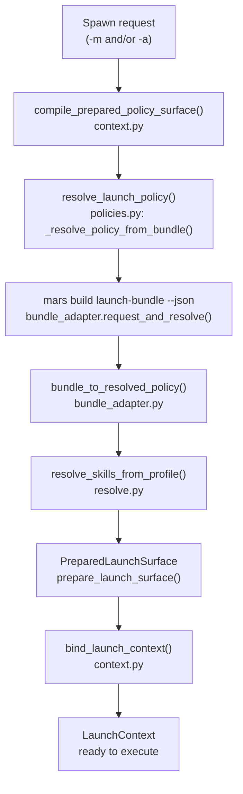

# Model Resolution Overview

When you run `meridian spawn -m gpt55` or `meridian spawn -a coder`, Meridian
doesn't immediately know which process to launch. `gpt55` is an alias, not a
binary. `coder` is a profile name, not a prompt. Resolution is the pipeline
that turns symbolic names into concrete decisions: which harness to launch,
which model ID to pass it, which skills to inject.

Resolution runs before any process launches and fails loudly if it can't
determine what to run.

## Resolution Pipeline

For **PRIMARY** and **SPAWN_PREPARE** surfaces, resolution flows through Mars
launch-bundle. Mars resolves model aliases, harness routing, and execution
policy, returning a structured JSON payload that Meridian assembles into a
`ResolvedLaunchPolicy`.

Mars is the runtime authority for model alias resolution, harness selection,
and execution policy for all PRIMARY and SPAWN_PREPARE launches. Meridian
passes explicit user overrides (CLI flags, env vars) to the bundle command and
applies Meridian config as a post-bundle execution-policy layer. The bundle
response carries provenance strings (`model_source`, `harness_source`, etc.)
that feed `FieldProvenance` for dry-run output.

## What Gets Resolved

After the bundle path runs, the pipeline has produced:

- **`ModelSelectionContext`** — frozen record carrying the original
  `requested_token`, `canonical_model_id`, `harness_model_id` (harness-specific
  model string from the Mars bundle `harness_model` field, may differ from
  canonical), and `harness_provenance` string
- **Harness** — which harness process to launch, resolved by Mars and returned
  in `bundle_result.harness`
- **Skills** — list of skill names from the profile, loaded and variant-selected
  for the resolved harness and model token via `resolve_skills_from_profile()`
- **`ResolvedLaunchPolicy`** — model, harness, adapter, skills, execution
  policy, tools, field provenance, and warnings assembled from bundle output
- **`LaunchContext`** — all of the above assembled with env, cwd, argv, and
  permissions, ready for execution

At the harness command boundary, `bind_launch_context()` uses `harness_model_id`
(not `canonical_model_id`) when building the subprocess command. For most harnesses
these are identical, but models with provider-prefixed IDs (e.g. `openai/gpt-5.5`
for OpenCode) diverge here. See [aliases-and-routing.md](aliases-and-routing.md#harness-specific-model-ids).

## Entry Points

- `compile_prepared_policy_surface()` — `src/meridian/lib/launch/context.py` —
  assembles `SurfacePolicyInput` and calls `resolve_launch_policy()`
- `resolve_launch_policy()` — `src/meridian/lib/launch/policies.py` — routes
  PRIMARY/SPAWN_PREPARE to `_resolve_policy_from_bundle()`
- `bundle_adapter.request_and_resolve()` — `src/meridian/lib/launch/bundle_adapter.py` —
  invokes `mars build launch-bundle --json` and parses the structured response
- `bundle_adapter.bundle_to_resolved_policy()` — maps bundle result + local
  context to `ResolvedLaunchPolicy`
- `resolve_skills_from_profile()` — `src/meridian/lib/launch/resolve.py` —
  skill attachment after bundle resolution
- `prepare_launch_surface()` / `bind_launch_context()` — `src/meridian/lib/launch/context.py` —
  content projection and final environment/argv assembly

> **Legacy note:** `src/meridian/lib/launch/compiler.py` (`compile_launch_params()`)
> and its `CompilerRequest`/`CompilerResult` types still exist in the codebase but
> are **deprecated** — the module docstring marks it explicitly. It is not the
> runtime authority for PRIMARY/SPAWN_PREPARE launches.

## Related

- [aliases-and-routing.md](aliases-and-routing.md) — Mars alias entries,
  harness-specific model IDs, identity/routing concepts
- [agent-profiles.md](agent-profiles.md) — how profiles are loaded and how
  they feed into the bundle request
- [model-policies.md](model-policies.md) — typed selector rules, visibility
  filtering, and candidate-chain transform semantics
- [vocabulary.md](vocabulary.md) — glossary for model-resolution terms
- [concepts/config-precedence.md](../config-precedence.md) — how execution
  policy layers (CLI → bundle → profile → config) interact
- [decisions/model-resolution.md](../../decisions/model-resolution.md) — why
  this design was chosen; D73/D74 (compiler era) are superseded by Mars bundle
- [architecture/launch-system.md](../../architecture/launch-system.md) — where
  `resolve_launch_policy()` fits in the full launch factory
- [architecture/mars-launch-bundle.md](../../architecture/mars-launch-bundle.md) —
  Mars launch-bundle schema and contract
