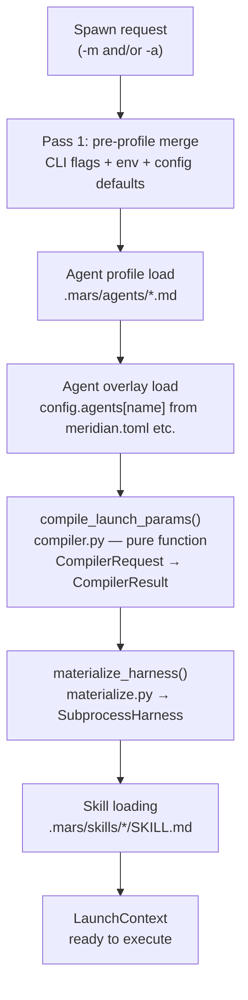

# Model Resolution Overview

When you run `meridian spawn -m gpt55` or `meridian spawn -a coder`, Meridian
doesn't immediately know which process to launch. `gpt55` is an alias, not a
binary. `coder` is a profile name, not a prompt. Resolution is the pipeline
that turns symbolic names into concrete decisions: which harness to launch,
which model ID to pass it, which skills to inject.

Resolution runs before any process launches and fails loudly if it can't
determine what to run.

## Resolution Pipeline

The **canonical launch-parameter compiler** (`src/meridian/lib/launch/compiler.py`) is the central authority for all field resolution. It takes a `CompilerRequest` (pure data: CLI overrides, env overrides, agent overlay, config defaults, profile data, resolved alias entry) and returns a `CompilerResult` (pure data: resolved model, harness, effort, approval, sandbox, autocompact, timeout, skill names, and `FieldProvenance` attribution).

## Two-Pass Merge

Resolution runs in **two passes** because the profile can influence model
selection, but the profile is selected based on pre-profile configuration:

**Pass 1 — Pre-profile merge:** Merge CLI flags, environment variables, and
config defaults to determine which agent profile to load.

**Pass 2 — Compiler:** Pass profile data, agent overlay, model alias entry,
and all override sources into `compile_launch_params()`. The compiler resolves
each field independently via the full precedence ladder:

| Tier | Source | Priority |
|---|---|---|
| 1 | CLI flags (`-m`, `--harness`, `--approval`, etc.) | highest |
| 2 | Environment variables (`MERIDIAN_MODEL`, etc.) | |
| 3 | Matched model-policy rule (overlay if set, else profile) | |
| 4 | Agent overlay generic defaults (`[agents.<name>]` in config) | |
| 5 | Agent profile frontmatter | |
| 6 | Config `[primary]` or `default_*` | |
| 7 | Model alias defaults | lowest |

Each field resolves independently. A CLI model override doesn't change the approval mode — that still comes from profile or config.

## What Gets Resolved

After both passes, the pipeline has produced:

- **`AliasEntry`** — alias string mapped to a concrete `model_id` and
  optional `mars_provided_harness`
- **`ModelSelectionContext`** — frozen record carrying the original
  `requested_token`, `canonical_model_id`, and `harness_provenance` string
- **Harness** — which harness process to launch, determined via the 7-source
  cascade in `resolve_harness_routing()`
- **Skills** — list of skill names from the profile, loaded and variant-selected
  for the resolved harness and model token
- **`LaunchContext`** — all the above assembled and ready for the composition
  stage

## Entry Points

- `compile_launch_params()` — `src/meridian/lib/launch/compiler.py` — the
  canonical compiler; pure function, `CompilerRequest` → `CompilerResult`
- `materialize_harness()` — `src/meridian/lib/launch/materialize.py` —
  turns `CompilerResult` into runtime objects (`SubprocessHarness`, etc.)
- `resolve_policies()` — `src/meridian/lib/launch/policies.py` — thin wrapper
  that loads profile + alias entry, builds `CompilerRequest`, calls the compiler,
  materializes, and maps to `ResolvedPolicies` for callers
- `resolve_model()` — `src/meridian/lib/catalog/models.py` — alias → AliasEntry
- `resolve_skills_from_profile()` — `src/meridian/lib/launch/resolve.py` —
  skill attachment

## Related

- [aliases-and-routing.md](aliases-and-routing.md) — how alias names become
  concrete model IDs and harnesses
- [agent-profiles.md](agent-profiles.md) — how profiles are loaded and how
  they feed into the merge
- [model-policies.md](model-policies.md) — typed selector rules, visibility
  filtering, and candidate-chain transform semantics
- [vocabulary.md](vocabulary.md) — glossary for model-resolution terms and
  the legacy fanout migration note
- [concepts/config-precedence.md](../config-precedence.md) — the agent overlay
  tier and how it fits in the full precedence ladder
- [decisions/model-resolution.md](../../decisions/model-resolution.md) — why
  this design was chosen (D72–D75 for the compiler, overlay, and candidate chain)
- [architecture/launch-system.md](../../architecture/launch-system.md) — where
  `resolve_policies()` fits in the full launch factory
