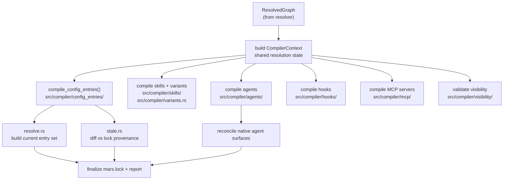

# Compiler Pipeline

The Mars compiler transforms a resolved dependency graph into materialized
output: agent profiles, skill files, MCP config entries, hook config entries,
and model alias tables. Entry point: `compiler::compile()` in
`src/compiler/mod.rs`.

## Pipeline Stages



## Module Map

```
src/compiler/
  mod.rs               ← entry point: compile(), agent emission policy
  context.rs           ← CompilerContext: shared resolution state per sync
  agents/
    mod.rs             ← agent compilation pipeline
    lower.rs           ← profile → materialized agent file
  config_entries/
    mod.rs             ← entry: compile_config_entries()
    resolve.rs         ← build current entry set from packages
    stale.rs           ← diff vs lock → stale entry removal
  hooks/
    mod.rs             ← hook lowering, per-target platform-aware commands
  mcp/
    mod.rs             ← MCP server lowering, collision resolution
  skills/
    mod.rs             ← universal skill frontmatter parsing + lowering
  variants.rs          ← skills/<name>/variants/<harness>/<model>/SKILL.md indexing
  visibility/
    mod.rs             ← model visibility validation
```

## Compiler Lanes

Each compiler lane handles one kind of output artifact:

### Agents (`compiler/agents/`)

Reads agent profiles from the resolved graph and materializes them into
`.mars/agents/*.md`. When agent emission is active, also lowers each profile to
the format each native harness target requires (YAML frontmatter + Markdown for
Claude/OpenCode/Cursor, TOML for Codex).

Agent emission is policy-driven via three modes:

| Mode | Behavior |
|---|---|
| `Auto` | Detect from `MERIDIAN_MANAGED` env var |
| `Always` | Always emit to native harness dirs |
| `Never` | Never emit to native harness dirs |

`MERIDIAN_MANAGED=1` (set by Meridian when invoking `mars sync`) causes `Auto`
to behave as `Never`. See [targeting.md](targeting.md) for the full emission
model.

### Skills and Variants (`compiler/skills/`, `compiler/variants.rs`)

Parses universal skill frontmatter from `.mars/skills/*/SKILL.md`. Indexes
optional variants at `skills/<name>/variants/<harness>/<model>/SKILL.md`.
Validates layout — variants must live under a named skill. Lowers skill metadata
into per-harness projection format for target sync.

### Config Entries (`compiler/config_entries/`)

Handles MCP server and hook config entries written into harness-native config
files (`.mcp.json`, `settings.json`, `codex_mcp.json`, etc.).

Two sub-phases:

**resolve.rs** — builds the current entry set from all packages in the resolved
graph. Resolves name collisions using precedence rules:

| Collision | Winner |
|---|---|
| `_self` (local) vs. dependency | Local wins silently |
| Dependency A vs. dependency B | Earlier in `mars.toml [dependencies]` declaration order wins, later dropped with warning |
| Same-scope alphabetically | Alphabetically first source; both named in warning |

Note: `graph.order` in the dependency graph is alphabetical, not declaration
order. Declaration-order precedence for dep-vs-dep collisions is implemented by
reading `mars.toml` directly. See [architecture/mars-compiler.md](../../architecture/mars-compiler.md)
for rationale.

**stale.rs** — diffs the current entry set against provenance records in
`mars.lock`. Calls `remove_config_entries()` for keys present in the prior lock
but absent from the current set. This is how mars cleans up entries from removed
packages without leaving orphans.

### Hooks (`compiler/hooks/`)

Parses `hook.toml`, validates V0 universal events, checks path traversal, emits
deterministic ordering. Classifies hooks as lossy or lossless per target (some
targets like OpenCode and Pi lack hook APIs; mars warns and skips rather than
aborting).

### MCP Servers (`compiler/mcp/`)

Parses `mcp.toml`, preserves symbolic env references (`${VAR}` form for Claude,
plain variable names for Codex), pre-flights missing env vars, lowers parsed MCP
items into target entries. Collision resolution is shared with `config_entries/`.

### Visibility (`compiler/visibility/`)

Validates model visibility patterns from `[settings] model_visibility` against
the resolved alias table. Default visibility by artifact kind:

| Kind | Default |
|---|---|
| Agents | Exported (visible) |
| Skills | Exported (visible) |
| Bootstrap docs | Exported (visible) |
| Hooks | Local (not exported) |
| MCP servers | Local (not exported) |

## CompilerContext

`CompilerContext` (`src/compiler/context.rs`) carries shared resolution state
across all compiler lanes for a single sync: the resolved graph, the project
root, managed root, target registry, and lock from the previous sync. Lanes
read from context instead of re-resolving independently.

## Output to Lock

After all lanes complete, `compiler::compile()` writes the updated lock via
`lock::build()`. The lock records:

- Content-hashed provenance for every managed file
- Config-entry provenance for every installed MCP/hook entry
- Carry-forward of skipped or locally-modified items (not overwritten)

The lock write is atomic (tmp+rename). See [sync-model.md](sync-model.md) for
how the lock feeds the diff phase on the next sync.

## Invariants

- **I-1: Compiler reads from resolved graph only** — no direct config re-reading
  after `CompilerContext` is built.
- **I-2: All writes are atomic** — tmp+rename, lock-guarded.
- **I-3: Target sync is per-target non-fatal** — a failure in one harness target
  records a warning and continues; sibling targets are not aborted.
- **I-4: Declaration order for dep-vs-dep collisions** — graph traversal order is
  not used; `mars.toml` is re-read for precedence.
- **I-5: Windows filename safety** — filename validation rejects Windows-invalid
  and reserved device names on all platforms before any write.

## Key References

- Entry point: `src/compiler/mod.rs` lines 35–96
- Agent emission policy: `src/compiler/mod.rs` lines 99–217
- Config-entry resolution: `src/compiler/config_entries/resolve.rs`
- Stale cleanup: `src/compiler/config_entries/stale.rs`
- Hook lowering: `src/compiler/hooks/mod.rs`
- MCP lowering: `src/compiler/mcp/mod.rs`
- Skill compilation: `src/compiler/skills/mod.rs`
- Variant indexing: `src/compiler/variants.rs`

## Related

- [targeting.md](targeting.md) — where compiled output lands and how harness projection works
- [sync-model.md](sync-model.md) — diff → plan → apply cycle that wraps the compiler
- [architecture/mars-compiler.md](../../architecture/mars-compiler.md) — MCP/hook collision rationale, config-entry provenance in the lock
- [decisions/package-management.md](../../decisions/package-management.md) — decisions behind the compiler design
