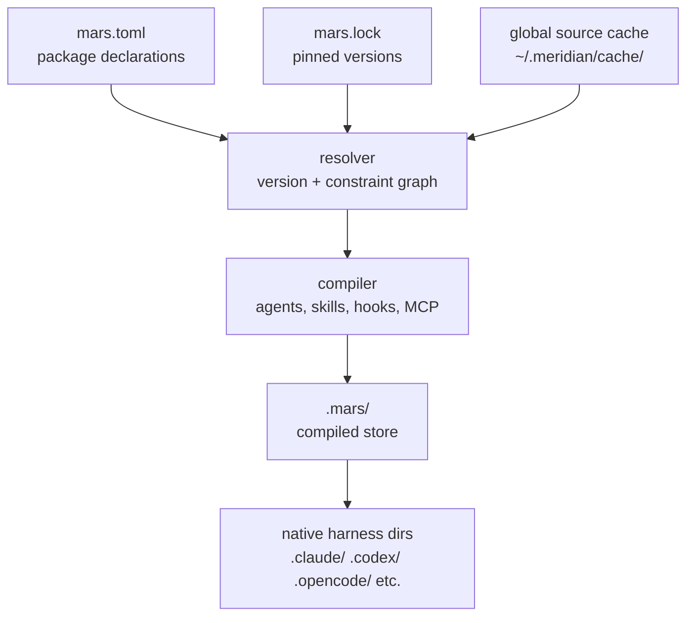

# Package Management

Mars is the package manager for agent and skill content. It compiles package
declarations from `mars.toml` into a canonical compiled store at `.mars/`, then
projects that store into each harness's native directories.

Meridian delegates all package operations to the `mars` binary (`mars-agents`).
It reads from `.mars/` at spawn time; it does not maintain its own copy of
package content.

## The .mars/ Compiled Store

`.mars/` is the canonical output of `mars sync`. Meridian reads from here. Only
mars writes to it.

```
.mars/
  agents/*.md                         ← full-fidelity agent profiles
  skills/*/SKILL.md                   ← canonical skill content
  skills/*/variants/<harness>/<model>/SKILL.md  ← harness/model skill variants
  skills/*/resources/BOOTSTRAP.md     ← skill bootstrap docs
  bootstrap/*/BOOTSTRAP.md            ← package bootstrap docs
  models-merged.json                  ← merged model alias catalog
  hooks/*/                            ← hook scripts
  mars.lock                           ← pinned version lock file
```

**`.mars/` is generated output.** Editing files in `.mars/` directly is
overwritten on the next `mars sync`. See the [targeting page](targeting.md) for
how `.mars/` relates to per-harness directories.

## Pipeline Overview



The pipeline runs when `meridian mars sync` is invoked. Each phase produces a
typed handoff struct:

| Phase | Struct | What it holds |
|---|---|---|
| Load config | `LoadedConfig` | Parsed `mars.toml`, old lock, sync options |
| Resolve | `ResolvedState` | Version-pinned dependency graph |
| Target | `TargetedState` | Compiler plan for all target directories |
| Plan | `PlannedState` | Diff-based action list (add/update/remove/skip) |
| Apply | `AppliedState` | File operations completed, outcomes recorded |
| Sync | `SyncedState` | Native target dirs updated, lock written |

Detailed phase behavior: [sync-model.md](sync-model.md).

## Package Declarations: mars.toml

```toml
[package]                # present when this repo IS a mars package
name = "my-pkg"
version = "1.0.0"

[dependencies]           # packages installed and exported to consumers
meridian-base = { url = "https://github.com/org/pkg", version = ">=1.0" }
local-tools = { path = "../local-package" }

[local-dependencies]     # installed but NOT exported to consumers
dev-helpers = { path = "../dev-helpers" }

[models]                 # model alias definitions exported by this package
sonnet = { model_id = "claude-sonnet-4-5", harness = "claude" }

[settings]
agent_emission = "auto"  # "auto" | "always" | "never"
```

Source types:

| Type | Key | Fetch |
|---|---|---|
| Git URL | `url = "https://..."` | `git clone`/fetch into global cache |
| Local path | `path = "../dir"` | Direct filesystem read |

Both support `subpath` (install only a sub-directory) and `include`/`exclude`
glob filters on agents and skills.

## Model Aliases Live in mars.toml

Model aliases (`sonnet`, `codex`, `gpt55`) are defined in `[models]` sections
across the dependency graph, not in Meridian config. The aliases travel with the
packages that use them. `mars sync` merges all alias definitions into
`.mars/models-merged.json`, which Meridian reads at spawn time.

See [concepts/model-resolution/aliases-and-routing.md](../model-resolution/aliases-and-routing.md)
for how aliases become concrete model IDs and harness selections.

## CLI Surface

Full reference: `meridian mars --help`.

| Command | Purpose |
|---|---|
| `meridian mars sync` | Fetch sources, compile, materialize to `.mars/` and harness dirs |
| `meridian mars add <source>` | Add a dependency to `mars.toml` and sync |
| `meridian mars upgrade` | Upgrade dependencies to latest versions |
| `meridian mars list` | List installed agents and skills |
| `meridian mars models list` | List model alias definitions |
| `meridian mars check` | Validate `mars.toml` and installed content |
| `meridian mars doctor` | Diagnose common configuration issues |
| `meridian mars why <item>` | Explain why an item is installed (dependency chain) |

## Binary Resolution

Meridian finds the `mars` binary by checking `Path(sys.executable).parent`
first (the scripts directory of the active Python install, which contains a
bundled Mars sibling when Meridian is installed as a `uv tool`), then falling
back to `shutil.which("mars")`. The scripts-directory preference is important
for isolated `uv tool` installs.

## Subtree

| Page | Content |
|---|---|
| [compiler-pipeline.md](compiler-pipeline.md) | Compiler phases, lanes, module map |
| [resolution-algorithm.md](resolution-algorithm.md) | Version selection, constraint graph, filters |
| [targeting.md](targeting.md) | Emission policy, TargetAdapter model, per-harness behavior |
| [sync-model.md](sync-model.md) | Diff → plan → apply cycle, lock provenance |

## Related

- [decisions/package-management.md](../../decisions/package-management.md) — why .agents/ was eliminated, why aliases travel with packages, why sync is manual
- [architecture/mars-compiler.md](../../architecture/mars-compiler.md) — compiler internals: MCP/hook conflict resolution, config-entry provenance
- [architecture/mars-targeting.md](../../architecture/mars-targeting.md) — targeting architecture: .mars/ vs native dirs, conditional agent emission
- [concepts/skill-schema.md](../skill-schema.md) — universal SKILL.md frontmatter, variants, per-harness lowering
- [concepts/bootstrap-docs.md](../bootstrap-docs.md) — two-tier bootstrap doc discovery
