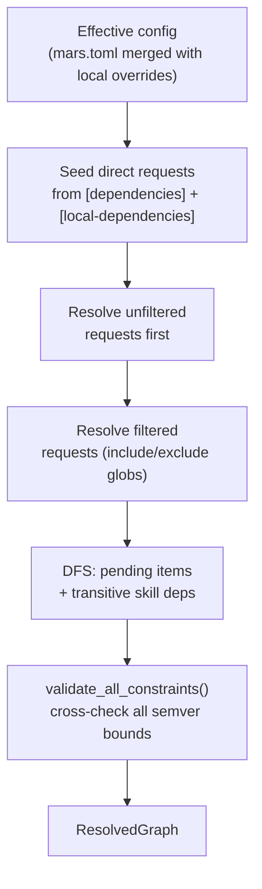
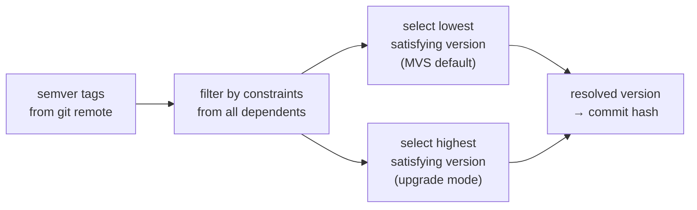

# Resolution Algorithm

The Mars resolver takes package declarations from `mars.toml`, fetches remote
sources into a global cache, and produces a `ResolvedGraph` — a version-pinned,
constraint-validated dependency graph. The resolver is trait-based and runs
before the compiler.

Entry point: `src/resolve/mod.rs`. Main types in `src/resolve/types.rs`.

## Data Structures

| Type | Role |
|---|---|
| `ResolvedGraph` | Final output: versioned nodes, item assignments |
| `ResolvedNode` | One package: source identity, resolved version, discovered items |
| `PendingItem` | In-flight item being resolved (agent, skill, bootstrap doc) |
| `VersionConstraint` | Semver constraint from a dependency declaration |
| `VisitedSet` | Guards against diverging source identities across names |
| `PackageVersions` | Tracks per-package version selections for constraint checking |
| `ResolveOptions` | Controls maximize/upgrade/bump/frozen mode |

## Resolution Flow



Steps in detail:

1. **Seed** — collect direct requests from both `[dependencies]` and
   `[local-dependencies]` sections. Unfiltered requests (no include/exclude)
   are resolved first; filtered ones follow.
2. **DFS traversal** — `resolve_package_bottom_up()` dedupes by source
   identity, applies subpaths, reads transitive manifests, discovers items, and
   seeds further transitive dependencies.
3. **Transitive skill resolution** — `resolve_skill_ref()` searches the
   requester's package, then the full dependency closure, then the remaining
   graph. Emits `SkillNotFound` if absent.
4. **Constraint validation** — `validate_all_constraints()` checks that resolved
   versions still satisfy every declared semver bound, including those from
   transitive dependencies.

## Version Selection

Path sources (`path = "../dir"`) bypass versioning — they are live filesystem
reads with no version semantics.

Git sources (`url = "https://..."`) use semver-based selection via
`resolve_git_source()` in `src/resolve/version.rs`:

1. **Ref pin** — if the dependency declares a specific `rev`/`tag`/`branch`,
   use it directly.
2. **Maximize mode** (upgrade) — fetch all tags, select the highest satisfying
   version.
3. **Locked commit replay** — if the lock has a satisfying commit, reuse it
   without a fetch.
4. **Safe fallback** — if the locked commit is unreachable (force-pushed,
   deleted), falls back to fetching rather than aborting.

Default algorithm is **MVS (Minimum Version Selection)**: when multiple
constraints exist on a package, the highest *lower bound* wins. This matches
Go module semantics. Maximize mode flips to highest available satisfying
version.



`select_version()` in `src/resolve/version.rs` lines 186–245 implements this.

## Constraint Validation

After all packages are resolved, `validate_all_constraints()` runs a second
pass over every declared constraint in the full graph. This catches cases where
a transitively-selected version satisfies one dependent but violates another
that was processed later in DFS order.

`VisitedSet` and `PackageVersions` guard against a package being resolved to
different versions under different names — if two dependency names resolve to
the same source URL, they must use the same version.

## Filter Modes

Each dependency declaration supports include/exclude filters:

```toml
[dependencies]
meridian-base = {
  url = "https://github.com/org/pkg",
  version = ">=1.0",
  include = ["agents/coder.md", "skills/meridian-spawn/**"],
  exclude = ["skills/experimental/**"]
}
```

`sync/filter.rs` applies these modes. An agent that passes an include filter
also pulls in its declared skill dependencies transitively — `seed_items_for_request()`
in `src/resolve/package.rs` lines 276–398 handles this.

Filter combinations are validated at config load time; incompatible combinations
(e.g., `include` with `only-skill`) are rejected with a diagnostic.

## Discovery

`discover_source()` in `src/discover/mod.rs` scans package layouts for items:

| Layout | Items found |
|---|---|
| `agents/*.md` | Agent profiles |
| `skills/*/SKILL.md` | Skills |
| `bootstrap/*/BOOTSTRAP.md` | Bootstrap docs |
| Root `SKILL.md` | Flat skill fallback |

`discover_fallback()` handles packages that don't follow the conventional
layout (flat roots, manifest-declared items, heuristic fallback).

For local (non-package) sources, `local_source::discover_local_items()` prefers
`.mars-src/` and optionally falls back to the repo root. Duplicate items by
`ItemId` are deduplicated with warnings.

## Source Cache

Fetched git sources are stored in a global cache at
`~/.meridian/cache/mars/archives/` (archives) and `~/.meridian/cache/mars/git/`
(git repos). `GlobalCache` in `src/source/mod.rs` manages this layout.

Path sources bypass the cache — they are read directly from the filesystem at
sync time.

GitHub archive download/extraction (`src/source/archive.rs`) includes retry
logic and path-safety checks. Git fetch (`src/source/git.rs`) handles tag/branch/HEAD
resolution and semver tag parsing.

## Trait Boundary

The resolver is decoupled from concrete source modules via four traits
(`src/resolve/mod.rs` lines 92–140):

| Trait | Responsibility |
|---|---|
| `VersionLister` | List available versions for a source |
| `SourceFetcher` | Fetch a source at a specific version |
| `ManifestReader` | Read `mars.toml` from a fetched source |
| `SourceProvider` | Compose the above into a single resolution interface |

`sync/provider.rs` bridges these traits to the concrete source modules.

## Invariants

- **I-1: Source identity is single** — a package source URL cannot resolve to
  different identity under different dependency names in the same graph.
- **I-2: Constraints checked twice** — at traversal time (fast-fail) and after
  full resolution (cross-check).
- **I-3: Path sources are unversioned** — no semver logic applies; the current
  filesystem state is used.
- **I-4: Locked commits are replayed unless unreachable** — reproducible installs
  by default, safe degradation under force-push or deletion.
- **I-5: Traversal path safety** — `apply_subpath()` rejects escaping or missing
  subpaths; `SourceSubpath`/`DestPath` normalize separators and reject traversal
  sequences.

## Key References

- Main resolution flow: `src/resolve/mod.rs` lines 142–283
- Version selection: `src/resolve/version.rs` lines 186–245
- Git resolution: `src/resolve/version.rs` lines 47–183
- Package bottom-up resolution: `src/resolve/package.rs` lines 75–264
- Item seeding + filters: `src/resolve/package.rs` lines 276–398
- Skill reference resolution: `src/resolve/skill.rs` lines 24–196
- Filter logic: `src/resolve/filter.rs`
- Source parser: `src/source/parse.rs`

## Related

- [sync-model.md](sync-model.md) — how the resolved graph feeds the sync cycle
- [compiler-pipeline.md](compiler-pipeline.md) — what happens to the resolved graph after resolution
- [overview.md](overview.md) — mars.toml format and dependency declaration syntax
- [decisions/package-management.md](../../decisions/package-management.md) — why MVS, why trait-based resolver
