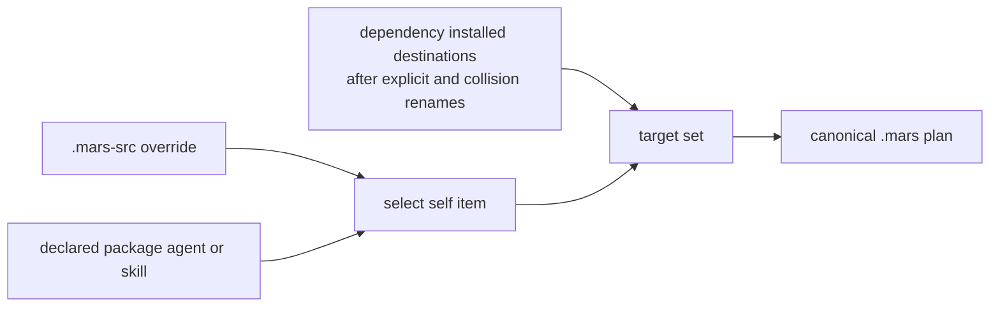

# Current-Package Source Selection

A project that declares `[package]` contributes its own agents and skills to
`mars sync`. Mars selects those current-package inputs alongside `.mars-src`
and dependencies, but records the selected current-project content under the
synthetic `_self` owner rather than resolving a dependency on the project.

This contract is approved and implemented on the `fix/package-self-sync`
feature branch; it is not yet an installed or released Mars capability.

## Selection order

The layers have this precedence:

1. `.mars-src` wins over a matching declared-package `(kind, name)` before
   either candidate is staged.
2. Dependencies resolve and receive their existing explicit or automatic
   collision renames.
3. The selected self item overlays only a matching **installed destination**.

This ordering preserves dependency naming and reference policy. A dependency
renamed from `writer` to `editor` can coexist with a self `writer`; self does
not deduplicate the dependency's raw source name. Existing reference rewriting
continues to operate on the resulting installed target set.

Only agents and skills enter through the declared-package self layer. Package
bootstrap documents and hooks are not imported a second time. `.mars-src`
continues to work without `[package]`; removing `[package]` disables only the
declared-package contribution.

## Dialect and identity are separate

Declared-package self items always enter staging as `MarsNative`. Mars does
not infer their dialect from the project root, because generated native target
directories must not reinterpret unchanged authored frontmatter. `.mars-src`
keeps its existing local dialect resolution, and dependency dialect resolution
is unchanged.

Both self layers use `source = "_self"` in `mars.lock`. For a package-root
`SKILL.md`, the installed skill name is the declared package name, not `_self`.
This distinction keeps the lock owner stable without leaking its synthetic
name into the installed catalog. No lock schema change or self-dependency is
required.

## Discovery boundaries

Declared-package selection reuses the ordinary bounded convention walk. Mars
globally grounds agents, skills, and bootstrap documents to the shallowest
occupied non-hidden layer, then admits only agents and skills to the self
contribution. Other convention kinds can still determine which layer is
occupied.

This means a deeper distribution directory is ineligible while a shallower
convention layer exists, but can become eligible after every shallower item is
removed. No directory such as `cw/` is permanently excluded, and empty source
directories do not pin a layer. This is the same source-discovery rule used for
downstream package consumption.

Non-hidden generated output remains a known limitation. A configured target
such as `out/native` can create a convention item that discovery selects on a
later run, including suppressing a package-root `SKILL.md` fallback. Resource
filtering happens after discovery and cannot repair that choice. Hidden target
roots avoid this feedback path; a general fix is tracked in
[mars-agents issue #161](https://github.com/haowjy/mars-agents/issues/161).

## Flat-root containment

A root `SKILL.md` treats the package directory as its resource tree. Before
walking that tree, staging excludes control and generated paths: the canonical
and staging tree, `.mars-src`, standard native target roots, and resolved
configured target paths. Existing paths are resolved as well as normalized so
absolute paths, dot segments, and aliases cannot reintroduce an output tree.
Filtering before traversal prevents staging from recursively copying its own
destination while preserving authored resources.

The filter is relative to the selected source root. Project-relative target
paths must not discard similarly named resources inside a separate
`.mars-src` root.

## Ownership transitions and collisions

The canonical `.mars` destination must already be owned by Mars or be absent
before a selected self item can apply. An unowned path is a pre-apply error even
when its bytes match, `--force` is present, or the command is a dry/frozen run.
The remedy is to relocate the blocking destination and retry; Mars does not
silently adopt it.

When source ownership changes but bytes do not, diff emits `Update` only if the
on-disk canonical content still matches the previous lock. That write records
the new `_self` owner while retaining native output claims. A locally modified
canonical item stays on the established keep-local path; when source and disk
both changed, the established source-wins conflict behavior remains.

Native target collisions are a separate ownership surface and retain their
existing warning and explicit-force adoption semantics. The canonical self
refusal does not change them.

## Non-goals

This design does not add a lock schema, self-dependency, alternate runtime
lookup, installed-package upgrade, live package mutation, content merge, or a
new dependency rename/reference algorithm.

## Provenance

- Work item: `work:mars-self-package-sync`
- Product baseline: `mars-agents` `a26e81ca`; feature commits `e519f5c`,
  `b44b7bc`, `6ef8760`, `f04d0a1`
- Settled source-selection refinement: 2026-09-15

## Related

- [resolution-algorithm.md](resolution-algorithm.md) — dependency and convention discovery
- [sync-model.md](sync-model.md) — diff, plan, ownership, and lock behavior
- [vocabulary.md](vocabulary.md) — self-source terms
- [../../decisions/package-management.md](../../decisions/package-management.md) — decision rationale
