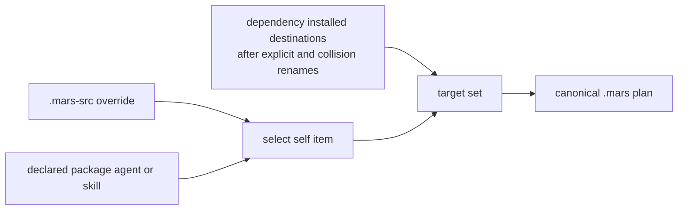

# Current-Package Source Selection

A project that declares `[package]` contributes its own agents and skills to
`mars sync`. Mars selects those current-package inputs alongside `.mars-src`
and dependencies, but records the selected current-project content under the
synthetic `_self` owner rather than resolving a dependency on the project.

This contract is approved and implemented on the `fix/package-self-sync`
feature branch; it is not yet an installed or released Mars capability.

## Selection order

The layers have this precedence:

1. `.mars-src` wins over a matching declared-package `(kind, name)` before
   either candidate is staged.
2. Dependencies resolve and receive their existing explicit or automatic
   collision renames.
3. The selected self item overlays only a matching **installed destination**.

This ordering preserves dependency naming and reference policy. A dependency
renamed from `writer` to `editor` can coexist with a self `writer`; self does
not deduplicate the dependency's raw source name. Existing reference rewriting
continues to operate on the resulting installed target set.

Only agents and skills enter through the declared-package self layer. Package
bootstrap documents and hooks are not imported a second time. `.mars-src`
continues to work without `[package]`; removing `[package]` disables only the
declared-package contribution.

## Dialect and identity are separate

Declared-package self items always enter staging as `MarsNative`. Mars does
not infer their dialect from the project root, because generated native target
directories must not reinterpret unchanged authored frontmatter. `.mars-src`
keeps its existing local dialect resolution, and dependency dialect resolution
is unchanged.

Both self layers use `source = "_self"` in `mars.lock`. For a package-root
`SKILL.md`, the installed skill name is the declared package name, not `_self`.
This distinction keeps the lock owner stable without leaking its synthetic
name into the installed catalog. No lock schema change or self-dependency is
required.

## Discovery boundaries

Declared-package selection reuses the ordinary bounded convention walk. Mars
globally grounds agents, skills, and bootstrap documents to the shallowest
occupied non-hidden layer, then admits only agents and skills to the self
contribution. Other convention kinds can still determine which layer is
occupied.

This means a deeper distribution directory is ineligible while a shallower
convention layer exists, but can become eligible after every shallower item is
removed. No directory such as `cw/` is permanently excluded, and empty source
directories do not pin a layer. This is the same source-discovery rule used for
downstream package consumption.

Non-hidden generated output remains a known limitation. A configured target
such as `out/native` can create a convention item that discovery selects on a
later run, including suppressing a package-root `SKILL.md` fallback. Resource
filtering happens after discovery and cannot repair that choice. Hidden target
roots avoid this feedback path; a general fix is tracked in
[mars-agents issue #161](https://github.com/haowjy/mars-agents/issues/161).

## Flat-root containment

A flat declared-package `SKILL.md` treats the project directory as its resource
tree. Before walking that tree, staging excludes project control and generated
paths: the canonical and staging tree, `.mars-src`, standard native target
roots, currently configured targets, and custom targets retained in the prior
lock. Existing paths are resolved as well as normalized so absolute paths, dot
segments, and aliases cannot reintroduce an output tree. Filtering before
traversal prevents staging from recursively copying its own destination while
preserving authored resources.

Exclusions are evaluated against the selected source root. A flat `.mars-src`
skill therefore does **not** reserve project-level names such as `.codex`,
`.agents`, or `.mars-src` inside its authored resource tree. Configured and
prior target paths are excluded only when their resolved project paths are
actually within that selected source root.

## Ownership transitions and collisions

The canonical `.mars` destination must already be owned by Mars or be absent
before a selected self item can apply. An unowned path is a pre-apply error even
when its bytes match, `--force` is present, or the command is a dry/frozen run.
Valid canonical write intent is the only exception: if Mars recorded an absent
destination before writing it, a retry can recover the matching regular output
into in-memory ownership before this guard runs. Without that evidence, the
remedy remains to inspect and relocate every blocked canonical destination
before retry or repair. Mars never adopts a path from byte equality alone.

When source ownership changes but bytes do not, diff emits `Update` only if the
on-disk canonical content still matches the previous lock. That write records
the new `_self` owner while retaining native output claims. A locally modified
canonical item stays on the established keep-local path; when source and disk
both changed, the established source-wins conflict behavior remains.

Native target collisions are a separate ownership surface and retain their
existing warning and explicit-force adoption semantics. The canonical self
refusal does not change them.

## Verification boundary

An isolated retained-state package copy preserved its original manifest and
dependency cache while sync restored current-package content: 22 `_self` items,
11 skills, and all 43 authored resources were present, `muse` resolved, and a
second run left self-item bytes, self-item mtimes, and `mars.lock` unchanged.
This does not establish whole-tree mtime stability: generated
`.codex/hooks.json` and transient staging mtimes still changed.

Dry-run and export-style commands avoid canonical/native installation and lock
finalization, but they are not filesystem-write-free: resolution may create
`.mars/sync.lock` and refresh `.mars/staging`. They do not publish new canonical
write intent. Resolution failure likewise occurs before new intent is
published.

Before applying new absent canonical outputs, the feature branch writes
version 1 `.mars/pending-canonical.json`. It binds expected output bytes and
source provenance to the exact prior `mars.lock` bytes (or recorded absence).
On retry, Mars accepts only matching regular outputs with no ancestor or nested
symlinks. Journal identity must also agree across its map key, item kind, and
destination; destinations are unique, target-scoped hooks are validated, and
dependency renames may use valid custom canonical paths. A changed output,
changed lock, malformed identity, duplicate destination, or symlink fails closed
rather than becoming ownership authority.

Recovered ownership remains in memory until normal finalization publishes
`mars.lock`. If the retry plans a replacement, the journal retains at most the
verified current and planned versions so failure on either side of the next
write stays recoverable. There is no early lock checkpoint: failed repair
preserves corrupt lock bytes across repeated source updates or errors. A crash
after lock publication but before journal cleanup is safe because published
ownership wins on retry. `--frozen` refuses any uncommitted recovered claim,
even when the resulting plan would otherwise contain only `Skip` actions; an
ordinary sync must publish ownership first. A no-op run creates no journal.

If the interrupted write moved a logical item to a new canonical destination,
recovery retains the old canonical claim until removal is confirmed. Lock
finalization filters confirmed-removed canonical records even if a skipped new
path carried them forward, and a recovered install replaces a same-path
pending-deletion record rather than duplicating it.

This journal covers canonical writes only. Native target and config outputs are
not journaled; [mars-agents issue #149](https://github.com/haowjy/mars-agents/issues/149)
remains open. Crashes from before the journal existed, or outputs that no longer
match it, still require the safe manual inspection-and-relocation path.

## Non-goals

This design does not change `mars.lock` v3 or `_self`, and it does not add a
self-dependency, alternate runtime lookup, installed-package upgrade, live
package mutation, content merge, or a new dependency rename/reference
algorithm. Canonical recovery is not a transaction for native/config outputs.

## Provenance

- Work item: `work:mars-self-package-sync`
- Product baseline: `mars-agents` `a26e81ca`; feature commits `e519f5c`,
  `b44b7bc`, `6ef8760`, `f04d0a1`, `256cdd0`, `bcf8930`, `1320260`,
  `9882e3c`; canonical-recovery commits `466f53e`, `cf86eb6`, `cb2ccc1`,
  `a4d17a2`, `34889b5`, `2aa796a`
- Current feature head: `2aa796a`; not merged, installed, or released
- Settled source-selection and canonical-recovery decisions: 2026-09-15
- Isolated runtime verification: `spawn:p6164`
- Ownership-loss investigation: `spawn:p6161` (12/12 pre-#103/current
  reproductions; exact June incident trigger remains unproven)
- Local recovery verification: 15 recovery tests plus focused suites and
  clippy; the final review and full runtime gate were still in progress at
  capture time

## Related

- [resolution-algorithm.md](resolution-algorithm.md) — dependency and convention discovery
- [sync-model.md](sync-model.md) — diff, plan, ownership, and lock behavior
- [vocabulary.md](vocabulary.md) — self-source terms
- [../../decisions/package-management.md](../../decisions/package-management.md) — decision rationale
