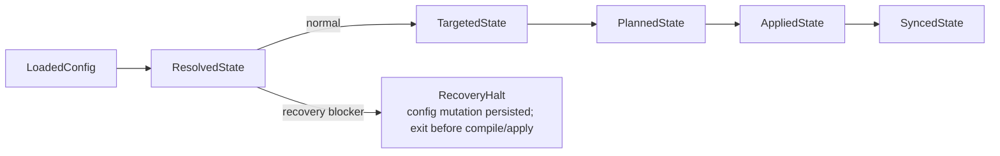

# Sync Model

`mars sync` runs the full package pipeline: load config, resolve, target, plan,
apply, and sync managed targets. Each phase produces a typed handoff struct.
The entire cycle is atomic at the file level and idempotent — running it twice
produces the same result.

Top-level entry: `sync::execute()` in `src/sync/mod.rs` lines 132–140.

## Phase Structs



| Struct | Produced by | Contains |
|---|---|---|
| `LoadedConfig` | `load_config()` | Parsed `mars.toml`, old lock, mutations, sync lock |
| `ResolvedState` | resolver | Version-pinned dependency graph |
| `TargetedState` | targeting layer | Compiler plan for all target directories |
| `PlannedState` | `sync/plan.rs` | Diff-based action list per item |
| `AppliedState` | `sync/apply.rs` | File operations completed, outcomes recorded |
| `SyncedState` | `target_sync` | Native target dirs updated, lock written |

`SyncRequest` carries the resolution mode (normal, maximize, frozen), optional
config mutation, and sync options (`src/sync/mod.rs` lines 59–81). `SyncReport`
includes `engine_fallbacks`: a list of sources where engine requirements caused
version fallback, each recording the skipped versions with their requirements,
the final selected version, and which engines triggered the fallback. This list
is reconciled against the completed `ResolvedGraph` to prune moot entries.

### Recovery Halt

Recovery commands may persist their requested config mutation and then return a
`RecoveryHalt` when resolution finds a removed-schema hook surface that cannot
be read. This branch exits before compiler, apply, target, and lock writes. The
halt carries the persisted mutations, blockers, and next step. Strict `sync` is
the only materializer; recovery never treats unreadable owned state as absence.

## Diff Classification

The diff phase (`src/sync/diff.rs`) compares the current planned state against
the installed state from `mars.lock`. Each item receives one of six
classifications:

| Classification | Condition |
|---|---|
| `Add` | Item is new — not in prior lock |
| `Update` | Item changed — content hash differs |
| `Unchanged` | Content hash matches lock |
| `Conflict` | Item changed upstream AND locally modified |
| `Orphan` | Item was in prior lock but is absent from current graph |
| `LocalModified` | On-disk content differs from the lock's installed hash |

Local modification detection uses dual checksums: the lock stores both the
content hash at install time and the on-disk hash at last check. If they
diverge, the item is flagged as `LocalModified` and protected from overwrite
unless `--force` is passed.

## Plan → Apply

`sync/plan.rs` maps each diff classification to an action:

| Diff state | Action (normal) | Action with --force |
|---|---|---|
| `Add` | Install | Install |
| `Update` | Overwrite | Overwrite |
| `Unchanged` | Skip | Skip |
| `Conflict` | Overwrite + `conflict-overwrite` warning | Overwrite |
| `Orphan` | Remove | Remove |
| `LocalModified` | Keep-local + warn | Overwrite |

`sync/apply.rs` executes the actions:

| Action | Operation |
|---|---|
| Install | Atomic copy (tmp+rename) |
| Overwrite | Atomic copy (tmp+rename) |
| Remove | Safe removal |
| Skip | No-op |
| Keep-local | No-op, records warning |

All file operations use atomic primitives (tmp+rename).

## Config Mutations

`sync/mutation.rs` handles in-place config changes under sync lock:

- Batch upserts (add/update dependencies)
- Removes
- Overrides
- Rename rules

Mutations are applied to `mars.toml` before resolution runs, so the resolved
graph reflects the post-mutation config. Writes are atomic and round-trip
checked.

## Lock File and Provenance

`mars.lock` is the authority on installed state. It is schema v3, keyed by
logical item identity (`kind/name`). Each item carries one or more output
records scoped by `(target_root, dest_path)` with an explicit lifecycle state:

```toml
version = 3

[items."agent/coder"]
source = "meridian-base"
source_checksum = "sha256:src..."

[[items."agent/coder".outputs]]
target_root = ".mars"
dest_path = "agents/coder.md"
state = "installed"
installed_checksum = "sha256:inst..."

[[items."agent/coder".outputs]]
target_root = ".claude"
dest_path = "agents/coder.md"
state = "installed"
installed_checksum = "sha256:claude..."

[config_entries.".claude"]
"hook:SessionStart:audit" = { emitted_json = "[...]" }
"mcp:some-server" = {}
```

The `items` section is the ownership registry: per-output lifecycle claims
keyed by `(target_root, dest_path)`. `state = "installed"` asserts content
at the path; `state = "pending-deletion"` asserts only retry-deletion
authority with no checksum. The `config_entries` section records provenance
for installed MCP and hook entries, with `emitted_json` carrying the exact
emitted bytes for structural removal.

On each sync, `lock::build()` reconstructs the lock from the resolved graph
plus apply outcomes. Skipped and kept-local items are carried forward
unchanged.

Lock writes are always atomic. Legacy v2 lock files are promoted at read
time by consulting disk state: a regular file or directory with a matching
checksum becomes `installed`; an absent, non-file, unreadable, or mismatched
path becomes `pending-deletion`. v1 locks are unsupported. The v2 promotion
preserves legacy config-entry records needed by the one-release #130 hook
sweep; delete the promotion after that sweep lands.

`LockIndex` is a fast lookup overlay for repeated dest-path queries during
the diff phase, with both target-scoped and broad unscoped methods.

## Rename and Rewrite Pass

After unmanaged-collision pruning, `sync/rewrite.rs` builds one `RenameIndex`
from explicit config renames and automatic collision renames, then applies a
single rewrite pass per agent. Each agent's `skills:` and `subagents:`
frontmatter is rewritten in one content update — no double-rewrite.

Resolution for which renamed variant to wire into an agent:
1. Same-source copy wins (the agent's own source)
2. If the agent's source still owns an unrenamed copy, the ref is left alone
3. Otherwise fall back to mars.toml declaration order (not `graph.order`,
   which is alphabetical)

After rewriting, `sync/validate.rs` checks config-side name references
(`[settings.meridian.fanout].agents`, `[agents.<name>]`, `[skills.<name>]`)
against installed names and emits a `config-rename-dangle` warning when a
referenced name was renamed away. See
[decisions/package-management.md#D88](../../decisions/package-management.md)
and
[#D89](../../decisions/package-management.md)
for the policy rationale.

## Sync Modes

| Flag | Behavior |
|---|---|
| (default) | MVS version selection, replay locked commits; models.dev catalog **Auto** + probe **Background** |
| `--force` | Overwrite locally-modified files |
| `--diff` | Dry-run: report what would change, no writes |
| `--frozen` | Do not fetch new versions; fail if lock is insufficient |
| `--refresh-models` | Force models.dev catalog refresh; run harness probes **synchronously** (no background `__refresh-probe` on stale cache) |
| `--no-refresh-models` | Disk-only catalog (`RefreshMode::Offline`); probe **Skip** (stale probe JSON still used when present) |
| `--ignore-requires-mars` | Skip package `requires-mars` compatibility checks |
| `--ignore-requires-meridian` | Skip package `requires-meridian` compatibility checks |

`--frozen` is the right mode for CI builds where reproducibility is required.

The `--ignore-requires-*` flags are available on `sync`, `upgrade`, `add`, and
`repair`. They emit a single warning noting the check is disabled.

Model/probe refresh uses the same **`ModelsRefreshControl`** as `mars models list|resolve`
and `mars build launch-bundle`. Full matrix: [../../architecture/mars-model-refresh.md](../../architecture/mars-model-refresh.md).

## Filter Pass

`sync/filter.rs` applies the include/exclude/only-agent/only-skill modes from
each dependency declaration. Agents passing an include filter also pull their
declared skill dependencies transitively. Filter resolution runs before the diff
phase.

## Sync Lock

`load_config()` acquires a sync lock (file lock via `fcntl.flock` on POSIX,
`LockFileEx` on Windows) before any state modification. Concurrent `mars sync`
invocations block rather than racing. The lock is held for the duration of the
sync and released on completion or crash.

## Invariants

- **I-1: Atomic writes** — every file write is tmp+rename; partial writes do not
  corrupt state.
- **I-2: Lock guards concurrency** — only one sync runs at a time per project root.
- **I-3: Idempotent** — syncing twice with no source changes produces identical
  output and no warnings.
- **I-4: Local-only modifications are preserved by default** — `LocalModified`
  items are kept unless `--force` is passed. A `Conflict` means source and local
  both changed; source wins even without force and Mars warns before overwrite.
- **I-5: Orphan cleanup** — items that were installed in a prior sync but removed
  from the current graph are removed from both `.mars/` and native target dirs.
- **I-6: v3 lock is always written** — v2 is promoted at read time by
  consulting disk state; v1 is unsupported. Any write produces v3.

## Key References

- Top-level entry: `src/sync/mod.rs` lines 132–140
- Phase structs: `src/sync/mod.rs` lines 83–130
- Diff classification: `src/sync/diff.rs`
- Plan mapping: `src/sync/plan.rs`
- Apply operations: `src/sync/apply.rs`
- Config mutations: `src/sync/mutation.rs`
- Filter pass: `src/sync/filter.rs`
- Skill rewrite: `src/sync/rewrite.rs`
- Lock build: `src/lock/mod.rs`
- Lock index: `src/lock/mod.rs` (`LockIndex`)
- Surface ownership: `src/surface_ownership/mod.rs`, `src/surface_ownership/retention.rs`

## Related

- [compiler-pipeline.md](compiler-pipeline.md) — what runs during the compile phase
- [targeting.md](targeting.md) — how the apply outputs are projected to harness dirs
- [resolution-algorithm.md](resolution-algorithm.md) — how the ResolvedState is produced
- [decisions/package-management.md](../../decisions/package-management.md) — why sync is manual, why the lock extends to config-entry provenance
- [../../architecture/mars-model-refresh.md](../../architecture/mars-model-refresh.md) — `ensure_fresh`, `ProbeRefreshMode`, refresh flags on sync
