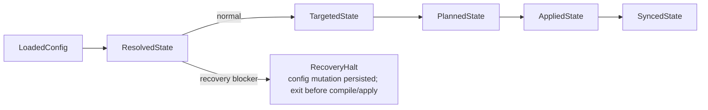

# Sync Model

`mars sync` runs the full package pipeline: load config, resolve, target, plan,
apply, and sync managed targets. Each phase produces a typed handoff struct.
Individual writes are atomic and the sync lock serializes runs, but the whole
cycle is not a transaction with rollback. Durable intent makes new canonical
writes recoverable across partial apply, while native/config writes remain
outside that recovery boundary. Completed unchanged runs converge in managed
bytes and ownership state; this does not promise stable mtimes for every
generated or staging path.

Top-level entry: `sync::execute()` in `src/sync/mod.rs` lines 132–140.

## Phase Structs



| Struct | Produced by | Contains |
|---|---|---|
| `LoadedConfig` | `load_config()` | Parsed `mars.toml`, old lock, mutations, sync lock |
| `ResolvedState` | resolver | Version-pinned dependency graph |
| `TargetedState` | targeting layer | Compiler plan for all target directories |
| `PlannedState` | `sync/plan.rs` | Diff-based action list per item |
| `AppliedState` | `sync/apply.rs` | File operations completed, outcomes recorded |
| `SyncedState` | `target_sync` | Native target dirs updated, lock written |

`SyncRequest` carries the resolution mode (normal, maximize, frozen), optional
config mutation, and sync options (`src/sync/mod.rs` lines 59–81). `SyncReport`
includes `engine_fallbacks`: a list of sources where engine requirements caused
version fallback, each recording the skipped versions with their requirements,
the final selected version, and which engines triggered the fallback. This list
is reconciled against the completed `ResolvedGraph` to prune moot entries.

### Recovery Halt

Recovery commands may persist their requested config mutation and then return a
`RecoveryHalt` when resolution finds a removed-schema hook surface that cannot
be read. This branch exits before compiler, apply, target, and lock writes. The
halt carries the persisted mutations, blockers, and next step. Strict `sync` is
the only materializer; recovery never treats unreadable owned state as absence.

## Diff Classification

The diff phase (`src/sync/diff.rs`) compares the current planned state against
the installed state from `mars.lock`. Each item receives one of six
classifications:

| Classification | Condition |
|---|---|
| `Add` | Item is new — not in prior lock |
| `Update` | Item changed — content hash differs |
| `Unchanged` | Content hash matches lock |
| `Conflict` | Item changed upstream AND locally modified |
| `Orphan` | Item was in prior lock but is absent from current graph |
| `LocalModified` | On-disk content differs from the lock's installed hash |

Local modification detection uses dual checksums: the lock stores both the
content hash at install time and the on-disk hash at last check. If they
diverge, the item is flagged as `LocalModified` and protected from overwrite
unless `--force` is passed.

## Plan → Apply

`sync/plan.rs` maps each diff classification to an action:

| Diff state | Action (normal) | Action with --force |
|---|---|---|
| `Add` | Install | Install |
| `Update` | Overwrite | Overwrite |
| `Unchanged` | Skip | Skip |
| `Conflict` | Overwrite + `conflict-overwrite` warning | Overwrite |
| `Orphan` | Remove | Remove |
| `LocalModified` | Keep-local + warn | Overwrite |

`sync/apply.rs` executes the actions:

| Action | Operation |
|---|---|
| Install | Atomic copy (tmp+rename) |
| Overwrite | Atomic copy (tmp+rename) |
| Remove | Safe removal |
| Skip | No-op |
| Keep-local | No-op, records warning |

All file operations use atomic primitives (tmp+rename).

## Config Mutations

`sync/mutation.rs` handles in-place config changes under sync lock:

- Batch upserts (add/update dependencies)
- Removes
- Overrides
- Rename rules

Mutations are applied to `mars.toml` before resolution runs, so the resolved
graph reflects the post-mutation config. Writes are atomic and round-trip
checked.

## Lock File and Provenance

`mars.lock` is the authority on installed state. It is schema v3, keyed by
logical item identity (`kind/name`). Each item carries one or more output
records scoped by `(target_root, dest_path)` with an explicit lifecycle state:

```toml
version = 3

[items."agent/coder"]
source = "meridian-base"
source_checksum = "sha256:src..."

[[items."agent/coder".outputs]]
target_root = ".mars"
dest_path = "agents/coder.md"
state = "installed"
installed_checksum = "sha256:inst..."

[[items."agent/coder".outputs]]
target_root = ".claude"
dest_path = "agents/coder.md"
state = "installed"
installed_checksum = "sha256:claude..."

[config_entries.".claude"]
"hook:SessionStart:audit" = { emitted_json = "[...]" }
"mcp:some-server" = {}
```

The `items` section is the ownership registry: per-output lifecycle claims
keyed by `(target_root, dest_path)`. `state = "installed"` asserts content
at the path; `state = "pending-deletion"` asserts only retry-deletion
authority with no checksum. The `config_entries` section records provenance
for installed MCP and hook entries, with `emitted_json` carrying the exact
emitted bytes for structural removal.

On each sync, `lock::build()` reconstructs the lock from the resolved graph
plus apply outcomes. Skipped and kept-local items are carried forward
unchanged.

Lock writes are always atomic. Legacy v2 lock files are promoted at read
time by consulting disk state: a regular file or directory with a matching
checksum becomes `installed`; an absent, non-file, unreadable, or mismatched
path becomes `pending-deletion`. v1 locks are unsupported. The v2 promotion
preserves legacy config-entry records needed by the one-release #130 hook
sweep; delete the promotion after that sweep lands.

### Pending canonical writes

`.mars/pending-canonical.json` is a versioned write-intent journal, not a lock
or ownership registry. Immediately before apply, Mars records each planned new
canonical output that was absent, including its expected installed checksum and
provenance. The journal is bound to the checksum of the exact pre-write
`mars.lock` bytes, or to the fact that no lock existed.

During the next load, before current-package source selection, Mars validates
the journal under the sync lock. Its `outputs` map is keyed by physical
`DestPath`; each destination has at most a verified-current and planned version.
It recovers a path into the in-memory lock only when the lock binding still
matches and the output has the recorded bytes, expected file/directory shape,
and no symlink in its ancestors or content tree. Shared read/write validation
checks path identity and kind, preserves hook target scope, and permits valid
custom dependency destinations. Published lock claims take precedence over
residue from a crash between lock publication and journal cleanup. Changed
bytes, links, changed lock state, or malformed identity fail closed.

Recovery is not published early. The retry journal keeps at most the verified
current version and its planned replacement; `mars.lock` changes only during
normal finalization, then the journal is removed. This ordering preserves exact
corrupt-lock evidence if repair fails repeatedly. A no-op run creates no
journal, while dry-run and resolution failure do not publish new intent.
`--frozen` refuses recovered claims that are not yet published, including an
all-`Skip` plan, because unchanged output bytes do not make ownership committed.

Repeated interrupted destination moves may leave several physical claims for
one logical item. Recovery validates each path using its exact journaled
provenance, then merges every verified physical claim into the logical lock
item. Old claims remain authoritative until removal succeeds. Both the
temporary ownership view used for native emission and final lock construction
apply canonical removals by physical path after carry-forward and upserts. A
removed obsolete destination cannot erase other canonical or native outputs on
the logical item, and a later `Skip` or `Keep` cannot resurrect it. A recovered
installed record replaces, rather than accompanies, a same-path
pending-deletion record.

The journal path is reserved before config or output mutation. Plan validation
rejects a canonical file, descendant, directory, or effective bootstrap root
that equals, contains, or falls beneath `pending-canonical.json`. This preflight
also runs for dry-run requests: dry run does not publish intent, but it cannot
approve a plan that would overwrite recovery evidence when applied. ASCII case
variants and trailing-dot/space aliases are reserved on every platform. The
rule preserves checkout portability to case-insensitive and Win32 filesystems;
its verification is a portable CLI contract, not a Windows runtime claim.

The journal covers new canonical outputs only. It does not cover native target
or config writes, and it cannot authorize recovery for crashes that predate the
journal. It also does not establish power-loss durability. Those boundaries remain tracked in
[mars-agents issue #149](https://github.com/haowjy/mars-agents/issues/149).

`LockIndex` is a fast lookup overlay for repeated dest-path queries during
the diff phase, with both target-scoped and broad unscoped methods.

## Rename and Rewrite Pass

After unmanaged-collision pruning, `sync/rewrite.rs` builds one `RenameIndex`
from explicit config renames and automatic collision renames, then applies a
single rewrite pass per agent. Each agent's `skills:` and `subagents:`
frontmatter is rewritten in one content update — no double-rewrite.

Resolution for which renamed variant to wire into an agent:
1. Same-source copy wins (the agent's own source)
2. If the agent's source still owns an unrenamed copy, the ref is left alone
3. Otherwise fall back to mars.toml declaration order (not `graph.order`,
   which is alphabetical)

After rewriting, `sync/validate.rs` checks config-side name references
(`[settings.meridian.fanout].agents`, `[agents.<name>]`, `[skills.<name>]`)
against installed names and emits a `config-rename-dangle` warning when a
referenced name was renamed away. See
[decisions/package-management.md#D88](../../decisions/package-management.md)
and
[#D89](../../decisions/package-management.md)
for the policy rationale.

### Current-package self overlay

When the project declares `[package]`, its selected agents and skills enter the
target set after dependency renames. `.mars-src` has already won matching self
definitions before staging. Self therefore overlays only matching installed
destinations and does not undo explicit or automatic dependency renames. See
[self-source-selection.md](self-source-selection.md) for the full selection
contract.

An unowned canonical destination blocks a selected self item before apply,
including with identical bytes or `--force`; the user must relocate it rather
than have Mars adopt it. If a managed destination changes source but retains
identical bytes, it is classified as `Update` only while disk still matches the
old lock. This records the new owner and carries native claims forward without
overwriting a local-only modification.

Self items are staged before this ownership guard. A refusal can therefore
refresh derived `.mars/staging` content while leaving canonical outputs, native
outputs, and the lock unapplied. This is not a rollback guarantee.
If partial apply leaves a new canonical self output without final ownership,
valid pending-canonical intent lets an ordinary retry recover it before this
guard. Without matching intent, `--force` does not bypass the guard: inspect and
relocate every blocked destination, then retry or repair.

## Sync Modes

| Flag | Behavior |
|---|---|
| (default) | MVS version selection, replay locked commits; models.dev catalog **Auto** + probe **Background** |
| `--force` | Overwrite locally-modified files |
| `--diff` | Report planned installed-state changes without applying canonical/native outputs or finalizing `mars.lock` |
| `--frozen` | Do not fetch new versions; fail if lock is insufficient or pending recovery would publish ownership |
| `--refresh-models` | Force models.dev catalog refresh; run harness probes **synchronously** (no background `__refresh-probe` on stale cache) |
| `--no-refresh-models` | Disk-only catalog (`RefreshMode::Offline`); probe **Skip** (stale probe JSON still used when present) |
| `--ignore-requires-mars` | Skip package `requires-mars` compatibility checks |
| `--ignore-requires-meridian` | Skip package `requires-meridian` compatibility checks |

`--frozen` is the right mode for CI builds where reproducibility is required.

Dry-run, frozen, and export-style resolution are not guaranteed to be
filesystem-write-free. They may create `.mars/sync.lock` and refresh derived
`.mars/staging` content even when canonical/native outputs and `mars.lock`
remain unchanged.

The `--ignore-requires-*` flags are available on `sync`, `upgrade`, `add`, and
`repair`. They emit a single warning noting the check is disabled.

Model/probe refresh uses the same **`ModelsRefreshControl`** as `mars models list|resolve`
and `mars build launch-bundle`. Full matrix: [../../architecture/mars-model-refresh.md](../../architecture/mars-model-refresh.md).

## Filter Pass

`sync/filter.rs` applies the include/exclude/only-agent/only-skill modes from
each dependency declaration. Agents passing an include filter also pull their
declared skill dependencies transitively. Filter resolution runs before the diff
phase.

## Sync Lock

`load_config()` acquires a sync lock (file lock via `fcntl.flock` on POSIX,
`LockFileEx` on Windows) before any state modification. Concurrent `mars sync`
invocations block rather than racing. The lock is held for the duration of the
sync and released on completion or crash.

## Invariants

- **I-1: Atomic writes** — every file write is tmp+rename; partial writes do not
  corrupt state.
- **I-2: Lock guards concurrency** — only one sync runs at a time per project root.
- **I-3: Idempotent** — syncing twice with no source changes produces identical
  output and no warnings.
- **I-4: Local-only modifications are preserved by default** — `LocalModified`
  items are kept unless `--force` is passed. A `Conflict` means source and local
  both changed; source wins even without force and Mars warns before overwrite.
- **I-5: Orphan cleanup** — items that were installed in a prior sync but removed
  from the current graph are removed from both `.mars/` and native target dirs.
- **I-6: v3 lock is always written** — v2 is promoted at read time by
  consulting disk state; v1 is unsupported. Any write produces v3.
- **I-7: Canonical self ownership is explicit** — selected self content never
  adopts an unowned `.mars` destination from disk bytes alone, even under
  force. Recovery requires matching pre-write intent bound to the prior lock.
  Native target collision policy remains independent.
- **I-8: The lock publishes only at finalization** — canonical recovery is
  reconstructed in memory; failed apply or repair does not checkpoint
  `mars.lock` and therefore preserves corrupt lock evidence.

## Key References

- Top-level entry: `src/sync/mod.rs` lines 132–140
- Phase structs: `src/sync/mod.rs` lines 83–130
- Diff classification: `src/sync/diff.rs`
- Plan mapping: `src/sync/plan.rs`
- Apply operations: `src/sync/apply.rs`
- Config mutations: `src/sync/mutation.rs`
- Filter pass: `src/sync/filter.rs`
- Skill rewrite: `src/sync/rewrite.rs`
- Lock build: `src/lock/mod.rs`
- Lock index: `src/lock/mod.rs` (`LockIndex`)
- Canonical write recovery: `src/sync/recovery.rs`
- Surface ownership: `src/surface_ownership/mod.rs`, `src/surface_ownership/retention.rs`

## Related

- [compiler-pipeline.md](compiler-pipeline.md) — what runs during the compile phase
- [targeting.md](targeting.md) — how the apply outputs are projected to harness dirs
- [resolution-algorithm.md](resolution-algorithm.md) — how the ResolvedState is produced
- [self-source-selection.md](self-source-selection.md) — how current-package inputs enter the target set
- [decisions/package-management.md](../../decisions/package-management.md) — why sync is manual, why the lock extends to config-entry provenance
- [../../architecture/mars-model-refresh.md](../../architecture/mars-model-refresh.md) — `ensure_fresh`, `ProbeRefreshMode`, refresh flags on sync
