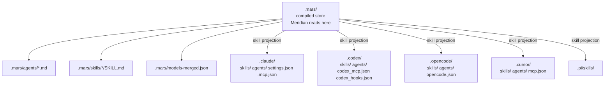
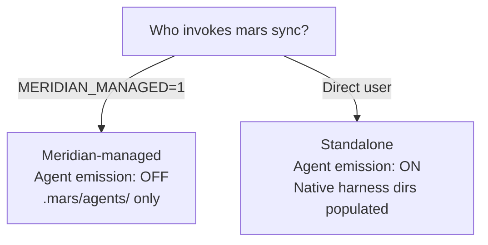

# Targeting

Targeting is how mars decides where compiled content lands. After the compiler
produces agent profiles, skill files, MCP entries, and hook entries, the
targeting layer copies that content from the `.mars/` canonical store into each
harness's native directories.

This page describes the emission model — what goes where and why. For the
concrete adapter implementations, see [architecture/mars-targeting.md](../../architecture/mars-targeting.md).

## Layout



**Three invariants:**

- `.mars/` is mars-owned compiled output. Only mars writes it. Meridian reads it.
- Every enabled harness's native skill directory gets a full projection of all
  enabled skills.
- Native agent emission to harness dirs is conditional — off when Meridian is
  managing the project.

## The TargetAdapter Model

Each harness is represented by a `TargetAdapter` implementation
(`src/target/mod.rs` lines 97–156). Adapters are registered once in
`TargetRegistry`; adding a new harness target means implementing the trait and
registering it.

Built-in adapters:

| Adapter | Target dir |
|---|---|
| `.agents` | `.agents/` (legacy, deprecated) |
| `.claude` | `.claude/` |
| `.codex` | `.codex/` |
| `.opencode` | `.opencode/` |
| `.pi` | `.pi/` |
| `.cursor` | `.cursor/` |

Each adapter knows its target root, file naming conventions, and how to lower
mars-compiled content into harness-native format.

## Skill Projection

Every enabled skill is lowered from the universal `.mars/skills/<name>/SKILL.md`
schema and written to `.<harness>/skills/<name>/SKILL.md` for each registered
harness. The lowering step translates universal skill frontmatter into
harness-specific frontmatter, preserving or dropping fields as each harness
requires.

Skills are projected to all harnesses, not routed to specific ones. The disk
cost is negligible (skill files are Markdown), and the architecture avoids the
overlap problem that arose with shared skill directories. See [decisions/package-management.md](../../decisions/package-management.md)
for why shared directories were rejected.

Optional skill variants (`skills/<name>/variants/<harness>/<model>/SKILL.md`)
provide harness- or model-specific overrides. The variant index is built during
compilation (`src/compiler/variants.rs`) and the appropriate variant is selected
during projection.

## Conditional Agent Emission

Agent profiles can also be emitted to harness native agent directories, but
this is context-dependent:



When Meridian invokes `mars sync` via `meridian mars sync`, it sets
`MERIDIAN_MANAGED=1`. Mars detects this and sets effective `agent_emission` to
`Never`, suppressing all native agent emission. Meridian owns routing — it reads
from `.mars/agents/` and selects the harness per spawn.

When users invoke `mars sync` directly (no Meridian), native agent emission
defaults to `On`. The harness's native agent catalog becomes the agent catalog.

Override in `mars.toml`:

```toml
[settings]
agent_emission = "auto"    # default: detect MERIDIAN_MANAGED
# agent_emission = "always"  # always emit
# agent_emission = "never"   # never emit
```

## Per-Harness Config: MCP and Hooks

MCP server and hook entries are compiled into harness-specific config files:

| Harness | MCP location | Hook location |
|---|---|---|
| Claude | `.mcp.json` (project root) | `.claude/settings.json hooks` |
| Codex | `.codex/config.toml [mcp_servers.*]` | `.codex/config.toml [hooks]` |
| OpenCode | `opencode.json mcp.<name>` | Plugin API (TypeScript) — mars warns, skips |
| Cursor | `.cursor/mcp.json` | No public hook API — mars warns, skips |
| Pi | N/A | Extension API — mars warns, skips |

Mars manages its entries in these files without touching user-managed entries
(append-and-lock approach). Stale entries from removed packages are cleaned up
via lock provenance — see [sync-model.md](sync-model.md).

## Native Agent Formats (When Emission Is On)

When agent emission is active, each adapter lowers the universal agent profile
to its harness-native format:

| Harness | Format | Output path |
|---|---|---|
| Claude | YAML frontmatter + Markdown body | `.claude/agents/<name>.md` |
| Codex | TOML (name, description, model, sandbox, instructions) | `.codex/agents/<name>.toml` |
| OpenCode | YAML frontmatter + Markdown body | `.opencode/agents/<name>.md` |
| Cursor | Markdown (schema evolving) | `.cursor/agents/<name>.md` |
| Pi | No first-class agent profiles | Skipped |

## .agents/ Deprecation

The `.agents/` target is deprecated. Existing repos with `.agents/` as a link
target see a deprecation warning on `mars sync`. Meridian reads from `.mars/`
first, falling back to `.agents/` during the transition window. Run
`meridian mars sync` once to populate `.mars/`, then migrate `.gitignore`
entries from `.agents/` to `.mars/`.

## Platform Safety

Filename validation runs before any write and rejects Windows-invalid names and
reserved device names (`CON`, `NUL`, `PRN`, etc.) on all platforms —
cross-platform safety is enforced uniformly, not conditionally.
Cross-platform hook command quoting is handled centrally in `src/target/mod.rs`.

## Invariants

- **I-1: .mars/ is write-once-per-sync** — only mars writes it; Meridian reads it.
- **I-2: Target sync is per-target non-fatal** — a failure for one harness does
  not abort others.
- **I-3: Orphan cleanup** — items present in the previous managed state but
  absent from the current apply outcomes are removed from target dirs.
- **I-4: Skill projection is total** — all enabled skills go to all enabled
  harness targets, no partial routing.

## Key References

- `TargetAdapter` trait: `src/target/mod.rs` lines 97–156
- Adapter registration: `src/target/mod.rs` lines 158–203
- Cross-platform quoting: `src/target/mod.rs` lines 205–218
- Filename validation: `src/target/mod.rs` lines 220–251
- Claude adapter: `src/target/claude.rs`
- Codex adapter: `src/target/codex.rs`
- OpenCode adapter: `src/target/opencode.rs`
- Cursor adapter: `src/target/cursor.rs`
- Target sync: `src/target_sync/mod.rs`

## Related

- [compiler-pipeline.md](compiler-pipeline.md) — what the compiler produces before targeting
- [sync-model.md](sync-model.md) — how target sync fits in the apply cycle
- [architecture/mars-targeting.md](../../architecture/mars-targeting.md) — targeting architecture: why .agents/ was eliminated, full layout rationale
- [concepts/skill-schema.md](../skill-schema.md) — universal skill frontmatter and variant model
- [decisions/package-management.md](../../decisions/package-management.md) — why skill duplication is intentional, why conditional agent emission
