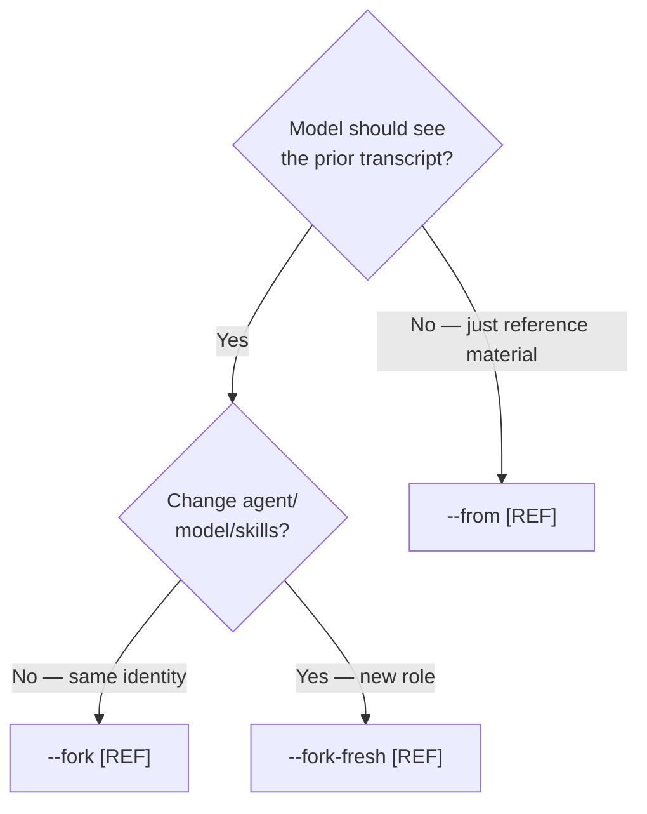

# Session Initiation Modes

Every Meridian session — spawn or primary — is initiated in one of four modes.
The mode controls whether transcript lineage is inherited from a prior session,
whether the agent identity can change, and how prior context is delivered to the
new session.

Understanding these modes is foundational for writing spawn orchestration and
for understanding why certain combinations of flags are rejected.

---

## The Four Modes

| Mode | Transcript lineage | Identity | Prior context delivery |
|------|-------------------|----------|----------------------|
| `--continue [REF]` | Resume same session in-place | Same (unchanged) | Not applicable — no new turn |
| `--fork [REF]` | Fork prior transcript | Locked (inherited from source) | None — transcript already carries it |
| `--fork-fresh [REF]` | Fork prior transcript | May override (`-a`/`-m`/`--skills`) | None — transcript already carries it |
| `--from [REF]` | None — fresh session | Fully user-controlled | Rendered into user-turn context blocks |

### `--continue [REF]`

Resume the same harness session in-place. The harness picks up exactly where it
left off — same identity, same transcript, same state. No new Meridian-rendered
content. The next turn comes from interactive input or the next spawn task.

Use when: resuming interrupted work on the same session.

### `--fork [REF]`

Branch the harness session. The forked session inherits the full prior transcript
(the harness loads it; Meridian does not compose or modify it). Agent, model, and
skills are locked to the source — `-a`, `-m`, and `--skills` are rejected.

Task-scoped overrides are allowed: `--goal`, `-f`, `--prompt-var`, `--work`,
`-p`/`--prompt-file`.

Use when: exploring a different task direction on an existing conversation, or
handing off a task continuation to the same agent type.

### `--fork-fresh [REF]`

Branch the harness session with identity changes allowed. `-a`, `-m`, and
`--skills` may override source values. When none are specified, behavior is
identical to `--fork`.

Use when: handing off mid-conversation to a different role (e.g., coder → reviewer)
while the model should still see the full prior conversation.

**Cache implication:** When identity overrides are present, the system prompt
changes, so the harness prompt cache cannot warm from the forked prefix. The
transcript lineage is still forked (the model sees the prior conversation), but
the cache prefix is invalidated.

### `--from [REF]`

Start a completely new session. No harness transcript lineage. Prior context from
the referenced spawn or session is rendered into the user turn as structured
reference material — evidence the agent evaluates, not instructions it obeys.

Use when: seeding a fresh session with findings or outputs from a prior one, without
conversation continuity.

---

## Decision Tree



---

## Four-Layer Content Composition

Every session launch assembles content across four layers, ordered from most
stable (best prompt cache hit) to most volatile:

```
Layer 1: SystemInstruction
  Agent identity: profile body, skills, runtime instructions,
  context dirs, passthrough system fragments.
  Completion goal / report contract (spawn runs only).
  Stable across launches with the same agent/model/skills.

Layer 2: Harness transcript lineage
  The harness's own conversation history, loaded via session
  resume or fork. Invisible to Meridian — the harness loads it
  from its own storage.
  Present in: --continue, --fork, --fork-fresh.
  Absent in: --from, fresh sessions.

Layer 3: UserTurn.context_blocks
  Meridian-rendered user-turn material: -f file refs, --from
  prior-context blocks (wrapped in <prior-spawn-context> tags).
  Ordering: -f refs first, then --from blocks.
  Channel: user turn (never system prompt).

Layer 4: UserTurn.current_request
  The prompt text: -p / --prompt-file / interactive first turn.
  Always the final user-turn item.
```

### Why Layer 3 is user-turn, not system prompt

Four reasons, each independently sufficient:

1. **Prompt injection defense.** Prior spawn reports may contain user-generated
   content or tool outputs. System prompt injection grants implicit authority
   status. User-turn placement means the model evaluates the content as evidence,
   not as instructions to obey.

2. **Prompt cache locality.** The system prompt fingerprint determines the prompt
   cache key. Variable prior-context in the system prompt destroys cross-session
   cache sharing for sessions that have the same agent identity. User-turn
   injection preserves the stable system-prompt prefix.

3. **Harness consistency.** `--append-system-prompt` is reserved for agent
   identity material (skills, profile, inventory, report instructions). The
   user-turn channel works consistently across Claude, Codex, and OpenCode;
   the system-prompt channel does not.

4. **Semantic consistency with `-f`.** File references (`-f`) go in user-turn
   context blocks. `--from` prior context is structurally the same kind of
   reference material. Same channel, same semantics.

The completion goal (`--goal`) and report contract are the exception — they are
authoritative stopping conditions set by Meridian (not prior agent output) and
belong in Layer 1 (SystemInstruction).

---

## Identity Lock: `--fork` vs `--fork-fresh`

`--fork` rejects `-a`, `-m`, and `--skills` with the error:
> `--fork preserves launch identity. Use --fork-fresh to change agent, model, or skills.`

**Why the split exists:**
Agent, model, and skills determine the system prompt fingerprint — the dominant
factor in prompt cache locality. `--fork` guarantees that the identity-shaping
inputs are unchanged, so the harness cache can warm from the shared prefix.
`--fork-fresh` allows identity changes but cannot guarantee cache warmth.

**What `--fork` does allow (task-scoped overrides):**
`--goal`, `-f`, `--prompt-var`, `--work`, `-p`/`--prompt-file`. These change
task-scoped content within a preserved identity — the profile name, model, and
skill set remain the same even when `--prompt-var` substitutes into the profile
body.

**Why enforcement is CLI-only, not ops-layer:**
`SpawnForkInput` already handles both identity-preserving and identity-changing
forks. The ops layer doesn't need to enforce which CLI mode was chosen. Non-CLI
callers (MCP, programmatic) may have legitimate reasons to fork with identity
changes.

---

## Bare Flag Inference

All three optional-ref flags default to `$MERIDIAN_SPAWN_ID` when no REF is given:

| Flag | Bare form | Resolved to |
|------|-----------|-------------|
| `--fork` | `--fork` (no REF) | `$MERIDIAN_SPAWN_ID` |
| `--fork-fresh` | `--fork-fresh` (no REF) | `$MERIDIAN_SPAWN_ID` |
| `--from` | `--from` (no REF) | `$MERIDIAN_SPAWN_ID` |

If `MERIDIAN_SPAWN_ID` is not set, fails with:
> `Cannot infer {flag} target: not inside a Meridian-managed session. Pass {flag} REF explicitly.`

`$MERIDIAN_CHAT_ID` is available as an explicit ref when session-level context is
wanted instead of spawn-level context.

### Argv normalization: how bare flags work with Cyclopts

Cyclopts requires a value token for `str | None` parameters. Bare `--fork`
(without a ref) would cause a parse error.

**Solution:** Pre-Cyclopts argv normalization (`normalize_optional_value_flags()`
in `cli/argv_normalization.py`), which runs before bootstrap parsing and Cyclopts
dispatch. Bare forms are rewritten to insert a sentinel token:

- `--fork` → `--fork __SELF__`
- `--fork=` → `--fork __SELF__`
- `--fork=p123` → `--fork p123`
- `--fork-fresh -a x` → `--fork-fresh __SELF__ -a x`

**Sentinel:** `SELF_FORK_REF_SENTINEL = "__SELF__"`. Not a valid spawn ref (`pN`),
chat ref (`cN`), or UUID. Bootstrap uses `SYNTHETIC_VALUE_TOKENS` to detect and
skip synthetic values. `resolve_optional_ref(raw_ref, flag_name)` maps sentinel
to `MERIDIAN_SPAWN_ID` or raises with the flag-specific error message.

**Applies to both surfaces:** spawn (`meridian spawn --fork`) and primary
(`meridian --fork`). The normalization runs in the CLI entry point in `main.py`
before any parsing.

---

## Mutual Exclusion Matrix

| Combination | Allowed? |
|-------------|----------|
| `--fork` + `--fork-fresh` | No — two fork modes |
| `--fork` + `--continue` | No — fork branches; continue resumes |
| `--fork-fresh` + `--continue` | No |
| `--from` + `--continue` | No — injecting context into a resumed session is incoherent |
| `--from` + `--fork` | No (MVP) — see below |
| `--from` + `--fork-fresh` | No (MVP) — see below |
| `--from` + `-a`/`-m`/`--skills` | **Yes** — `--from` imposes no identity constraints |
| `--from` + `-f` | **Yes** — additive; file refs and prior-context blocks are complementary |

### Why `--from` + fork is rejected

`--fork` already carries the full prior transcript (Layer 2). Adding `--from` on
top means the model sees the same context twice — once as lived transcript, once
as rendered reference. This is redundant and creates ambiguous ordering between
the transcript (harness-managed, Meridian-invisible) and the `--from` blocks
(Meridian-rendered, user-turn).

If you need a forked conversation plus external context from a third spawn, pass
it via `-f`. File references compose cleanly with fork without semantic overlap
with transcript lineage.

---

## Surface Coverage

All four modes apply to both surfaces:

| Surface | `--continue` | `--fork` | `--fork-fresh` | `--from` |
|---------|-------------|----------|----------------|----------|
| `meridian spawn` | Yes | Yes | Yes | Yes (repeatable: multiple `--from` refs allowed) |
| `meridian` (primary) | Yes | Yes | Yes | Yes (single ref) |

---

## Implementation Seam

The shared user-turn context resolution seam lives in `launch/context.py`:

```python
resolve_task_context_inputs(
    context_from: tuple[str, ...],
    reference_files: tuple[str, ...],
    project_root: Path,
) -> TaskContextInputs
```

Both `_resolve_spawn_prepare_projection()` and `_resolve_primary_projection()` call
it. These two functions are **not** unified — they keep their respective surface
differences. Only the user-turn context resolution (file refs + `--from`
prior output + sanitization) is shared.

`sanitize_prior_output()` provides defense-in-depth by escaping content that could
look like Meridian structural markers, but user-turn placement is the primary trust
boundary.

---

## Related Pages

- [composition-pipeline.md](composition-pipeline.md) — how `ComposedLaunchContent` and `ProjectedContent` work; where the user-turn channel is materialized per harness
- [../decisions/launch.md](../decisions/launch.md) — identity-lock and argv-normalization decision rationale
- [../architecture/launch-system.md](../architecture/launch-system.md) — `build_launch_context()` as the sole composition seam; `resolve_task_context_inputs` placement
- [../architecture/claude-session-isolation.md](../architecture/claude-session-isolation.md) — how `--continue` and `--fork` work at the Claude harness level
- [../decisions/session-reference-resolution.md](../decisions/session-reference-resolution.md) — how spawn/chat/session IDs are resolved for `--from`/`--fork`/`--continue`
