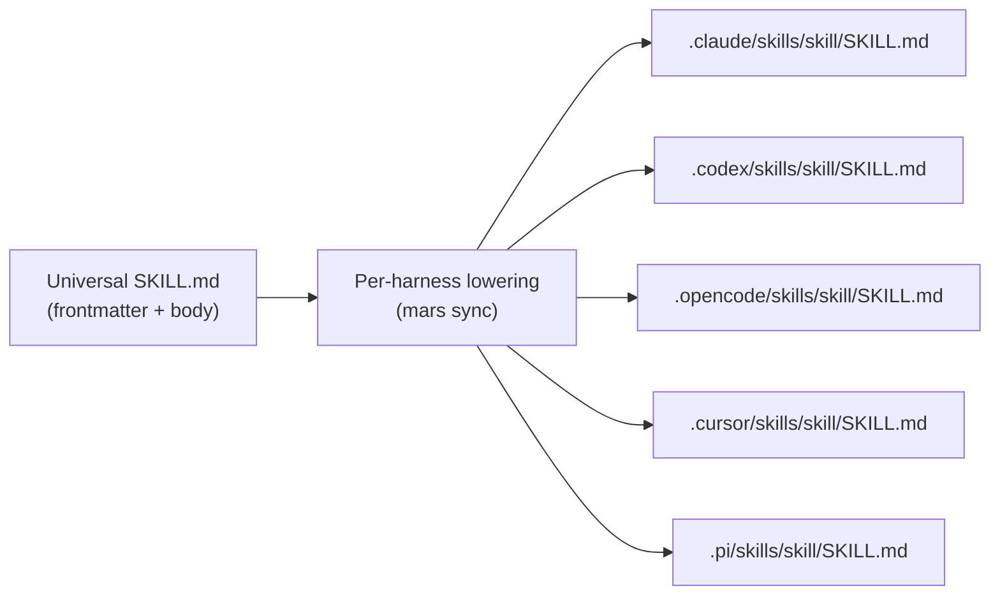
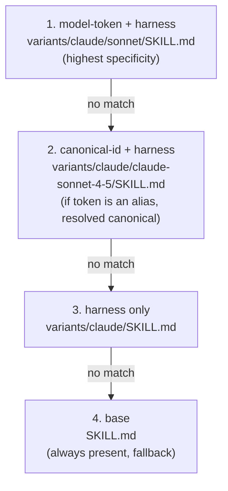

# Skill Schema, Variants, and Per-Harness Lowering

This page covers three related concepts:

1. **Universal skill frontmatter** — the common schema that every SKILL.md uses,
   independent of harness
2. **Per-harness lowering** — how the universal schema is projected to each
   harness's native format on sync
3. **Skill variants** — how a single skill name can have harness- or model-
   specific override versions selected at launch time

---

## Universal Skill Frontmatter Schema

Every SKILL.md carries a YAML frontmatter block. The schema is harness-agnostic:

```yaml
---
name: my-skill                    # canonical short name (required)
description: >                    # one-liner shown in skill catalog (required)
  What the skill does.
model-invocable: false            # can the model self-load this skill? (default: true)
user-invocable: false             # can the user trigger it with /name? (default: true)
allowed-tools:                    # tool allowlist injected on skill load (optional)
  - Bash
  - Read
  - Write
license: Apache-2.0               # SPDX identifier (optional)
metadata:                         # free-form pass-through block (optional)
  author: acme-team
  version: 1.2.0
  custom-field: any-value
---

Skill body content here...
```

**Fields:**

| Field | Required | Default | Meaning |
|---|---|---|---|
| `name` | Yes | — | Canonical identifier; must be unique in the package |
| `description` | Yes | — | Short description for catalogs and help text |
| `model-invocable` | No | `true` | Whether the model can see this skill and decide to load it |
| `user-invocable` | No | `true` | Whether the user can trigger it with `/name` |
| `allowed-tools` | No | — | Tool names Meridian injects as allowed when loading this skill |
| `license` | No | — | SPDX license identifier; propagated to skill catalogs |
| `metadata` | No | — | Arbitrary key-value data — pass-through everywhere |

**Invocability is two orthogonal dimensions, not one enum.** Before this schema,
a single `invocation: explicit | implicit` field collapsed two independent concerns.
Every harness (Claude, Codex, OpenCode, Pi, Cursor) independently controls
model-invocability and user-invocability. The two-boolean representation matches
what harnesses actually support. See [decisions.md](../decisions.md) — D71.

**Both default to `true`.** A skill without these fields is fully invocable.
To restrict a skill to explicit use only, set `model-invocable: false`; to
prevent slash-command triggering, set `user-invocable: false`. Both false is
valid: the skill is present (loadable by the agent profile) but neither dimension
can trigger it autonomously — useful for skills injected by `skills:` that the
agent should only use when directed.

**Presence is not a skill property.** Whether a skill is loaded at boot is
determined by the agent profile's `skills:` list, not by skill-level metadata.
A skill in the `skills:` array is loaded at boot; one not listed is discoverable
on-demand (subject to the two invocability booleans).

**Legacy fields are hard errors.** The old `invocation:`, `disable-model-invocation`,
and `allow_implicit_invocation` fields emit a `RemovedField` error diagnostic and
are ignored. Skill authors must migrate:

```yaml
# Old                              New
invocation: explicit          →    model-invocable: false
invocation: implicit          →    (remove — both default true)
disable-model-invocation: true →   model-invocable: false
allow_implicit_invocation: false → model-invocable: false
```

`user-invocable: false` has no old equivalent — it's a new capability.

---

## metadata: Pass-Through Semantics

`metadata` is a free-form YAML mapping. No consumer validates or acts on
its keys — it is pure pass-through:

- **Meridian** includes it verbatim in compiled skill metadata (catalog listing,
  `meridian mars list --json` output). Agents can read it.
- **Harness adapters** ignore unknown frontmatter fields. A skill with
  `metadata.custom-field` emits cleanly to `.claude/skills/`, `.codex/skills/`,
  etc., without errors.
- **Mars** records it in the lock file's content hash but does not interpret it.

---

## Per-Harness Lowering

On `mars sync`, each skill in `.mars/skills/*/SKILL.md` is emitted to every
enabled harness's native skill directory. The emission is not a simple file
copy — it goes through a **lowering step** that projects the universal schema
to each harness's expected format.

**Invocability compilation matrix:**

| Source field | Claude | Codex | OpenCode | Pi | Cursor |
|---|---|---|---|---|---|
| `model-invocable: false` | `disable-model-invocation: true` | `allow_implicit_invocation: false` | dropped (lossiness) | `disable-model-invocation: true` | `disable-model-invocation: true` |
| `model-invocable: true` | (omit) | (omit or emit when explicit†) | (omit) | (omit) | (omit) |
| `user-invocable: false` | `user-invocable: false` | dropped (lossiness) | dropped (lossiness) | dropped (lossiness) | dropped (lossiness) |
| `user-invocable: true` | (omit) | (omit) | (omit) | (omit) | (omit) |

† Codex emits `allow_implicit_invocation` only when the source frontmatter
explicitly set `model-invocable` (tracked by `had_model_invocable_field`).

**Lossiness model:** When a harness has no native equivalent for a field (e.g.,
Codex has no `user-invocable`), the lowering records a `Dropped` lossiness entry.
These are internal metadata for tooling (`mars validate --verbose`), not
user-visible warnings. Only `Approximate` lossiness entries surface to users.



**Native projections are always refreshed on sync.** Even if the source skill
hasn't changed, every native harness file is re-emitted. If Mars detects that
a native projection has diverged from what sync would produce (e.g., manual
edits in `.claude/skills/`), it emits a divergence warning. This keeps the
single canonical source in `.mars/skills/` authoritative.

**Why always refresh:** The alternative (skip unchanged projections) would
silently leave stale projections after frontmatter format changes or harness
output changes. Staleness would only surface as subtle harness behavior
differences. Always-refresh makes sync idempotent and trustworthy.

---

## Skill Variants

A skill package may ship multiple variants of the same skill — alternate
versions tuned for specific harnesses or models. Variants let one package
serve different runtime contexts without requiring the user to select the
right file manually.

### Variant Directory Convention

```
skills/
  my-skill/
    SKILL.md               # base variant (always required)
    variants/
      claude/
        SKILL.md                       # harness-specific override
        claude-sonnet-4-5/
          SKILL.md                     # canonical-model-specific override
        sonnet/
          SKILL.md                     # requested-token-specific override
      codex/
        SKILL.md
```

The base `SKILL.md` is always required. Variants live under
`variants/<harness>/`. A harness-only override is
`variants/<harness>/SKILL.md`; a model-specific override is
`variants/<harness>/<model-token>/SKILL.md`.

### Specificity Ladder (4 steps)

At launch time, Meridian selects the most-specific variant that matches the
resolved harness and model. Selection is **exact match only** — no fuzzy
matching or glob:



**Step order in detail:**

| Priority | File name pattern | Match condition |
|---|---|---|
| 1 (highest) | `variants/<harness>/<requested-token>/SKILL.md` | Harness matches AND requested model token matches exactly |
| 2 | `variants/<harness>/<canonical-id>/SKILL.md` | Harness matches AND resolved canonical model ID matches |
| 3 | `variants/<harness>/SKILL.md` | Harness matches, any model |
| 4 (fallback) | `SKILL.md` | Always matches |

**"Requested token" vs "canonical ID":** Priority 1 uses the token the user
or profile originally provided (e.g., `sonnet`). Priority 2 uses the resolved
canonical model ID (e.g., `claude-sonnet-4-5`). Both are checked because a
variant author may write `variants/claude/sonnet/SKILL.md` (alias form) or
`variants/claude/claude-sonnet-4-5/SKILL.md` (canonical form) — both should
resolve.

**Why exact match only:** Fuzzy matching (e.g., glob-based `claude-sonnet-*`)
would make variant selection non-deterministic when multiple globs match. Exact
match makes the selected variant predictable and auditable.

### When to Use Variants

Use variants when a skill's behavior must differ across runtimes:
- Claude version uses `allowed-tools: [Bash]`; Codex version omits it because
  Codex has different tool semantics
- Sonnet variant uses a longer context strategy; Haiku variant is condensed
- A skill works only on Claude; the base SKILL.md has a stub explaining this

Don't use variants for minor wording tweaks. Variants add maintenance cost;
use them only when runtime behavior genuinely differs.

---

## Compilation Invariant

`mars sync` emits native projections **always** — it does not use content-hash
optimization to skip unchanged skills. This guarantees that the native harness
dir always reflects the current `.mars/skills/` state after sync. The invariant:

> After `mars sync` completes without errors, every `.{harness}/skills/<skill>/SKILL.md`
> is byte-for-byte identical to what the lowering step would produce from `.mars/skills/<skill>/SKILL.md`.

Divergence between `.mars/skills/` and native dirs is only possible between
sync runs (e.g., from manual edits). `mars check` validates the invariant.

---

## Related Pages

- [package-management/overview.md](package-management/overview.md) — what mars manages, sync workflow
- [bootstrap-docs.md](bootstrap-docs.md) — two-tier bootstrap doc discovery and `meridian bootstrap`
- [../architecture/mars-targeting.md](../architecture/mars-targeting.md) — why skills are emitted to each harness's native dir
- [../decisions.md](../decisions.md) — D58–D63 for specific decisions made during capability-packaging work
