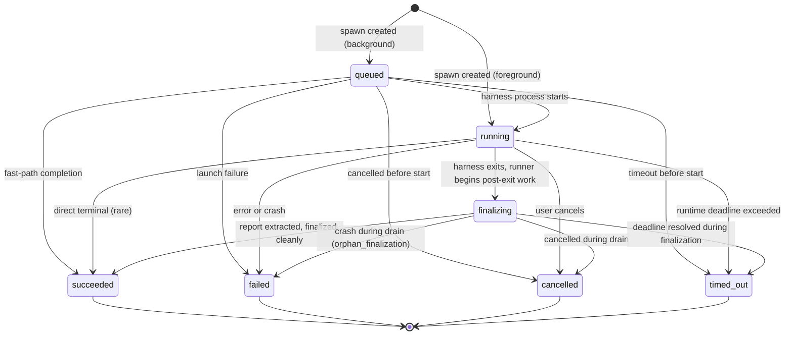
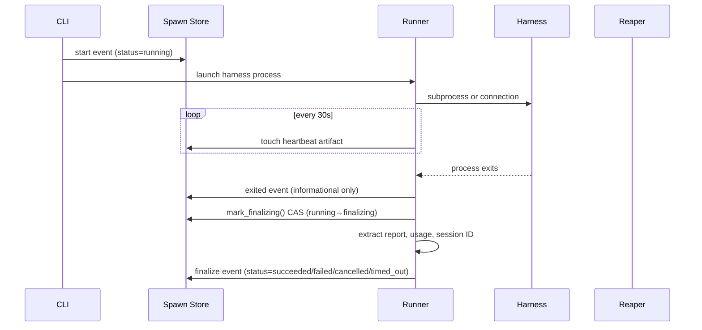

# Spawn Lifecycle

A **spawn** is Meridian's unit of delegated work — a single harness invocation
with a defined start, a prompt, and an eventual terminal state. Every `meridian
spawn` command creates one. Every background subagent is one. The primary
interactive session is one too (kind `"primary"`).

Understanding the spawn lifecycle is foundational: it governs how work is
tracked, how crashes are recovered from, and what observers can rely on.

---

## What a Spawn Is

At its core, a spawn is:

1. A **per-spawn state file** (`spawns/<id>/state.json`) — the authoritative record
2. An **artifact directory** (`spawns/<id>/`) — prompt, output, report, heartbeat
3. A **running harness process** (while active) — Claude, Codex, OpenCode, or Direct

The state file is created before the process launches. It persists after the
process exits. The process itself is ephemeral — the spawn record is durable.

### Primary vs Child

| Kind | Created by | Purpose |
|------|-----------|---------|
| `primary` | `meridian` CLI interactive launch | The user's interactive session |
| `child` | `meridian spawn` command | Delegated subagent work |

Both kinds go through the same lifecycle. The distinction matters for session
management and the top-level chat tree, not for lifecycle semantics.

---

## The Status Machine

### Active Statuses

- **`queued`** — Spawn row exists; harness process not yet started. Occurs for
  background spawns during the setup window, or when the spawn is waiting to
  be claimed by a background worker.
- **`running`** — Harness process is live and doing work. The runner touches
  the `heartbeat` artifact every 30 seconds.
- **`finalizing`** — Harness process has exited; the runner is doing post-exit
  work (extracting the report, recording usage, finalizing the spawn row). This
  is an active state — the runner is still operating. Treat it like `running`
  when polling.

### Terminal Statuses

- **`succeeded`** — Work completed successfully. Report available in
  `report.md`.
- **`failed`** — Work failed. Check `error` field and `stderr.log` for details.
  See [failure error codes](#failure-error-codes) below.
- **`cancelled`** — Spawn was cancelled before or during execution.
- **`timed_out`** — Spawn exceeded its runtime deadline. It is terminal and counts
  as a failure class, but it is not folded into generic `failed`; list/status/stats
  surfaces can distinguish timeouts from other failures.

### Allowed Transitions

Not every path is valid. Key constraint: `queued → finalizing` is **not**
allowed. A queued spawn cancelled before the process starts goes directly to
`cancelled`, not through `finalizing`.

---

## From Request to Terminal State

The journey of a typical foreground spawn:

The `exited` event is **informational only** — it records the raw process exit
code and timestamp for audit purposes, but does not change the spawn's
projected status. A spawn stays `running` (or `finalizing`) until a `finalize`
event arrives. This is why `spawn wait` blocks until finalization, not until
the process exits.

### The `mark_finalizing()` CAS

When the harness exits, the runner calls `mark_finalizing()` — a
compare-and-swap that transitions `running → finalizing` only if the current
status is exactly `running`. This atomic step tells the reaper: "I know the
process is done, I'm doing post-exit work, don't treat this as an orphan yet."

If `mark_finalizing()` fails (the spawn was already cancelled or finalized by
something else), the runner logs it and proceeds to `finalize_spawn()` anyway —
the projection authority rule handles the resulting race.

---

## Crash Recovery: Heartbeat, Projection, Repair

Meridian uses a **crash-only design**: there is no graceful shutdown path. If a
runner process dies mid-flight, readers can recognize the stale state from disk and
repair commands can converge it durably.

### The Heartbeat

The runner touches `spawns/<id>/heartbeat` every 30 seconds while a spawn is
active (both `running` and `finalizing`). This file's modification timestamp is
the reaper's primary liveness signal.

### Read-Time Projection vs Explicit Repair

Ordinary read surfaces — `spawn list`, `spawn show`, `spawn wait`, dashboard — call
read-time reconciliation. They may show a stale active spawn as terminal in the
returned view, but they do not write `state.json`, mark process scopes released, or
send process signals.

Durable orphan repair is explicit. `meridian doctor --kill-orphans` and the
primary-launch background repair path call the mutating reconciliation entry point,
which can finalize stale rows and clean recorded process scopes. Nested processes
still fail closed: a spawn calling `meridian spawn list` cannot reap its own parent.

Both paths use the same liveness decision rules:

**For `running` spawns:**
1. If `runner_pid` is absent and we're outside the 15-second startup grace → orphan
2. If `runner_pid` is alive → skip (still running)
3. If `runner_pid` is dead and no recent artifact activity → orphan
4. Recent activity (any artifact touched in last 120s) → skip (still running)

**For `finalizing` spawns:**
1. Recent heartbeat/activity (last 120s) → skip (still draining)
2. Durable report found → prefer completion evidence
3. Recorded `runner_exit_status` present → use the runner's terminal tuple
4. Cancel intent without completion → finalize as cancelled
5. None of the above → `orphan_finalization`

### Managed Primary Reconciliation

Codex and OpenCode managed primaries have a different process topology from
normal child spawns. The launcher wrapper, backend, and TUI have separate PIDs.
For those spawns, a dead launcher means the Meridian wrapper is unhealthy, but
it does not prove the backend or TUI are dead.

The mutating repair path may finalize such a spawn as `failed` with
`error="orphan_primary"`. The safety boundary is the **skip/finalize**
decision:

- **Skip** decisions (launcher alive, recent activity, startup grace) never send
  signals to the managed backend or TUI.
- **Finalize-as-failed** decisions may terminate tracked backend/TUI runtime
  children as a cleanup safety net, using metadata and PID-reuse guards.

If metadata is missing or corrupt, repair records `orphan_primary` but does not
terminate runtime children beyond any recorded process scopes it can safely clean.
Explicit commands such as `spawn cancel <id>` remain the cleanup path when repair
cannot safely identify runtime-child PIDs.
See [architecture/managed-primary-lifecycle.md](../architecture/managed-primary-lifecycle.md).

### Failure Error Codes

| Code | Meaning |
|------|---------|
| `orphan_run` | Runner PID dead, no recent activity, no durable report. Hard kill or OOM. |
| `orphan_finalization` | Spawn was finalizing; heartbeat went stale, no durable report. Crash during post-exit work. |
| `missing_runner_pid` | No `runner_pid` recorded, outside startup grace. PID never committed. |
| `orphan_primary` | Managed Codex/OpenCode primary launcher died or metadata was missing/corrupt for a managed-primary candidate. Explicit repair records failure; if metadata or recorded scopes safely identify runtime children, finalize-as-failed cleanup may terminate them. |

`orphan_finalization` is more likely to have useful work product than
`orphan_run` — the agent may have produced output even if the runner crashed
during report extraction.

---

## Projection Authority Rule

Multiple writers can attempt to finalize a spawn (the runner, the reaper, a
cancel operation). Meridian resolves races by classifying writers:

- **Authoritative** origins: `runner`, `launcher`, `launch_failure`, `cancel`
- **Reconciler** origins: `reconciler` (the reaper)

The first authoritative finalize wins. A later authoritative write cannot
overwrite an earlier authoritative write. However: **authoritative always
overrides reconciler**. If the reaper stamps a spawn as `orphan_run` but the
runner then reports success (it was briefly network-partitioned), the runner's
write wins — it is strictly more informed.

Metadata (cost, tokens) is merged from all finalize events regardless of
authority. No writer loses its token accounting.

The authority lattice is enforced at two layers:
1. **Under flock** — `spawn_store.finalize_spawn()` calls `decide_terminal_write()` inside the exclusive flock, making the read-decide-write sequence atomic across concurrent processes.
2. **During state mutation** — v2 spawn storage applies the same rule when updating `state.json`, so later reads observe the same authority decision that was made under lock.

See [architecture/spawn-finalization.md](../architecture/spawn-finalization.md) for the full decision lattice and concurrent-write mechanics.

---

## Cancellation and cancel-all Scoping

`meridian spawn cancel <id>` cancels a specific spawn. `meridian spawn cancel-all` cancels all active spawns in the current chat scope.

### Subtree Scoping for Nested Orchestrators

When `cancel-all` is called from inside a nested spawn (`MERIDIAN_SPAWN_ID` is set in context), it scopes cancellation to **descendants of the caller only** — not siblings, the primary session, or other agents in the same chat.

This mirrors the descendant-scoping of `spawn wait` (see [spawn-wait-barrier.md](spawn-wait-barrier.md)). Implementation uses `_collect_descendants(caller_spawn_id, all_spawns)` BFS in `ops/spawn/api.py` to build the descendant set before issuing cancel events.

**Why this matters:** Without subtree scoping, an orchestrator spawn calling `cancel-all` to clean up its sub-agents could accidentally cancel parallel work launched by sibling spawns or the primary session. Subtree scoping makes `cancel-all` safe to call from nested orchestrators without cross-agent coordination.

**Bypass when needed:** `--include-others` flag bypasses subtree scoping and cancels all active spawns across the entire chat tree. Use this only when the caller is explicitly responsible for the whole chat, not just its own subtree.

**Contrast with `spawn wait`:** Both commands apply descendant-scoping when called from a nested spawn, using the same BFS walk. The difference is effect: `wait` blocks until descendants complete; `cancel-all` sends cancel events to descendants immediately.

---

## Key Invariants

1. A spawn state record exists before the harness process launches.
2. The `exited` event is informational — status transitions require `finalize`.
3. `queued → finalizing` is not a valid transition.
4. Mutating orphan repair only runs at root depth (`MERIDIAN_DEPTH` absent, empty, or `0`); read-time projection has no process side effects.
5. Recent artifact activity (120s window) always suppresses reaping, regardless
   of PID status.
6. Runner-origin finalization supersedes reconciler-origin finalization.
7. Reconciliation only signals managed-primary backend/TUI/runtime children from explicit repair/control paths, after a finalize-as-failed decision, and only when metadata or recorded scopes safely identify them.

---

## Related Pages

- [State Model](state-model.md) — how spawn `state.json` files and session
  JSONL preserve crash tolerance through atomic writes
- [Harness Abstraction](harness-abstraction.md) — what the harness process
  actually is
- [architecture/state-system.md](../architecture/state-system.md) — implementation details of the spawn store and reaper
- [architecture/spawn-finalization.md](../architecture/spawn-finalization.md) — finalization subsystem: policy function, store-level flock, arbitration, conclude accumulator
- [architecture/managed-primary-lifecycle.md](../architecture/managed-primary-lifecycle.md) — managed-primary process roles and reaper/cancel boundary
- [spawn-output-contract.md](spawn-output-contract.md) — what a caller sees after a spawn completes: report-first default, transcript pointer, progressive disclosure flags
