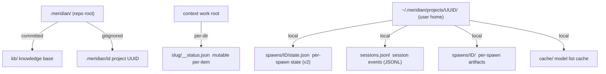

# State Model

Meridian's state lives entirely on disk — no database, no background service,
no hidden in-memory state. If it's not in a file, it doesn't exist. This
constraint is load-bearing: it makes the system inspectable, crash-tolerant,
and portable across machines.

---

## The Dual-Root Split

State splits across two roots with different purposes:



### Repo `.meridian/` — Committed Scaffolding

This is the project's shared memory. It gets committed to git, travels with the
repo, and is readable by anyone who clones the project:

- **`kb/`** — the agent-facing knowledge base (this document's home)
- **`work/`** — active work scratch directories
- **`archive/work/`** — completed work directories
- **`.meridian/id`** — the project UUID (gitignored — each checkout gets its own)

The repo root holds *structure*, not high-churn runtime data.

### User `~/.meridian/projects/<uuid>/` — Runtime State

This is where Meridian stores high-churn, machine-local state: spawn events,
session transcripts, per-spawn artifact directories, and heartbeat files. It
never gets committed.

The `<uuid>` is the project's identity key — a stable v4 UUID stored in
`.meridian/id`. It decouples runtime state from the repo path: if you rename
or move the repo, the UUID stays the same and the runtime state is still found.

### Why the Split?

Two concrete problems it solves:

1. **Rename/move safety.** Runtime state is keyed by UUID, not path. Moving the
   repo doesn't orphan your spawn history.
2. **Clean clones.** A fresh checkout has no runtime state yet. The first write
   creates the UUID and runtime directory. Read-only commands (list, show) never
   trigger this creation — they fall back gracefully to an empty state.

---

## UUID-Based Project Identity

The UUID is created on the first write operation (not on clone). It's written to
`.meridian/id` under an exclusive lock (`id.lock`) to prevent races if two
processes first-write concurrently.

The UUID is **gitignored** intentionally. Different checkouts of the same repo
get different UUIDs and therefore different runtime state roots. This is correct:
two people cloning the same repo don't share spawn history.

If you need to inspect raw spawn state:
```bash
UUID=$(cat .meridian/id)
# List all spawn IDs:
ls ~/.meridian/projects/$UUID/spawns/
# Read one spawn's state:
cat ~/.meridian/projects/$UUID/spawns/p42/state.json | jq
```

---

## Three Storage Patterns

Different kinds of state use different storage strategies, each optimized for
its access pattern.

### Per-Spawn State Files (Spawns — V2)

```
locks/spawns/<id>.lock            → stable per-spawn mutation lock (GC'd when spawn deleted)
spawns/<id>/state.json            → full current state of one spawn, O(1) read
spawns/<id>/starting-prompt.md    → prompt body (written once)
```

Spawn state uses one JSON file per spawn (since 2026-05 migration). Reads are O(1) — no event replay. Writes use atomic tmp+rename. The authority lattice (`decide_terminal_write()`) enforces terminal monotonicity: runner-origin writes supersede reconciler-origin writes.

**Single locked mutation path:** every update to a published spawn calls `write_state_locked()`, which acquires the stable per-spawn lock, re-reads current state, applies a pure mutator, and writes atomically. The lock identity lives under `locks/spawns/` outside the spawn artifact directory; orphaned lock inodes are removed only through a validated GC seam (see [state-system locking](../architecture/state-system.md#platform-locking)). There is no public unlocked write path.

### JSONL Event Stores (Sessions)

```
sessions.jsonl → append-only sequence of typed events
```

Session state remains event-sourced JSONL. Session history is much smaller than spawn history, so the O(n) replay cost is not a problem at scale.

**Why append-only?** Appends are safe across crashes. A partial append produces
a truncated final line — readers skip malformed lines, so earlier events are
never corrupted.

State is derived by **replaying** all events for a given session ID:
- Historical state is always recoverable
- Concurrent writers need only a file lock per append, not a full transaction

### Mutable JSON (Work Items)

```
<context.work>/<slug>/__status.json  → one file per work directory, full overwrite
```

Work items are different: they live under a context-resolved work root (not
`.meridian/`), each as a directory with `__status.json` inside. Archiving moves
the entire directory. Directory location is the primary authority for
active-vs-archived state.

For these, Meridian uses one JSON file per item with **atomic overwrites** via
`tmp + os.replace()`. The rename intent is stored in a sidecar file before any
rename begins, so a crash mid-rename is recoverable.

### Artifact Directories (Per-Spawn)

```
spawns/<id>/
  state.json                authoritative spawn state (v2) — read/written by spawn_store
  starting-prompt.md        prompt body — written once at spawn creation
  report.md                 agent's run report
  history.jsonl             seq-enveloped harness events
  heartbeat                 touched every 30s (liveness signal)
  process_scopes.json       durable process identities + release markers
  reaper_cleanup_claim.json pending finalize-first cleanup targets
  stderr.log                harness warnings and errors
  params.json               spawn parameters snapshot
  tokens.json               usage record
```

Each spawn gets its own isolated directory — no cross-spawn interference. `state.json` is the authoritative record (written by `spawn_store`, read by all). The `heartbeat` file is the exception: repeatedly touched (not written) as a liveness signal for the reaper.

---

## Crash-Only Design

There is no graceful shutdown in Meridian. If a process is killed mid-operation,
the system recovers on the next read. This isn't an accident — it's a deliberate
design choice that eliminates an entire class of bugs:

> **Crash-only design:** Every write is safe to interrupt. Recovery IS startup,
> not a separate shutdown hook.

In practice:

| Operation | Crash safety mechanism |
|-----------|----------------------|
| JSONL append (sessions) | Truncated last line → skipped on read |
| Spawn state.json write | `tmp + os.replace()` → atomic; per-spawn lock for external writers |
| Work item save | `tmp + os.replace()` → atomic, no partial state |
| Work item rename | Intent file written first → replayed on startup |
| UUID creation | Exclusive lock + double-checked read → no duplicate |

The reaper is the crash-recovery mechanism for spawn state. When a runner
crashes, the reaper (running on the next read) detects the stale heartbeat and
finalizes the spawn as failed. See [Spawn Lifecycle](spawn-lifecycle.md) for
the reaper's decision logic.

---

## Read vs Write Resolution

Meridian distinguishes between read and write state resolution:

| Resolver | Creates UUID? | Use when |
|----------|--------------|---------|
| Read resolver | No | `spawn list`, `spawn show`, diagnostics |
| Write resolver | Yes | `spawn create`, work item updates |

Read paths never create UUIDs. This matters for CI environments and first-time
tool runs: running `meridian spawn list` in a fresh checkout produces an empty
list, not a UUID creation event.

---

## Locking

Concurrent writers need coordination. Meridian uses file-based locking through
one parameterized primitive (`lock_file`): timeout, shared/exclusive mode,
thread-local reentrancy, and post-fork descriptor cleanup.

All coordination locks live under `locks/<domain>/` outside the directories they
protect. Lock inodes are never unlinked except through a validated GC seam
(`unlink_validated_lock` under fresh exclusive flock, immediately before release).
This prevents the POSIX split-brain failure where one process unlinks a lock file
while another still holds the old inode.

- **Spawn state (v2)**: `locks/spawns/<id>.lock`. Every mutation acquires this lock.
- **Spawn ID reservation**: a global `spawns_flock` serializes ID counter increments and initial publication.
- **Scope projections**: `locks/process-scopes/<id>.lock`. Mutation of the process-scope sidecar.
- **Reaper cleanup**: `locks/reaper-cleanup/<id>.lock`. Prevents concurrent cleanup signalling.
- **Hook intervals**: `locks/hooks/<name>.lock`. Per-hook serialization.
- **Session JSONL**: `sessions.jsonl.flock` sidecar. Exclusive lock held during append.
- **Session management**: per-session lock file held for the duration of an active session.
- **Project lifetime**: `~/.meridian/projects/.locks/<uuid>.lock`. Sessions hold shared; pruning acquires exclusive.
- **UUID creation**: `id.lock` exclusive lock with double-checked read inside.

---

## User Root Resolution

`get_user_home()` resolves the user state root with this precedence:

1. `MERIDIAN_HOME` env var (if set)
2. Windows: `%LOCALAPPDATA%\meridian\`
3. Windows fallback: `%USERPROFILE%\AppData\Local\meridian\`
4. POSIX fallback: `~/.meridian/`

### Runtime Root Derivation Chain

The runtime root for any project is derived as:

```
project root  →  .meridian/id  →  UUID  →  ~/.meridian/projects/<UUID>/
```

Step by step:

1. **Project root** — resolved by `resolve_project_root_resolution()` from the `-C` flag, `MERIDIAN_PROJECT_DIR`, or literal CWD (no ancestor walk; see [config-precedence.md](config-precedence.md#project-root-discovery)).
2. **Project UUID** — read from `<project_root>/.meridian/id`. Created on first write; gitignored so each checkout has its own identity.
3. **Runtime root** — `get_user_home() / "projects" / UUID`. All spawn state, session JSONL, and artifact directories live here.

### `MERIDIAN_RUNTIME_DIR` Override

`MERIDIAN_RUNTIME_DIR` short-circuits the derivation chain, replacing step 3 entirely. An absolute path is used directly; a relative path is resolved against the repo root. Useful for testing and CI where you want to isolate state from normal project history.

**Scope is intentionally top-level only.** `MERIDIAN_RUNTIME_DIR` is NOT auto-propagated to child processes. Each nested process derives its own runtime root from its own project identity. Propagating it would force all children to share one parent's runtime directory — breaking isolation for spawns that operate on different projects.

**`-C` unsets `MERIDIAN_RUNTIME_DIR`.** When the `-C` / `--directory` flag is active, `main.py` unsets `MERIDIAN_RUNTIME_DIR` before running the subcommand. The rationale: `-C` changes the project identity, so a stale runtime-dir override that was set for a different project would be silently wrong. Unsetting forces the full derivation chain to run from the new project root. See [decisions/state.md](../decisions/state.md#directory-env-scope-eliminates-meridian_directory_explicit) for the decision record.

---

## Established Project

The CLI distinguishes between commands that require a Meridian project and those that don't. Tool-level linters (`kg check`, `qi`, `mermaid check`), config inspection (`config show`, `config get`), and extension introspection (`ext list`) are **rootless** — they run anywhere without a project.

Commands that do require a project (spawn, work, telemetry) need an **established project**:

1. **Explicit targeting:** `-C <path>` or `MERIDIAN_PROJECT_DIR`, OR
2. **Literal-cwd marker:** the CWD contains its own `.meridian/id` file — **no ancestor walk**

The predicate is `cwd_has_project_id(cwd)` in `src/meridian/lib/config/project_root.py`. It checks the literal CWD only; ancestor walk-up was removed in #335.

At the CLI edge, `resolve_cli_project_root()` in `src/meridian/cli/utils.py` is the single canonical resolver. It returns a typed `CliProjectRoot` (never raises). `exit_no_established_project()` is the single `SystemExit(1)` translation point. See [architecture/startup-pipeline.md](../architecture/startup-pipeline.md#rootless-commands-and-established-project) for the full resolver design.

### Future: `.meridian/id` → `meridian.toml`

Issue [#341](https://github.com/haowjy/meridian-cli/issues/341) tracks moving project identity from the committed `.meridian/id` file into `meridian.toml`. This will deprecate the repo-local `.meridian/` directory as the identity holder, making `meridian.toml` the single project-configuration entry point. The `cwd_has_project_id` predicate is intentionally one function so the marker check can be broadened to `meridian.toml` / `mars.toml` in one place.

## Related Pages

- [Spawn Lifecycle](spawn-lifecycle.md) — how spawn state maps to status
  transitions and crash recovery
- [../architecture/state-system.md](../architecture/state-system.md) — implementation detail: path resolvers,
  flock strategy, reaper logic
- [../architecture/startup-pipeline.md](../architecture/startup-pipeline.md) — rootless commands and established-project detection
