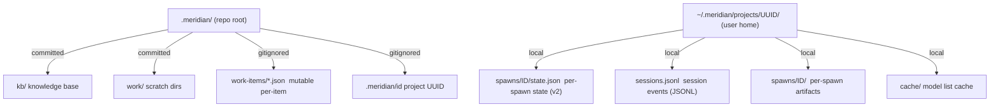

# State Model

Meridian's state lives entirely on disk — no database, no background service,
no hidden in-memory state. If it's not in a file, it doesn't exist. This
constraint is load-bearing: it makes the system inspectable, crash-tolerant,
and portable across machines.

---

## The Dual-Root Split

State splits across two roots with different purposes:



### Repo `.meridian/` — Committed Scaffolding

This is the project's shared memory. It gets committed to git, travels with the
repo, and is readable by anyone who clones the project:

- **`kb/`** — the agent-facing knowledge base (this document's home)
- **`work/`** — active work scratch directories
- **`archive/work/`** — completed work directories
- **`.meridian/id`** — the project UUID (gitignored — each checkout gets its own)

The repo root holds *structure*, not high-churn runtime data.

### User `~/.meridian/projects/<uuid>/` — Runtime State

This is where Meridian stores high-churn, machine-local state: spawn events,
session transcripts, per-spawn artifact directories, and heartbeat files. It
never gets committed.

The `<uuid>` is the project's identity key — a stable v4 UUID stored in
`.meridian/id`. It decouples runtime state from the repo path: if you rename
or move the repo, the UUID stays the same and the runtime state is still found.

### Why the Split?

Two concrete problems it solves:

1. **Rename/move safety.** Runtime state is keyed by UUID, not path. Moving the
   repo doesn't orphan your spawn history.
2. **Clean clones.** A fresh checkout has no runtime state yet. The first write
   creates the UUID and runtime directory. Read-only commands (list, show) never
   trigger this creation — they fall back gracefully to an empty state.

---

## UUID-Based Project Identity

The UUID is created on the first write operation (not on clone). It's written to
`.meridian/id` under an exclusive lock (`id.lock`) to prevent races if two
processes first-write concurrently.

The UUID is **gitignored** intentionally. Different checkouts of the same repo
get different UUIDs and therefore different runtime state roots. This is correct:
two people cloning the same repo don't share spawn history.

If you need to inspect raw spawn state:
```bash
UUID=$(cat .meridian/id)
# List all spawn IDs:
ls ~/.meridian/projects/$UUID/spawns/
# Read one spawn's state:
cat ~/.meridian/projects/$UUID/spawns/p42/state.json | jq
```

---

## Three Storage Patterns

Different kinds of state use different storage strategies, each optimized for
its access pattern.

### Per-Spawn State Files (Spawns — V2)

```
spawns/<id>/state.json  → full current state of one spawn, O(1) read
spawns/<id>/state.lock  → per-spawn exclusive lock for external writers
spawns/<id>/starting-prompt.md  → prompt body (written once)
```

Spawn state uses one JSON file per spawn (since 2026-05 migration). Reads are O(1) — no event replay. Writes use atomic tmp+rename. The authority lattice (`decide_terminal_write()`) enforces terminal monotonicity: runner-origin writes supersede reconciler-origin writes.

**Two write tiers:** The spawn's runner writes directly (no lock — sole writer). External writers (reaper, cancel, `update_spawn()`) acquire `state.lock`, read current state, apply mutation, write atomically.

### JSONL Event Stores (Sessions)

```
sessions.jsonl → append-only sequence of typed events
```

Session state remains event-sourced JSONL. Session history is much smaller than spawn history, so the O(n) replay cost is not a problem at scale.

**Why append-only?** Appends are safe across crashes. A partial append produces
a truncated final line — readers skip malformed lines, so earlier events are
never corrupted.

State is derived by **replaying** all events for a given session ID:
- Historical state is always recoverable
- Concurrent writers need only a file lock per append, not a full transaction

### Mutable JSON (Work Items)

```
work-items/<slug>.json  → one file per work item, full overwrite
```

Work items are different: they're correlated with a directory that gets renamed
(e.g., `work/my-task/` → `archive/work/my-task/`), and they need atomic reads
that reflect the current full state without replaying history.

For these, Meridian uses one JSON file per item with **atomic overwrites** via
`tmp + os.replace()`. The rename intent is stored in a sidecar file before any
rename begins, so a crash mid-rename is recoverable.

### Artifact Directories (Per-Spawn)

```
spawns/<id>/
  state.json      authoritative spawn state (v2) — read/written by spawn_store
  state.lock      per-spawn exclusive lock for external writers
  starting-prompt.md  prompt body — written once at spawn creation
  report.md       agent's run report
  history.jsonl   seq-enveloped harness events
  heartbeat       touched every 30s (liveness signal)
  stderr.log      harness warnings and errors
  params.json     spawn parameters snapshot
  tokens.json     usage record
```

Each spawn gets its own isolated directory — no cross-spawn interference. `state.json` is the authoritative record (written by `spawn_store`, read by all). The `heartbeat` file is the exception: repeatedly touched (not written) as a liveness signal for the reaper.

---

## Crash-Only Design

There is no graceful shutdown in Meridian. If a process is killed mid-operation,
the system recovers on the next read. This isn't an accident — it's a deliberate
design choice that eliminates an entire class of bugs:

> **Crash-only design:** Every write is safe to interrupt. Recovery IS startup,
> not a separate shutdown hook.

In practice:

| Operation | Crash safety mechanism |
|-----------|----------------------|
| JSONL append (sessions) | Truncated last line → skipped on read |
| Spawn state.json write | `tmp + os.replace()` → atomic; per-spawn lock for external writers |
| Work item save | `tmp + os.replace()` → atomic, no partial state |
| Work item rename | Intent file written first → replayed on startup |
| UUID creation | Exclusive lock + double-checked read → no duplicate |

The reaper is the crash-recovery mechanism for spawn state. When a runner
crashes, the reaper (running on the next read) detects the stale heartbeat and
finalizes the spawn as failed. See [Spawn Lifecycle](spawn-lifecycle.md) for
the reaper's decision logic.

---

## Read vs Write Resolution

Meridian distinguishes between read and write state resolution:

| Resolver | Creates UUID? | Use when |
|----------|--------------|---------|
| Read resolver | No | `spawn list`, `spawn show`, diagnostics |
| Write resolver | Yes | `spawn create`, work item updates |

Read paths never create UUIDs. This matters for CI environments and first-time
tool runs: running `meridian spawn list` in a fresh checkout produces an empty
list, not a UUID creation event.

---

## Locking

Concurrent writers need coordination. Meridian uses file-based locking:

- **Spawn state (v2)**: a per-spawn `spawns/<id>/state.lock` file. Acquired by external writers (reaper, cancel, `update_spawn()`); the spawn's runner writes without the lock as the sole owner during active execution.
- **Spawn ID reservation**: a global `spawns_flock` serializes ID counter increments. Held only for the duration of the counter bump.
- **Session JSONL**: a `sessions.jsonl.flock` sidecar file. Exclusive lock held during append. Cross-platform: `fcntl.flock` on POSIX, `msvcrt.locking` on Windows. Thread-local reentrant.
- **Session management**: a per-session lock file (`<chat_id>.lock`) held for the duration of an active session.
- **UUID creation**: `id.lock` exclusive lock with double-checked read inside.

---

## User Root Resolution

`get_user_home()` resolves the user state root with this precedence:

1. `MERIDIAN_HOME` env var (if set)
2. Windows: `%LOCALAPPDATA%\meridian\`
3. Windows fallback: `%USERPROFILE%\AppData\Local\meridian\`
4. POSIX fallback: `~/.meridian/`

`MERIDIAN_RUNTIME_DIR` overrides the runtime root entirely (useful for testing
and CI). An absolute path is used directly; a relative path is resolved against
the repo root.

---

## Related Pages

- [Spawn Lifecycle](spawn-lifecycle.md) — how spawn state maps to status
  transitions and crash recovery
- [../architecture/state-system.md](../architecture/state-system.md) — implementation detail: path resolvers,
  flock strategy, reaper logic
