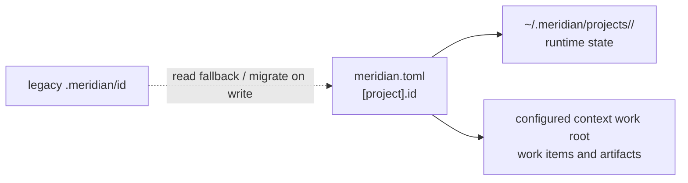

# State Model

Meridian separates committed identity from uncommitted runtime state. A project
is identified by `[project].id` in `meridian.toml`; that ID selects a user-local
runtime directory. Work items use the configured context work root because they
are shared task artifacts, not repo state.

## Three Roots, Three Responsibilities

```mermaid
graph LR
    P["meridian.toml\n[project].id"] --> R["~/.meridian/projects/<id>/\nruntime state"]
    P --> W["configured context work root\nwork items and artifacts"]
    M["legacy .meridian/id"] -. "read fallback / migrate on write" .-> P
```

- **Project config:** `meridian.toml` is committed and is the authoritative home
  of project identity. A new identity is a generated three-word ID.
- **Runtime root:** `~/.meridian/projects/<id>/` is never committed. It contains
  spawn state and artifacts, session events, locks, and runtime caches.
- **Work root:** `[context.work]` resolves the mutable work-item store. A work
  item can therefore be shared or archived independently of the repository.

No active state, lock, cache, generated `.gitignore`, or fallback context
folder belongs under repo-local `.meridian/`. Existing `.meridian/id` values
remain a compatibility input: reads may fall back to them, and the first write
atomically migrates the value to `meridian.toml` before using it.

This indirection lets a repository move without losing its runtime history.
Cloned repositories share an identity only when their committed
`meridian.toml` does; operators who need distinct state must assign a distinct
project ID.

## Storage Patterns

Different state shapes have different update patterns. “Files as authority”
does not mean every domain uses one file format.

### Per-Spawn State Files

`spawns/<id>/state.json` is the authoritative mutable row for one spawn. Every
published-row mutation acquires its stable per-spawn lock, re-reads the row,
applies a pure mutation, and atomically replaces the file. Artifacts under the
same spawn directory live only while that row remains published.

The former global `spawns.jsonl` is legacy input for a one-shot migration, not
the current store.

### JSONL Event Stores

Sessions and append-only journals use JSONL. Writers serialize append and
repair torn tails; readers tolerate an incomplete final record. JSONL is used
where ordered history is the contract, not as a universal state model.

### Mutable Work-Item JSON

Each work item has `__status.json` under the context work root. The repository
store owns locking, mutation, rename intent, and archive transitions.

### Artifact Directories

Prompt, transcript, report, heartbeat, and diagnostic files live beneath a
spawn directory. They supplement `state.json`; none is an independent spawn
lifecycle authority.

## Crash and Concurrency Model

State writes use one of three publication mechanisms: atomic file replacement,
durable JSONL append, or atomic directory publication. Locks live at stable
paths outside deletable data and are removed only through validated exclusive
GC. A store mutation means acquire, re-read, mutate, and publish—not “read now,
lock later.”

Ordinary list/show/wait reads may project an apparently orphaned active spawn as
terminal without changing disk. Explicit reconciliation performs durable
finalization and process cleanup. This keeps observation from becoming an
unexpected destructive action.

The exact lock order, state machine, migration codec, layouts, and repair paths
are canonical in [Architecture: State System](../architecture/state-system.md).
The rationale and superseded alternatives are in [State Decisions](../decisions/state.md).

## Root Resolution

The user root is resolved by `get_user_home()` and may be overridden by
`MERIDIAN_HOME`. The normal runtime root is `<user-root>/projects/<project-id>`;
`MERIDIAN_RUNTIME_DIR` can override it for isolated execution and tests.

A literal working directory is considered established when it contains
`meridian.toml` or `mars.toml`. There is no ancestor walk and `.mars/`, `.git`,
or `.agents/` alone do not establish a project. Commands that are explicitly
allowed to initialize a project may create configuration before continuing.

## Related Pages

- [Architecture: State System](../architecture/state-system.md) — current paths,
  stores, locks, reconciliation, and migrations
- [State Decisions](../decisions/state.md) — identity, store, and concurrency
  rationale
- [State Design Lessons](../lessons/state-design-lessons.md) — historical
  mistakes and transferable lessons
- [Spawn Lifecycle](spawn-lifecycle.md) — lifecycle states and terminal behavior
