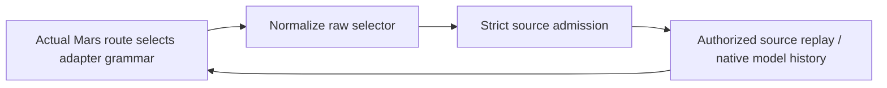

# Decision: Bound native source arguments; stop at route-dependent admission

**Status: bounded grammar policy is settled; integration is stopped.** The unmerged, unpushed `fix/native-session-identity-v2` branch through `b61d6c04` contains four adapter-local grammars and their registrations, plus the typed primary-fork correction. The grammars are **not wired** into primary owner, public bind, or runner admission. Neither these commits nor focused grammar tests qualify a tracked transport. Clean `main` retains the shipped behavior described by [native session identity](native-session-identity.md) and [session operations](../codebase/session-operations.md).

## Bounded input is not source authority

A raw native flag can select a conversation even when Meridian's typed request looks fresh. Parse raw arguments against the **actual executing adapter and transport**, convert a supported exact selector into the existing typed source/operation, and preserve only a validated non-selecting remainder. The original typed request, resolved request, replayed snapshot, launch seed, and final command or managed request remain independent claims to reconcile; a matching flag is a consistency assertion, not another credential. Explicit fresh intent, including `--from`, cannot be promoted to resume or fork by a raw tail. A bare native ID is genuinely untracked only after a negative strict authority query; a conflicted, missing, legacy, or unqualified tracked claim cannot be laundered into it.

| Adapter-local grammar in the branch | Bounded source behavior |
|---|---|
| Claude | Exact `--resume ID` on the supported subprocess surface; no implicit latest or caller-selected create target. |
| Codex | Leading `resume ID`; generated policy flags precede the native resume subcommand, while accepted raw tail flags follow `ID`. Managed app-server accepts a smaller config-only remainder, not subprocess-only options. |
| OpenCode | Exact `--session ID` / `-s ID`; no implicit continue, raw fork, or subcommand injection. Managed and subprocess remainders differ. |
| Pi | No raw source selector; allow only bounded non-selecting primary overrides. Tracked primary TUI remains refused, and the tracked RPC tail stays stricter. |

This is deliberately **not** an empty-tail policy. Ordinary model, effort, permission, tool, logging, and other settings survive only where the selected consumer demonstrably honors them without changing session, store, or transport. Unknown syntax, repeated selectors, indirection that can hide a source, or a field the real consumer ignores must refuse rather than be stripped or guessed. Codex parser evidence narrowed the initial design: raw subprocess options must follow `resume ID`; generated flags remain before it. Reject repeated raw bypass switches with a fixed, secret-free diagnostic, while preserving a single supported occurrence. Typed primary fork remains a fork in the request; a regression fix did not weaken source reconciliation to make tests pass.

The parser is pure syntax validation, **not permission**. Each independent owner, direct-build, public-bind, and runner boundary must check its supplied selection and perform its own strict source admission before source reads or effects. A same-stack preview may reuse its owner's operation-local result; no prepared surface or caller label transfers permission. Final argv or managed method/path/body must be checked at its actual consumer. Spawn and streaming have separate admission contracts; primary restrictions must not leak into them merely because they share a helper.

## Route/admission dependency stops integration

The cycle is real for exact continuation: replay may supply the model or harness that Mars needs to select the actual adapter, but raw source selection cannot safely reach replay until the adapter's grammar is known and the source admitted. An explicit harness and model constrain routing; they do not prove that a fresh Mars bundle equals the continuation branch's policy. A synthetic replay probe changed only the native last-model and obtained different routed models; saved raw arguments arrived only after history reads. The work item's design-only early-route analysis therefore stops universal “actual route → raw normalization → admission” integration rather than shipping an explicit-harness shortcut.

The small positive reuse sketch is **fresh, source-independent requests only**, and even that requires proof of safe evaluator effects. Full early bundle resolution can read profile, skills, prompt, and tool content; disabling model refresh does not prevent independent native auth-status subprocesses. A route-only API could reduce coupling but cannot create missing source-dependent inputs. Pinned typed or raw-promoted resume/fork has no approved one-decision replay contract. Direct build has a concrete supplied adapter rather than a Mars route, but its own pre-reference admission is still unwired; direct Pi `-c` remains a known bypass. Do not treat registration tests or the older phase-1 primary gate as integration approval.

**Open product choice, not a decision:** preserve typed continuation by admitting its original typed source before source-dependent route resolution and define a separately fail-closed raw-only subset (the work item's recommendation), **or** explicitly accept reduced typed continuation under universal route-first ordering. No choice has been confirmed. Until then, retain the production-integration STOP. After a choice, prove evaluator effects, replay ordering, independent boundaries, real consumers, and strict source-query/read counts before transport qualification. No read/index or per-event write cost improvement is claimed; native log/search cutover and runner-history removal remain later work under [native session identity](native-session-identity.md).

**Rationale and rejected alternatives.** A registry guess from explicit harness, local alias lookup, or trying grammars until one parses would duplicate or evade Mars precedence, profile fallback, and model validation. Moving full compilation early risks premature content/native-auth effects; compiling again after replay risks a second, different route. Silently dropping typed continuation is a product change, not an implementation cleanup. These failures justify a stop rather than another partial wiring patch.

**Provenance:** `work:native-harness-session-identity/decision.md`; `design/b3b-bounded-passthrough.md`, `design/b3b-codex-flag-placement.md`, `design/b3b-early-route.md`; `DIVERGENCE/early-harness-route-seam.md`; `review/b3b-early-route-independent.md`, `review/b3b-early-route-recheck.md`; `spawn:p6890`–`spawn:p6903`. The early-route review verified the STOP, not a positive pinned API or production tests.
