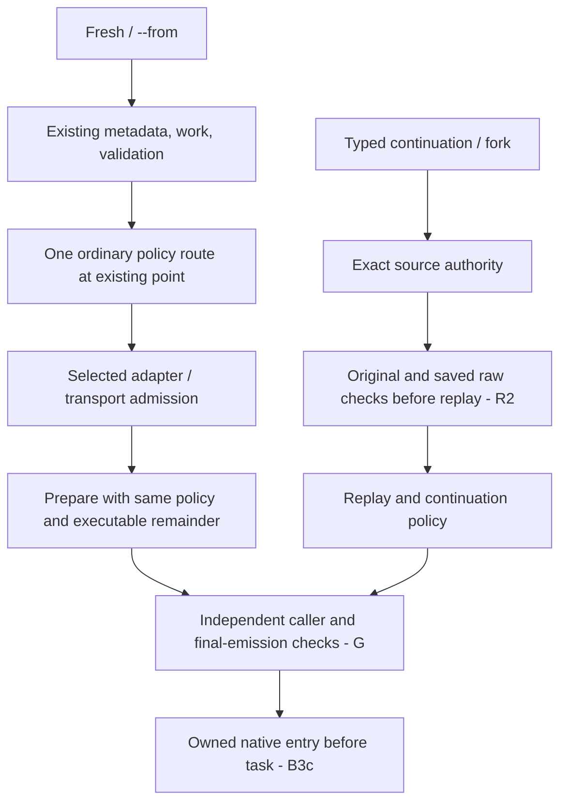

# Decision: Admit native arguments against the selected route

**Settled intent; bounded R1 and standalone R2a implemented on an unmerged branch, not shipped or native-qualified.** Fresh and fresh `--from` requests keep inferred-harness routing. The primary owner makes its **one ordinary policy decision at the existing late point**, then asks the selected adapter and transport to admit raw arguments before launch preparation. R1 at `20fd651a` passed guarded fake-boundary review. R2a at `f2aeebb8` adds an exact admitted-source metadata join but does not connect typed owner replay or change raw ordering. Neither phase approves final executable selection, independent public callers, or tracked native entry/exit. Clean `main` retains [shipped session behavior](../codebase/session-operations.md). The larger [identity and native-history contract](native-session-identity.md) remains unshipped.

## Identity and scalar rules

Raw native arguments are not source credentials. A fresh or `--from` raw selector cannot turn a new conversation into resume/fork. A typed continuation must authorize its **original** source, then compare original and saved raw vectors separately against that source's exact harness/key/store **before** replay or native/model-history access. Resume executes saved raw; fork executes caller raw, but neither vector may conceal a different selector. The current typed path has not yet achieved that before-history ordering (R2).

The original raw vector, admitted executable remainder, replayed request, seed, prepared surface, and final argv/RPC/HTTP/env are distinct claims. R2b must pair the original operation/reference/runtime scope with its retained admission before metadata I/O, then check caller and saved raw vectors independently against that exact source before replay/model history. R2a's metadata object is not a permission seal, and the discovery-capable replay resolver cannot substitute for this ordering. An admission result is not transferable to public direct-build, bind or runner callers. Each independent entry must validate its own raw input and concrete route. The final consumer must check **the value it actually emits and consumes**, after preflight or other transformations; parsing a prior candidate is insufficient (G).

The adapter owns option arity, aliases, decoded roles and transport eligibility. Supported benign options retain their bytes and order. Unknown or ambiguous forms, response/config/store/endpoint indirection, unsupported consumer cells and identity selectors refuse. A duplicate ordinary raw scalar loses to typed/generated policy **only when generated presence and the consumer-owned emitted field are proved**; suppress its complete option span and give a value-free warning. An intentional native default is controlled presence, not missing data. Raw-only routing-sensitive model with absent or unknown generated provenance refuses with a typed-model alternative. Mandatory permission/tool-denial conflicts refuse *before* duplicate suppression. Lists combine only under option-specific proved additive semantics, never a generic merge.

The R1 carrier supplies the selected adapter with retained model/provenance and execution-policy facts, not a second policy engine. Claude's supported subprocess model/effort and Pi native-TUI model/thinking cells can suppress proved duplicates; Pi's low effort projects to native `minimal`. Codex managed config/model/effort/tool cells whose server-plus-thread ownership is unproved still refuse; mandatory sandbox/approval conflicts refuse. OpenCode managed accepts bounded global logging options, not run-only model/agent/variant flags. Cursor remains empty-raw-only. A harness name does not make every transport cell safe. The earlier launch-layer spelling blacklist was rejected because it missed Codex config and Pi thinking aliases while refusing supported Claude duplicates; role classification belongs in the leaf grammar.

## Fresh C is late admission, not early routing

C does **not** move ordinary Mars earlier, ask it to route twice, require an explicit harness for benign raw, or evaluate a constrained shadow policy. Existing context, `--from` metadata, path checks, bootstrap reads, work materialization, and the ordinary resolver can precede invalid-raw refusal; resolver errors can precede raw diagnostics. A rejected fresh request may therefore incur existing work writes, cache/network/probe effects or detached refresh. It must still refuse before source/native transcript and model-history access, observation writes, composed reference contents, Pi seed/repair, session/spawn lifecycle rows, native startup, and task/model/notification turns. Pi's separately approved startup-repair exception applies only at its downstream gate. Fresh needs **zero strict source-authority queries**.

R1 passes the selected policy object into preparation rather than rereading or rerouting after normalization. Original raw stays available as evidence, while only the admitted remainder becomes executable raw. This proves neither a safe installed resolver nor final emission: the inspected Mars selection can choose an unverified executable and source-level resolver effects include catalog/cache/lock/failure writes, native status commands and detached availability refresh. Because C no longer moves the resolver earlier, that trust/effect inventory is a **runtime qualification requirement**, not a structural blocker to guarded fake-only R1. Do not force `--no-refresh-models` or an offline substitute and call routing unchanged.

## Qualification still open

At R1 final review (`20fd651a`, p6970), 146 focused checks passed behind a pre-import process/network denial guard with fake catalog/bundle and isolated state; Pyright had zero errors. This is bounded evidence of owner order, adapter cells, redacted warnings, original/remainder separation and supported projection—not installed latency, native semantics, or end-to-end safety. Adversarial fake preflight can reintroduce a model flag after suppression, and the runner can accept an independently changed original or prepared raw vector. G must verify and consume one checked final value; R2b must validate both typed raw vectors before history, while R2c still needs exact source-keyed model observation and replay intent. Public/direct/bind/runner boundaries remain independent. B3c then needs owned native entry/exit before task delivery. Native read/search cutover and runner-history removal are separate later gates; no measured overall savings follow from R1 or R2a.

The alternative early-placement design would narrow all nonempty inferred-harness raw to explicit harnesses or require an unproved constrained route evaluator. Those losses and new effects are unnecessary for native-identity safety. A generic cross-harness token blacklist, second parser, second full route, or fallback from an unqualified raw selector would instead create policy drift or bypass the source authority.

**Provenance:** `work:native-harness-session-identity`; `design/b3b-c-late-admission.md`, `design/b3b-r1-scalar-boundary.md`; `DIVERGENCE/c-early-route-effect-challenge.md`, `DIVERGENCE/r1-scalar-boundary.md`; `review/b3b-r1-final.md`, `review/b3b-r1-convergence.md`; `spawn:p6938`, `spawn:p6945`, `spawn:p6951`, `spawn:p6958`, `spawn:p6959`, `spawn:p6962`, `spawn:p6963`, `spawn:p6970`. The earlier installed-Mars effect audit remains evidence of runtime risk, not a prerequisite to fake-only R1 placement.
