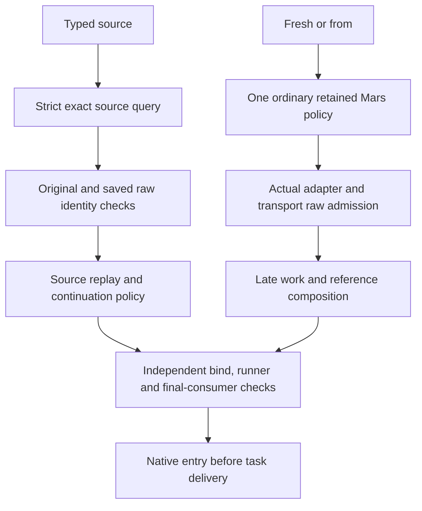

# Decision: Admit native arguments against the actual route

**Settled policy, not shipped:** Fresh and fresh `--from` requests with benign raw options retain inferred-harness routing. Meridian should make one ordinary Mars policy decision from the original typed/config inputs, then validate raw arguments against the **selected adapter and transport**. That early integration is blocked: the inspected environment has no trusted installed Mars executable, and the ordinary resolver can have effects beyond the user's approved pre-refusal budget. The feature branch at `aa1a5aa7` contains a reviewed, behavior-preserving policy/assembly split (R0), not an earlier Mars call, raw-admission wiring, or a qualified tracked transport. Clean `main` retains [current session operations](../codebase/session-operations.md); the target identity contract is [native session identity](native-session-identity.md).

## Source authority precedes source-dependent routing

Raw native arguments are not a second source credential. A typed continue or fork first queries strict source authority for its original cN/pN/native reference and obtains exact metadata. Only then can its original and saved raw vectors be parsed against the source harness and checked for identity mismatch, **before** source replay, native model-history reads, observation writes, work materialization, or task delivery. A raw-only resume/fork selector is not a required positive surface: absent typed authority, refuse it rather than promote it into a typed source. Fresh and `--from` make zero source-authority queries; a raw selector cannot turn either into a resume or fork. `--from` still starts a separate native conversation with lightweight references, not a transcript copy.

The original request, saved raw vector, replayed request, seed, prepared surface, and final argv or managed method/path/body are separate claims. A matching-looking native ID grants nothing. Refuse a mismatch against typed source, operation, harness, store or namespace rather than silently choosing one claim or laundering a tracked source into an untracked bare ID. Every independent owner, direct-build, public-bind, runner and final consumer boundary must validate what it actually receives; a prepared surface is not portable authorization.

Four adapter-local grammars are registered on the unmerged branch but are **not wired** through those admission boundaries:

| Adapter | Bounded syntax and transport limit |
|---|---|
| Claude | Exact `--resume ID` is source syntax on the supported subprocess surface. |
| Codex | Leading `resume ID` is source syntax; generated policy flags precede it and accepted subprocess raw options follow `ID`. Managed app-server has a smaller config-only remainder. |
| OpenCode | Exact `--session ID` / `-s ID` is source syntax. Managed and subprocess remainders differ. |
| Pi | No raw source selector is admitted; supported non-selecting primary overrides remain bounded. Tracked primary TUI and RPC surfaces have separate restrictions. |

Keep supported non-selecting raw options, including benign inferred-harness options, in their original order and bytes. Reject unknown syntax, response/config/store/endpoint indirection, repeated selectors, and fields the actual consumer ignores. A generated scalar wins over a duplicate raw scalar **only when its typed/generated presence and final emission are proven**; an incidental fallback or unknown provenance is not enough. A raw-only routing-sensitive model without a known generated source refuses with a typed-model alternative. Additive lists combine only for options whose consumer semantics are individually proven. Mandatory permission or other policy conflicts refuse before any duplicate suppression. Diagnostics identify the option and precedence, not secret values or the full raw vector.

## Fresh-route choice: C, with an effect gate

For source-independent fresh/`--from`, the user chose **C** over A's early-refusal narrowing and B's unproved constrained evaluator. C freezes original typed fields and presence, env/config precedence, project authority root, agent/profile, skills/exclusions, execution overrides, model/default provenance and transport preference. It resolves **one ordinary full Mars bundle**, without promoting raw text into routing inputs, and retains that complete policy and compiled content. The actual route determines the grammar. Only after raw admission may late work and `--from` reference composition proceed, using the *same* policy object; no second resolution or config/catalog reread may select a different route. DIRECT/bind/runner use supplied concrete route facts and perform their own checks rather than treating this policy as permission.

C permits ordinary config/profile/skill/prompt/tool reads and compilation, cache activity, and **trusted status checks** before invalid raw is reported. Resolver errors may therefore precede raw diagnostics; a rejected request may pay for a discarded bundle. This is not permission for arbitrary PATH wrappers, unbounded network/probes, detached refresh, user transcript or credential mutation, or pre-admission source/reference/work/session/model effects. The exact approved effect envelope and installed resolver must be proven, not inferred from a source-only call graph. For Pi, the separately approved native startup-repair exception still permits no task/model turn until qualified entry and durable acceptance.

The installed-resolver audit found no trusted installed Mars in the inspected route. Meridian can select a binary beside `sys.executable` or on PATH without an install-owned identity check. The reviewed Mars source permits project/user catalog/cache/lock/failure-marker writes, network/provider refresh, PATH native auth/model-list/version probes, and detached availability refresh that may outlive refusal. `--no-refresh-models` changes possible route/fallback and still permits status calls, so forcing it is **not** a behavior-neutral safety fix. Do not move full Mars earlier, claim C qualified, silently downgrade to A, or add an offline substitute. Inventory and bound the real executable and each route's prerequisites; if ordinary C requires unapproved effects, return for a policy/design decision. No live Mars, native or model probe was authorized by this capture.

R0 only extracted `resolve_launch_policy_for_request()` from `compile_prepared_policy_surface()` and added `assemble_prepared_policy_surface()` while preserving the same path snapshot and late active-work lookup. Production callers still invoke the compiler at the original time. Independent review approved the behavior-preserving split and synthetic path/namespace checks; it did **not** approve the effect gate or integration. Later work must retain the path snapshot, one policy identity, typed-source ordering, original/saved-vector separation, scalar/list semantics, and exact consumer checks. Synthetic tests may prove ordering and refusal without native/model effects; measured native read/index and eliminated runner-write cost remain future work.

**Why not the alternatives:** A requires explicit grammar before Mars for nonempty fresh raw, so it loses all inferred-harness raw options, including benign ones; the user did not choose that product reduction. B's proposed constrained route evaluator has no proven parity with ordinary routing or bounded installed effects and may reject valid launches as indeterminate. Guessing a harness from registry/config or trying parsers until one accepts duplicates Mars authority. A second full route after raw promotion can select a different harness. Neither a chosen C label nor a pure parser certifies the real consumer or native identity.

**Provenance:** `work:native-harness-session-identity/decision.md`; `design/b3b-fresh-route-policy-options.md`; `evidence/b3b-installed-mars-c-effects.md`, `evidence/b3b-c-policy-seam.md`; `review/b3b-fresh-route-effect-budget.md`, `review/b3b-r0-final.md`; `spawn:p6921`, `spawn:p6923`, `spawn:p6924`, `spawn:p6930`. The effect inventory is static/source-based, not installed-binary certification or a live safety test.
