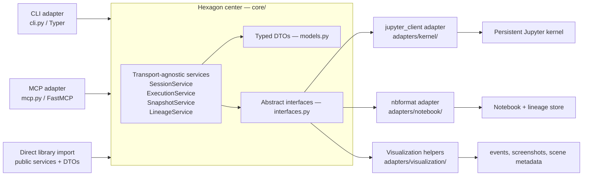

# Jupyter Workbench — Architecture

Related: [overview.md](./overview.md) | [runtime-model.md](./runtime-model.md)
Source: `work/jupyter-workbench-design/design/architecture/jupyter-workbench-target-architecture.md`

---

## Governing Pattern: Ports and Adapters + SOLID

The runtime adopts **Ports and Adapters (hexagonal architecture)** as its top-level structural pattern. The reusable core sits at the center; CLI, MCP, and direct library import are **peer inbound adapters**; kernel and notebook integrations are **outbound adapters behind abstract ports**.

This was chosen because the product has multiple present entry surfaces: CLI, direct library import for local helpers, and MCP. Treating those as peer adapters keeps the durable session model, notebook lineage rules, and visualization workflow in one place instead of cloning behavior into each transport wrapper.



---

## Why DTOs Are the API

The same business result must be usable from a terminal, from JSON tools, and from direct Python imports. Typed DTOs give the core one inspectable contract while letting each adapter choose its own presentation.

Core invariants:
- No terminal formatting in service returns.
- No JSON serialization in service returns.
- No CLI-only concepts in service method signatures.
- All durable side effects land under the shared session root.

---

## Service Boundaries (Single Responsibility)

Each service owns one concern and changes for one reason:

| Service | Owns | Primary DTOs |
|---|---|---|
| `SessionService` | Session lifecycle: open, close, status, list; degraded-state reporting | `SessionInfo`, `SessionList` |
| `ExecutionService` | Notebook-backed code execution, markdown recording, bounded output summaries, artifact refs | `ExecResult`, `NotebookMutationResult` |
| `SnapshotService` | Machine-readable observation over session, notebook, lineage, and visualization state | `SnapshotResult` |
| `LineageService` | Notebook history, recovery, derivation, cleanup: lineage, replay, derive, compact | `LineageInfo`, `ReplayResult`, `DerivationResult`, `CompactionResult` |

The service split follows Session / Execution / Snapshot / Lineage because those responsibilities change for different reasons and map cleanly to the public verbs and the cheap-vs-expensive workflow split.

---

## SOLID Applied

| Principle | Applied rule |
|---|---|
| **Single Responsibility** | Each service owns one verb family; KernelManager owns `jupyter_client` interaction; NotebookStore owns `nbformat`/file IO. |
| **Open / Closed** | New adapters, such as a future web API, are additions around the core — not modifications to core service rules. New visualization patterns land as new skills or adapter helpers. |
| **Liskov Substitution** | `KernelPort` may be backed by `jupyter_client` or a test fake; `NotebookPort` by `nbformat` or a test double. |
| **Interface Segregation** | CLI imports only services it wraps. `microct-analysis` depends only on stable public services + DTOs or documented CLI verbs. |
| **Dependency Inversion** | Core services depend on abstract interfaces for kernel management, notebook storage, and event logging. Concrete adapters are injected. |

---

## Boundary Rules

1. **No business logic in adapters.** If a branch changes transport-independent behavior, it belongs in the service layer.
2. **Adapters depend on core; core never depends on adapters.** `typer`, `fastmcp`, terminal formatting, and JSON serialization stay out of `core/`.
3. **Every service method must be exposable through any adapter without redesign.**
4. **Parity comes from shared services, not duplicated code.** CLI and MCP are aligned because both wrap the same DTO-returning methods.

### EventLogPort (implementation note)

During the final implementation gate (p3005), the `SnapshotService` was found to import `DurableEventLog` directly from `adapters/` — a boundary violation. This was fixed by injecting an `EventLogPort` abstract interface. The port was already defined in `interfaces.py`; the fix wired `SnapshotService` to depend on the abstraction rather than the concrete adapter. This is the canonical example of why the boundary rules exist.

---

## Package File Layout

```text
jupyter-workbench/
  pyproject.toml
  mars.toml
  src/jupyter_workbench/
    __init__.py                ← re-exports stable public API
    core/                      ← hexagon center (business rules + contracts)
      models.py                ← typed DTOs
      interfaces.py            ← abstract ports (KernelPort, NotebookPort, EventLogPort)
      session_service.py
      execution_service.py
      snapshot_service.py
      lineage_service.py
    adapters/                  ← concrete integrations only
      kernel/
        jupyter_client_manager.py
      notebook/
        nbformat_store.py
      visualization/
        event_log.py
        screenshots.py
        pyvista_trame.py
    cli.py                     ← Typer adapter
    mcp.py                     ← FastMCP adapter wrappers around core services
  bootstrap/
    setup.md
  skills/
    session-management/
    notebook-lineage/
    compaction-cleanup/
    pyvista-interactive/
```

Key rules:
- `core/` is the hexagon center. It may not import from `adapters/`.
- `adapters/` owns concrete integrations only.
- `cli.py` and `mcp.py` are peer transport adapters that format or serialize DTOs — no business logic.

---

## `microct-analysis` Interface Contract

`microct-analysis` may depend on `jupyter-workbench` in two ways only:

1. **CLI-first prompt workflow** — agents call `jupyter-workbench` verbs as taught by skills and bootstrap docs.
2. **Optional local helper import** — local Python helpers import stable public services + DTOs from `jupyter_workbench`.

It must **not** import from `jupyter_workbench.adapters.*`, depend on `jupyter_client` objects, or depend on raw `nbformat` objects.

### Domain event interpretation

`jupyter-workbench` persists generic event records:
```json
{"type": "pick", "payload": {"actor_id": "component-3"}}
```

`microct-analysis` owns the domain translation layer:
```json
{"domain_event": "component_picked", "component_id": "femur_fragment_3", "suggested_meaning": "candidate femur anchor"}
```

The generic event shape is stable in `jupyter-workbench`; the semantic translation is `microct-analysis`'s concern.

---

## Extension Model

| Future change | Move | What stays stable |
|---|---|---|
| Extend MCP support | Add or update `mcp.py` wrappers around existing services | Service methods, DTO field semantics, durable artifacts |
| Add new visualization library | Add new skill; optionally add helper under `adapters/visualization/` | Session + notebook model, snapshot/result DTOs |
| Add new domain package | Publish new mars package consuming services/DTOs | Public service layer, CLI verbs, artifact conventions |
| Add new CLI command | Add/extend a core service method; wire a Typer command around it | Business logic stays in services, CLI stays thin |

---

## Known Structural Debt (Non-Blocking)

These were identified during the final review gate and are documented for future cleanup:

- **Session manifest policy scattered across services** — `_resolve_session_id` and `_read_manifest` are repeated in execution, snapshot, and lineage services. Should be extracted to a `SessionStore`/`SessionRepository` owned by `SessionService`.
- **DTOs use raw dicts in some fields** — `visualization_delta`, `EventRecord.payload`, and some summary fields are raw mutable dicts. Future cleanup: introduce typed DTOs for scene summaries, cell summaries, and event records.
- **Notebook writes not atomic (tmp+rename)** — the session mutation lock serializes access, but writes are not atomic at the file level. Low risk in single-agent use; a future improvement.
- **`LineageService.replay()` carries execution mechanics** — it instantiates `ExecutionService` and calls a private helper. A `NotebookOutputSerializer` collaborator would clean this boundary.

See also [../../open-questions/future-work.md](../../open-questions/future-work.md#jupyter-workbench-structural-follow-ups-from-final-gate) for deferred work tracking.
