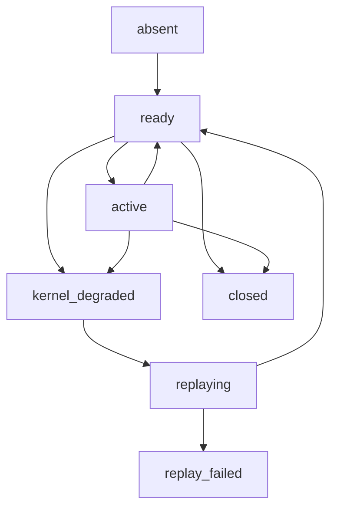
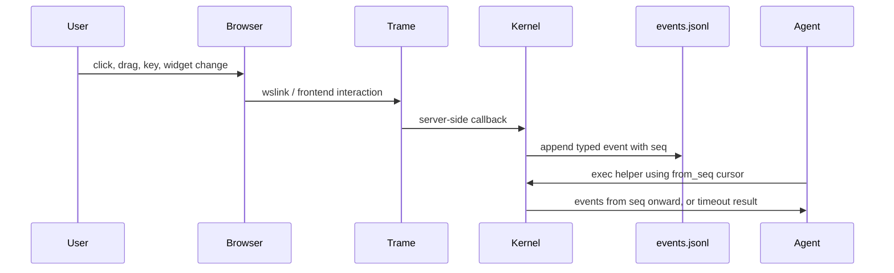
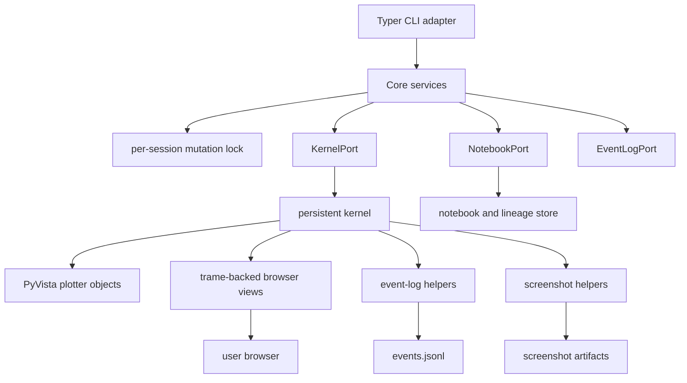

# Jupyter Workbench — Runtime Model

Related: [overview.md](./overview.md) | [architecture.md](./architecture.md)
Source: `work/jupyter-workbench-design/design/architecture/jupyter-workbench-target-architecture.md`

---

## Why Jupyter, Not a Plain REPL

The key capability `jupyter-workbench` needs is **structured rich output capture**: cell execution that records display data (images, HTML, JSON), maintains kernel state across invocations, and produces real `.ipynb` artifacts that can be opened independently in JupyterLab.

A plain REPL provides none of this:

| Requirement | Plain REPL | Jupyter kernel (`jupyter_client`) |
|---|---|---|
| Rich output capture (images, HTML) | No | Yes — via IOPub messages |
| Persistent kernel state across invocations | No (process boundary) | Yes — reconnect to running kernel |
| Real `.ipynb` artifacts | No | Yes — via `nbformat` |
| Replay / replay-from-notebook | No | Yes — re-execute notebook cells |
| Integration with PyVista + trame | Poor | Native — trame is a Jupyter backend |

`jupyter_client` provides message-level kernel interaction and rich output capture via the IOPub channel. `nbformat` provides durable real-notebook recording. Together they give the system execution fidelity, provenance, and replayability that no subprocess-based REPL can match.

---

## No Daemon

There is no visualization daemon. The Jupyter kernel is the long-lived runtime process.

Each CLI invocation:
1. Resolves the session root and session id.
2. Reconnects to the persistent kernel through the `KernelPort` adapter.
3. Performs work and returns a DTO.
4. Exits.

The kernel retains all in-memory state — plotter handles, callback registrations, event log writers — between invocations.

**Why this matters for visualization:** PyVista officially supports interactive Jupyter rendering via the trame backend and `plotter.show(jupyter_backend='trame')`. Once that code runs inside the kernel via `jupyter-workbench exec`, the browser scene is live, and later `exec` calls can inspect or update it without any daemon coordination.

Eliminating the daemon eliminates: a daemon control protocol, a second session namespace, viz-specific CLI verbs (`viz-show`, `viz-update`, `viz-events`), a formal cross-package scene-spec schema, and a second concurrency model.

---

## Durable Session Layout

```text
<project>/
  .jupyter-workbench/
    sessions/
      <session_id>/
        manifest.json          ← session health, kernel/viz status
        kernel.json            ← kernel connection file
        snapshot.json          ← last snapshot
        lineage.json           ← lineage graph
        notebooks/
          active.ipynb         ← append-only working notebook
          derived/             ← compacted/derived notebooks
        outputs/               ← artifact files for large execution outputs
        visualizations/
          manifests/           ← per-visualization metadata
          events.jsonl         ← durable interaction event log
          screenshots/         ← captured screenshots
```

`jupyter-workbench` is the **sole authority** for this layout. Domain packages write through documented helpers and CLI contracts, not by inventing parallel state roots.

---

## Session Lifecycle State Machine



Visualization status is an **independent overlay** on an otherwise valid kernel session:
- `visualization_absent`
- `visualization_healthy`
- `visualization_degraded`

### Recovery rules

**Kernel loss (`kernel_degraded`):**
- `SessionService.open()` auto-recovers dead sessions by detecting the kernel is missing and reporting `kernel_degraded`.
- It does **not** silently replay. Replay is expensive, may fail, and changes live state — it must stay observable.
- `LineageService.replay()` is the explicit repair action: start a fresh kernel, re-execute the source notebook, record as a new lineage revision.
- **Implementation note:** After replay, visualization status resets to `absent` by design. The viz state requires a live browser/trame session; replay can't reconstruct it. Agents must re-execute scene setup code after replay.

**Visualization loss (`visualization_degraded`):**
- Kernel remains healthy; just re-execute visualization setup code via `jupyter-workbench exec`.
- No daemon restart needed because there's no daemon.

**Both failed:** Recover kernel first via `replay`, then reconstruct visualization via `exec`.

---

## Append-Only Notebook Model

Cells are **appended, never modified in place**. Every execution step is recorded in `active.ipynb` in order.

**Why append-only:**
- Complete provenance: every exploratory branch is recorded.
- LLM-driven compaction: a cheap cleanup agent can read the full history and derive a clean version without losing context about what was tried.
- Replay fidelity: replaying the notebook re-executes the steps in order.

### Large-output policy

- Execution outputs are truncated to 64 KB inline (configurable).
- Full output written to `outputs/` artifact file with a handle returned in the DTO.
- A per-cell 1 MB **warning threshold** triggers an `output_size_warning` field in the result, prompting the agent to restructure the cell.
- `snapshot` always returns bounded summaries regardless of cell output size.

---

## Notebook Lineage Operations

| Operation | CLI verb | What it does |
|---|---|---|
| **Replay** | `jupyter-workbench replay` | Start fresh kernel, re-execute active notebook, record as new lineage revision |
| **Derive** | `jupyter-workbench derive` | Create a new derived notebook from a subset of the lineage; source notebook preserved immutable |
| **Compact** | `jupyter-workbench compact` | Produce a clean compacted notebook, removing dead-end branches; source preserved |

These operations work with **no active browser session**. The cheap cleanup agent uses only these verbs — it never needs visualization.

**Why replay is explicit, not silent:**
Silent replay hides cost and failure risk. An explicit command keeps recovery inspectable and preserves the provenance story around derived notebooks and repaired sessions.

---

## Event Capture Architecture

User interaction loop: browser → trame callback → kernel helper → durable event log → later `exec` or `snapshot` read.



### Event record shape

Each record in `events.jsonl`:

```json
{
  "seq": 42,
  "ts": "2026-05-02T10:31:00Z",
  "session_id": "abc123",
  "viz_id": "main",
  "type": "pick",
  "scene_revision": 3,
  "payload": {"actor_id": "component-3"}
}
```

Core v1 event types: `pick`, `selection`, `camera_change`, `widget_change`, `key`, `client_connected`, `client_disconnected`.

### Cursor-based consumption

Callers supply a `from_seq` cursor. The system never uses a shared unread pointer. This means:
- Multiple agents/consumers can independently read the event log without stealing each other's events.
- A cheap cleanup agent can scan event history without affecting an ongoing interactive session.

---

## Concurrency and Session Ownership

**Single-writer lock per session.** Mutating commands (`open` when creating, `exec`, `markdown`, `replay`, `derive`, `compact`, `close`) are serialized through a per-session mutation lock on disk.

**Concurrent reads allowed.** Read-only commands (`snapshot`, `status`, `list`, `lineage`) may execute concurrently with each other and with one in-flight mutation.

**Visualization uses the same lock.** Visualization updates happen through `exec`, so there's no second concurrency model for viz-only commands.

**No cross-session blocking.** Sessions are fully independent.

---

## In-Kernel Visualization: PyVista + Trame



### How visualization works

1. Agent runs `jupyter-workbench exec` with Python that creates PyVista plotter objects.
2. Code calls `plotter.show(jupyter_backend='trame')`.
3. Kernel retains plotter handles, callback registrations, and event-log writers in session memory.
4. Browser connects to the emitted URL.
5. Later `exec` calls inspect existing plotters, poll/wait for interaction events, take screenshots, or apply scene updates.

### Two layers of visualization state

- **Live in-kernel objects** — plotter handles, callbacks; for immediate interaction.
- **Durable notebook + artifacts** — events.jsonl, screenshots, scene metadata; for replay, inspection, recovery.

Visualization state that matters for replay must be reconstructible from notebook cells and durable artifacts, not only from transient in-memory objects.

### Known caveats

- **Environment variability** — OpenGL and display-environment differences (especially Linux headless, remote machines) are the main operational risk. A known-good compatibility set for pyvista/trame/trame-vtk must be pinned and tested.
- **Remote hosts** — May require `jupyter-server-proxy` or `trame_jupyter_extension` for browser connectivity. Document in setup, not an architecture blocker.

---

## Expensive-Agent / Cheap-Agent Workflow Split

This is the primary operational pattern for `microct-analysis` workflows.

### Expensive analysis loop (interactive)

```
jupyter-workbench open
jupyter-workbench exec [code or --file script.py]
jupyter-workbench snapshot            ← machine-readable observation
  → agent shares browser URL with user
jupyter-workbench exec [poll events]  ← wait for picks, widget changes
  → agent explains what changed and why
  → repeat from exec
```

Characteristics: requires live browser, kernel, and possibly PyVista + trame stack.

### Cheap cleanup loop (no viz needed)

```
jupyter-workbench status / snapshot
jupyter-workbench lineage             ← inspect full notebook history
jupyter-workbench derive / compact    ← produce clean derived notebook
jupyter-workbench snapshot            ← verify result
```

Characteristics: works with no active browser session and no live visualization. A smaller/cheaper agent model can handle this pass, although replaying notebooks that contain visualization setup still requires the package environment needed by those cells.

### Why the split matters

- Expensive agents are slower and costlier. They should focus on interactive analysis and explanation, not notebook housekeeping.
- Cheap agents don't need visualization capabilities but can produce clean reproducible notebooks from the append-only history.
- The split also matches a natural workflow: analyze interactively, then clean up the provenance record.
