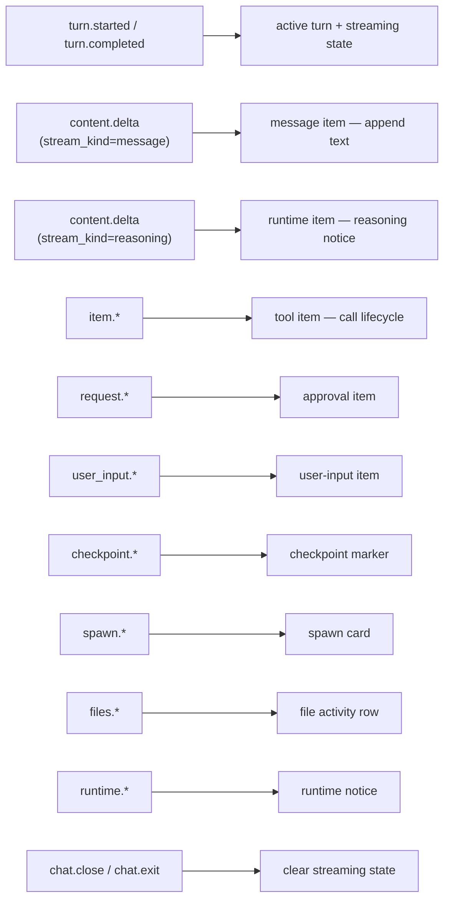

# Chat Extension

The chat extension (`src/extensions/chat/`) is the canonical first-party extension. It renders the agent conversation timeline, handles user input, and translates backend event streams into a UI timeline.

It activates immediately at startup and owns the main view, rail item, model chip, and connection indicator.

---

## Activation and Contributions

Manifest and activation entry point: `src/extensions/chat/index.ts`

**Contributions:**

| Contribution | Details |
|---|---|
| Main view | Chat panel in `MainPanel` slot |
| Rail item | Chat icon with badge for pending approvals |
| Status bar — connection | Live connection state display |
| Status bar — model | Current model identifier |

**Commands registered at activation:**

| Command | Action |
|---|---|
| `chat.sendPrompt` | Submit user text to the agent |
| `chat.cancel` | Cancel the active turn |
| `chat.approve` | Approve a pending tool call |
| `chat.reject` | Reject a pending tool call |
| `chat.answerInput` | Respond to a HITL user-input prompt |
| `chat.revert` | Revert to a checkpoint |
| `chat.close` | Close the chat session |

At activation, the extension:
1. Subscribes to backend event patterns via `EventAPI`.
2. Hydrates `chatStore` from the full current event log (sorted by `seq`).
3. Registers commands and the chat panel view.
4. Writes initial status bar content.
5. Sets the `hasPendingApproval` context key.

---

## Chat Store and Timeline Model

`src/extensions/chat/store/chatStore.ts` normalizes the backend event stream into a UI timeline.

### Timeline Item Kinds

| Kind | Created by |
|---|---|
| `message` | Assistant text from `content.delta` with `stream_kind = message` |
| `tool` | `item.*` events (tool call lifecycle) |
| `approval` | `request.*` events (tool approval requests) |
| `user-input` | `user_input.*` events (HITL prompts) |
| `checkpoint` | `checkpoint.*` events |
| `spawn` | `spawn.*` events (sub-agent cards) |
| `file` | `files.*` events (file activity) |
| `runtime` | `runtime.*` events (notices, reasoning) |

Timeline entries are sorted by timestamp. Pending approvals are tracked in a `Map`. `pendingUserInput` holds at most one active HITL prompt.

### Backend Event Mapping

---

## Chat Panel and Timeline UI

`src/extensions/chat/components/ChatPanel.tsx` composes two children:

- **`ChatTimeline`** — scrollable event history
- **`InputConsole`** — user input and control strip

### ChatTimeline

`src/extensions/chat/components/ChatTimeline.tsx`

- Backed by `react-virtuoso` for virtualized rendering.
- Autoscrolls to follow streaming output.
- Shows a "scroll to latest" button with unseen item count when the user scrolls away from the bottom.
- Applies entry animations via `motion/react`.
- Rendered as `role="log"` with `aria-live="polite"`.

### Timeline Item Rendering

`src/extensions/chat/components/TimelineItem.tsx` dispatches each item kind to a dedicated component:

| Kind | Component | Notes |
|---|---|---|
| `message` | `MessageContent` | Splits on triple backticks; appends `StreamingCursor` while streaming |
| `tool` | `ToolCallCard` | Collapsible; starts open unless completed |
| `approval` / `user-input` | `ApprovalCard` | Handles both approval and HITL input prompts |
| `checkpoint` | `CheckpointMarker` | Label + short SHA + revert action |
| `spawn` | `SpawnCard` | Sub-agent lifecycle/status card |
| `file` | inline row | File activity summary |
| `runtime` | colored notice | Type-specific color via Lucide icons |

### InputConsole

`src/extensions/chat/components/InputConsole.tsx`

Behaviors:
- Reads draft text from `chatStore`.
- `Ctrl/Cmd+Enter` submits; `Escape` cancels when active.
- Displays current model chip, chat state chip, pending input request, and pending approval banner.
- Dispatches `chat.sendPrompt`, `chat.answerInput`, `chat.cancel`, `chat.approve`, `chat.reject`.
- Contains disabled placeholder slots for future attach and slash-command features.

---

## Hydration and State Recovery

On activation, the chat extension hydrates `chatStore` from the full `eventLogStore` contents — sorted by `seq` — before subscribing to new events. This ensures the UI reflects all events received before the extension activated, including events that arrived during bootstrap.

`handleChatEvent()` clears streaming state when a `chat.close` or `chat.exit` event arrives.

---

## Key References

| File | Role |
|---|---|
| `src/extensions/chat/index.ts` | Manifest, activation, command + event subscription |
| `src/extensions/chat/store/chatStore.ts` | Timeline state model and event reducer |
| `src/extensions/chat/components/ChatPanel.tsx` | Panel composition root |
| `src/extensions/chat/components/ChatTimeline.tsx` | Virtualized timeline with autoscroll |
| `src/extensions/chat/components/TimelineItem.tsx` | Per-kind item dispatch |
| `src/extensions/chat/components/MessageContent.tsx` | Assistant text rendering |
| `src/extensions/chat/components/ToolCallCard.tsx` | Collapsible tool call display |
| `src/extensions/chat/components/ApprovalCard.tsx` | Approval and HITL input rendering |
| `src/extensions/chat/components/CheckpointMarker.tsx` | Checkpoint with revert action |
| `src/extensions/chat/components/SpawnCard.tsx` | Sub-agent card |
| `src/extensions/chat/components/InputConsole.tsx` | User input strip |
| `src/extensions/chat/components/StreamingCursor.tsx` | Blinking cursor for streaming messages |

---

## Related

- [overview.md](overview.md) — Shell bootstrap and overall architecture
- [extension-system.md](extension-system.md) — Manifest model, activation policies, extension context APIs
- [connection-protocol.md](connection-protocol.md) — How backend events arrive and flow into `eventLogStore`
