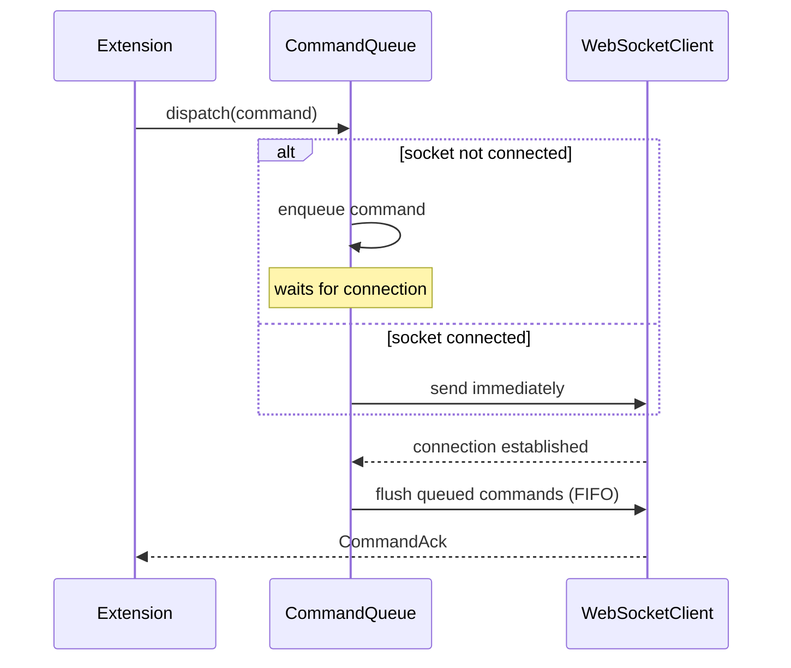
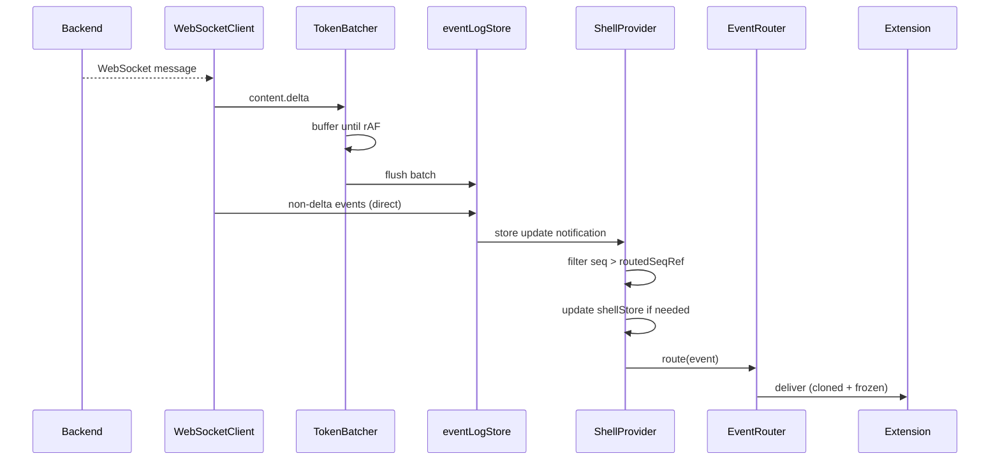

# Connection Protocol

The frontend communicates with the backend over a persistent WebSocket connection. Events stream from backend to frontend; commands flow from frontend to backend. Three transport-layer components coordinate this: `WebSocketClient` (transport), `CommandQueue` (command reliability), and `TokenBatcher` (content delta coalescing).

---

## WebSocket Transport

`src/shell/connection/WebSocketClient.ts`

The client wraps `partysocket` for automatic reconnection behavior.

### URL Construction

WebSocket connections use `buildWsUrl()` to construct URLs of the form:

```
ws[s]://host/ws/chat/{chatId}?last_seq={seq}
```

The `last_seq` parameter lets the backend resume delivery from the last sequence number the client has seen, avoiding duplicate delivery after reconnection.

### Connection Lifecycle

The client tracks connection state in `shellStore`. On state transitions, it emits synthetic shell events:

| Shell Event | When |
|---|---|
| `shell.ready` | Initial connection established |
| `shell.connection.changed` | Any subsequent state change |

These events are routed through `EventRouter` like backend events, so extensions can react to connectivity changes.

### Message Handling

Incoming WebSocket messages are classified by shape:

| Type | Handling |
|---|---|
| `CommandAck` | Resolved through the command acknowledgement path |
| `ChatEvent` | Delivered to `eventLogStore` |
| Unknown | Ignored with a warning |

`content.delta` events are not delivered directly — they are buffered through `TokenBatcher` first.

---

## Command Queue

`src/shell/connection/CommandQueue.ts`

Commands issued before the socket is connected are queued. Once connected, the queue flushes in FIFO order. If the socket disconnects or closes while commands are pending, those commands are rejected.



On disconnect, `CommandQueue.rejectAll()` rejects all pending commands with an error.

---

## Token Batcher

`src/shell/connection/TokenBatcher.ts`

Streaming text arrives as a high-frequency stream of `content.delta` events. Delivering each delta synchronously to the React render pipeline would cause excessive re-renders.

`TokenBatcher` coalesces deltas:
- Buffers all incoming `content.delta` events.
- Flushes the buffer on `requestAnimationFrame` (once per render frame at most).
- Non-delta events bypass the batcher and are delivered immediately.
- `flushNow()` drains the buffer immediately on disconnect or socket close.

---

## Event Log Store

`src/shell/stores/eventLogStore.ts`

All backend events that survive the token batcher are written to `eventLogStore` — the durable in-memory event ledger.

Key properties:

| Property | Value |
|---|---|
| Deduplication | By `seq` field |
| Max size | `DEFAULT_MAX_EVENT_LOG_SIZE = 10_000` events (oldest dropped) |
| Indexes | `turnMap`, `itemMap`, `requestMap` |

Query patterns supported:
- Exact type: `"content.delta"`
- Prefix glob: `"item.*"`
- Wildcard: `"*"`

---

## Shell Event Routing

`ShellProvider` subscribes to `eventLogStore` and drives extension routing on each update:



`ShellProvider` maintains `routedSeqRef` to track the last routed sequence number. On each `eventLogStore` update, it replays only events with `seq > routedSeqRef.current`. This is the "event log as source of truth" pattern: the UI always reconstructs from the log rather than relying on ephemeral socket state.

---

## Environment Configuration

`src/shell/config/env.ts` derives connection parameters:

| Parameter | Source |
|---|---|
| WebSocket URL | `window.location` in browser; `ws://localhost:8080` as SSR default |
| API URL | `window.location` in browser; `http://localhost:8080` as SSR default |
| Session mode | `VITE_SESSION_MODE` env var, validated to `chat` or `app` |
| Dev flag | Vite `import.meta.env.DEV` |

---

## Invariants

- **I-1: Event ordering** — events are delivered to extensions in `seq` order; `ShellProvider` enforces this by replaying from the store rather than accepting events as they arrive.
- **I-2: Immutable delivery** — events are cloned and frozen before delivery to `EventRouter` subscribers; extensions cannot mutate event objects.
- **I-3: Queue drain on disconnect** — `CommandQueue.rejectAll()` must be called on disconnect to avoid stale command promises.
- **I-4: Token batcher drain on close** — `TokenBatcher.flushNow()` must be called on disconnect or close so buffered content is not lost.

---

## Key References

| File | Role |
|---|---|
| `src/shell/connection/WebSocketClient.ts` | Transport, URL construction, reconnect |
| `src/shell/connection/CommandQueue.ts` | Pre-connection command buffering and FIFO flush |
| `src/shell/connection/TokenBatcher.ts` | `content.delta` coalescing via `requestAnimationFrame` |
| `src/shell/stores/eventLogStore.ts` | Durable event ledger, indexes, deduplication |
| `src/shell/ShellProvider.tsx` | Event routing loop, `routedSeqRef`, shell state updates |
| `src/shell/types/events.ts` | `ChatEvent`, `ShellLifecycleEvent`, `CommandAck` type definitions |
| `src/shell/config/env.ts` | URL and session mode derivation |
| `src/test/phase6-probe.test.ts` | Tests for `TokenBatcher.flushNow()` and `CommandQueue.rejectAll()` |

---

## Related

- [overview.md](overview.md) — Shell architecture and bootstrap sequence
- [extension-system.md](extension-system.md) — `EventRouter`, `EventAPI`, and how extensions subscribe to events
- [chat-extension.md](chat-extension.md) — How `chatStore` consumes events from `eventLogStore`
