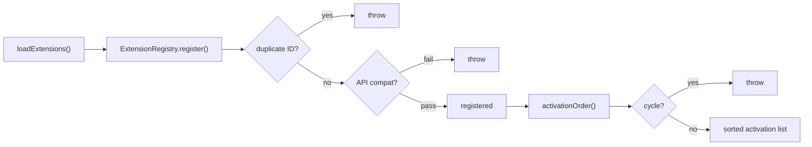
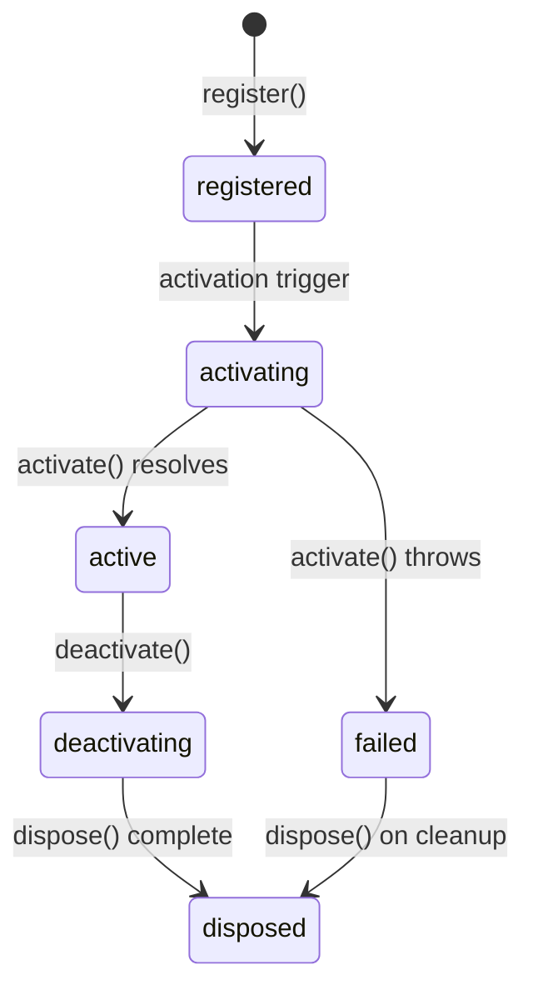

# Extension System

The shell hosts functionality through extensions. Every visual contribution — views, rail items, status bar items — is registered by an extension. The chat panel itself is an extension.

Extensions are manifest-driven: a manifest declares identity, activation policy, and contributions. The `ExtensionManager` assembles runtime behavior from those manifests at startup.

---

## Manifest Model

`src/shell/types/extension.ts` defines the manifest schema.

Each manifest carries:

| Field | Description |
|---|---|
| `id` | Unique extension identifier |
| `version` | SemVer string |
| `apiVersion` | Required shell API version (major-version compatibility check) |
| `activationPolicy` | When the extension activates (see below) |
| `trust` | `first-party` or `third-party` |
| `contributions` | Views, commands, rail items, status bar items, keybindings |
| `permissions` | Optional capability declarations |
| `entryUrl` | Optional iframe URL for third-party extensions |
| `dependencies` | Optional list of extension IDs that must activate first |

### Activation Policies

| Policy | Meaning |
|---|---|
| `immediate` | Activates at startup, before any user interaction |
| `onVisible` | Activates when the user clicks its rail item |
| `onEvent` | Activates when a matching event arrives |
| `onCommand` | Activates when a matching command is dispatched |

---

## Registry and Dependency Ordering

`src/shell/extensions/ExtensionRegistry.ts` manages registration.

Behaviors:
- Rejects duplicate extension IDs at registration time.
- Checks API compatibility via `checkApiVersion` — major-version match only (`src/shell/extensions/version.ts`).
- On activation, `activationOrder.ts` sorts extensions topologically by `dependencies`.
- Fails on missing dependency or circular dependency.

---

## Extension Manager

`src/shell/extensions/ExtensionManager.ts` is the runtime lifecycle engine.

On startup it:
1. Registers all loaded extensions through `ExtensionRegistry`.
2. Adds manifest contributions to `layoutStore` as placeholders.
3. Activates extensions with `immediate` policy.

On demand it activates extensions for:
- `onVisible` — when the rail item for the extension is clicked.
- `onEvent` — when a routed event matches the extension's event pattern.
- `onCommand` — when a dispatched command matches the extension's command pattern.

Deactivation disposes all resources registered through the extension context and removes contributions from `layoutStore`.

Extension runtime state and errors are tracked in `shellStore`.

> **Third-party extensions** are not yet activated. `BridgeHost.ts` (`src/shell/extensions/BridgeHost.ts`) is an explicit seam for future iframe bridge support. The code path is intentional scaffolding, not a working implementation.

---

## Extension Context

When an extension activates, it receives an `ExtensionContext` implemented by `ExtensionContextImpl` (`src/shell/extensions/ExtensionContextImpl.ts`).

The context exposes:

| API | Interface | Purpose |
|---|---|---|
| `connection` | `ConnectionAPI` | Connection state and reconnect |
| `events` | `EventAPI` | Subscribe to backend/shell events by pattern |
| `commands` | `CommandAPI` | Register and dispatch commands |
| `views` | `ViewAPI` | Register React components into layout slots |
| `statusBar` | `StatusBarAPI` | Register or update status bar items |
| `storage` | `StorageAPI` | Namespaced localStorage (`meridian-ext-{id}-{key}`) |
| `state` | `StateAPI` | Shell + event log state snapshots |
| `contextKeys` | `ContextKeyAPI` | Set and read `when`-expression keys |
| `logger` | — | Extension-scoped logger |

**State access pattern:** `state.get()` and `state.subscribe()` are the preferred imperative APIs. `state.use()` is marked deprecated because it can produce unstable snapshots.

State returned from `StateAPI` is a frozen/cloned snapshot — extensions cannot mutate shell state.

`contextKeys` are cleared on extension disposal.

---

## Event Router

`src/shell/extensions/EventRouter.ts` delivers events to extension subscribers.

- Supports pattern subscriptions (`foo.*`, `*`) and predicate subscriptions.
- Clones and freezes events before delivery — extensions cannot mutate events.
- Catches handler exceptions so one failing extension does not interrupt routing for others.

---

## Context Key Store

`src/shell/extensions/ContextKeyStore.ts` powers `when`-expression evaluation for conditional keybindings and activation.

Built-in keys:

| Key | Reflects |
|---|---|
| `connection` | Current connection state |
| `chatState` | Current chat lifecycle state |
| `chatId` | Active chat identifier |
| `sidebarVisible` | Whether the sidebar panel is open |
| `inspectorVisible` | Whether the inspector panel is open |

Supported operators: `\|\|`, `&&`, `==`, `!=`, `!`  
Literal types: booleans, numbers, strings.

---

## Extension Lifecycle Diagram

---

## Error Isolation

Extension views are wrapped in `ExtensionViewBoundary` (`src/shell/layout/ExtensionViewBoundary.tsx`), which:
- Catches render errors from extension React components.
- Logs errors with extension and view identifiers.
- Offers a retry action to attempt re-render.

The rail (`src/shell/layout/Rail.tsx`) shows a failure indicator and error tooltip for extensions that failed activation.

---

## Backend-Discovered Extensions

In production builds, `src/shell/config/manifest.ts` fetches `/extensions` from the backend. When the backend returns extension manifests, those extensions are registered. If the fetch fails, the loader falls back to static manifests with a warning.

> **Current limitation:** backend-discovered extensions exist as manifests only — there are no runtime implementations yet. This is a documented seam, not a bug.

---

## Key References

| File | Role |
|---|---|
| `src/shell/types/extension.ts` | Manifest schema and contribution types |
| `src/shell/types/context.ts` | Extension-facing API interfaces |
| `src/shell/extensions/ExtensionRegistry.ts` | Registration and API compatibility checks |
| `src/shell/extensions/activationOrder.ts` | Topological dependency sort |
| `src/shell/extensions/ExtensionManager.ts` | Runtime lifecycle engine |
| `src/shell/extensions/ExtensionContextImpl.ts` | Shell API implementation |
| `src/shell/extensions/EventRouter.ts` | Pattern and predicate event delivery |
| `src/shell/extensions/ContextKeyStore.ts` | `when`-expression evaluation |
| `src/shell/extensions/BridgeHost.ts` | Future third-party iframe seam |
| `src/shell/extensions/version.ts` | API version compatibility and deprecation warnings |
| `src/shell/config/manifest.ts` | Static and backend-discovered manifest loading |

---

## Related

- [overview.md](overview.md) — Shell architecture and bootstrap sequence
- [chat-extension.md](chat-extension.md) — Canonical first-party extension implementation
- [connection-protocol.md](connection-protocol.md) — Event delivery pipeline that drives `onEvent` activation
