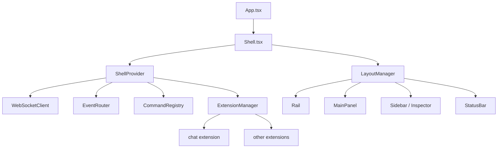

# meridian-web — Overview

`meridian-web` is the general-purpose agent frontend for Meridian. It provides a browser-based shell that hosts extensions, streams backend events over WebSocket, and renders a chat UI on top of the agent runtime.

**Stack:** React 19 · Vite · TypeScript · shadcn/ui · Zustand · `react-resizable-panels` · `react-virtuoso`  
**License:** Apache-2.0  
**Source root:** `../meridian-web/src/`  
**Dev URL:** `https://app.meridian.localhost` (via `make frontend`)

---

## Architecture Summary

The frontend is organized as a **shell** that hosts **extensions**. The shell owns bootstrap, WebSocket transport, event routing, and layout. Extensions own all visible functionality — the chat panel is itself an extension.

`App.tsx` is a thin wrapper over `Shell.tsx`. `Shell.tsx` composes `ShellProvider` and `LayoutManager` — the only two top-level components.

---

## Shell Bootstrap Sequence

`ShellProvider` (`src/shell/ShellProvider.tsx`) is the orchestration root. On mount, it:

1. Reads `chat_id` from the URL, or creates a new chat via `POST /chat`.
2. Validates an existing chat via `GET /chat/{id}/state`.
3. Writes the resolved `chat_id` back to the URL.
4. Creates the runtime services: `WebSocketClient`, `EventRouter`, `CommandRegistry`, `ExtensionManager`.
5. Loads extensions from `loadExtensions(shellEnv.sessionMode)`.
6. Activates extensions with `immediate` activation policy.
7. Opens the WebSocket connection.
8. Subscribes to the event log and routes new events through the extension event router.

Bootstrap fetches use retry/backoff. Services are exposed to extensions through `ShellServicesContext`.

---

## State Architecture

Three Zustand stores hold shell state:

| Store | File | Contents |
|---|---|---|
| `shellStore` | `src/shell/stores/shellStore.ts` | Connection state, chat ID/state, backend capabilities, active extension, extension runtime states |
| `layoutStore` | `src/shell/stores/layoutStore.ts` | Registered views, rail items, status bar items (all keyed by extension) |
| `eventLogStore` | `src/shell/stores/eventLogStore.ts` | Raw event array, `turnMap`, `itemMap`, `requestMap` indexes, deduplication by `seq` |

Only the `layout` substate from `shellStore` is persisted across page loads. Extension runtime state is volatile.

---

## Extension Model

Extensions are manifest-driven. Each extension declares its identity, activation policy, and contributions (views, rail items, status bar items, commands, keybindings). The `ExtensionManager` assembles runtime behavior from these manifests.

The chat panel is the canonical first-party extension. It activates immediately and contributes the main timeline view, rail item, model chip, and connection indicator.

See [extension-system.md](extension-system.md) for full details.

---

## Layout System

`LayoutManager` (`src/shell/layout/LayoutManager.tsx`) reads registered contributions from `layoutStore` and composes them into:

- **Rail** — icon strip on the left; activates extensions on click
- **MainPanel** — renders the active main view
- **Sidebar / Inspector** — render all visible views in their slot
- **StatusBar** — splits items into left/right groups, sorted by priority

Views are wrapped in `ExtensionViewBoundary` for error isolation. On narrow screens (`< 767px`), sidebar and inspector are hidden.

---

## Session Modes

`VITE_SESSION_MODE` controls which extensions load at startup. The variable is validated to `chat` or `app`. In `app` mode, `demoExtension` and `brokenExtension` (an intentional failure fixture) are added to exercise the failure handling path.

---

## Key References

| File | Role |
|---|---|
| `src/App.tsx` | Entry point — renders `Shell` |
| `src/shell/Shell.tsx` | Top-level composition |
| `src/shell/ShellProvider.tsx` | Bootstrap, service creation, event routing |
| `src/shell/stores/shellStore.ts` | Core shell state |
| `src/shell/stores/layoutStore.ts` | Layout contribution registry |
| `src/shell/stores/eventLogStore.ts` | Durable event ledger |
| `src/shell/types/context.ts` | Extension-facing shell API types |
| `src/shell/types/events.ts` | `ChatEvent`, `ShellEvent`, `CommandAck` envelopes |

---

## Related

- [extension-system.md](extension-system.md) — Manifest model, registry, activation lifecycle, extension context APIs
- [chat-extension.md](chat-extension.md) — Chat timeline model, event mapping, panel and input UI
- [connection-protocol.md](connection-protocol.md) — WebSocket transport, command queue, token batching, event routing
