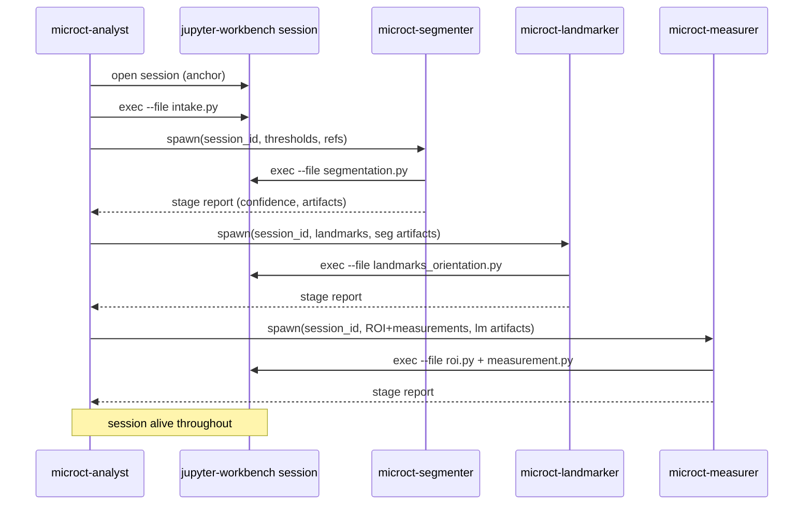

# MicroCT Analysis — Package Architecture

Status: Shipped and validated (2026-05-05)  
Runtime layer: [jupyter-workbench/overview.md](../jupyter-workbench/overview.md)  
Measurement design: [measurement-design.md](./measurement-design.md)  
Toolkit implementation: [toolkit-implementation.md](./toolkit-implementation.md)

---

## What it is

`microct-analysis` is a mars prompt package for volumetric image analysis. The Python tools layer is **domain-agnostic** — it has no knowledge of anatomy, species, pathology, or measurement protocol. Domain knowledge enters exclusively through workflow definition files at runtime, making the same tools applicable to different anatomies and studies without code changes.

The first shipped workflow targets preclinical mouse bone microCT for osteoarthritis research (Tang et al. 2026). The package owns segmentation, landmark placement, ROI definition, morphometric measurements, scene semantics, and the explain-then-apply interaction pattern.

The package is a pure domain layer. All kernel lifecycle, notebook persistence, session management, and visualization run through `jupyter-workbench`. The package depends on `jupyter-workbench` as its only runtime tool and fails loudly at bootstrap if it is missing.

For the runtime contract, see [jupyter-workbench/architecture.md](../jupyter-workbench/architecture.md).

---

## Agent Architecture: Analyst + Specialists

The package ships six agent profiles in two categories.

### Session-linked agents (analysis pipeline)

| Agent | Role | Session ownership |
|---|---|---|
| `microct-analyst` | Session-owning orchestrator — drives the full analysis, confidence-gates between stages | Opens and keeps the session alive |
| `microct-segmenter` | Segmentation + structure identification + seed curation | Operates within analyst's session via session_id |
| `microct-landmarker` | Landmark placement + tibia orientation | Operates within analyst's session |
| `microct-measurer` | ROI definition + measurement execution | Operates within analyst's session |

### Independent agents

| Agent | Role | Session |
|---|---|---|
| `microct-workflow-creator` | Knowledge creation from papers and descriptions → workflow notes | No workbench session |
| `microct-cleanup` | Lineage-based notebook derivation and compaction | Operates within analyst's session (no live viz) |

### Why analyst + specialists, not monolithic

The value of sub-agents is **clean context windows**. A segmentation agent starts fresh with only segmentation-relevant context (threshold values, reference images, current volume state) — not the accumulated context of DICOM loading, measurement math, and everything else.

**Rejected alternative: monolithic analyst.** Accumulates the full context of every stage in one window. Segmentation thresholds, landmark geometry, measurement math, and seed curation state all compete for attention. Individual stages cannot be retried without replaying the entire session.

**Rejected alternative: peer top-level stage agents** (the archived design with `microct-segmentation`, `microct-landmarks`, `microct-measurement` as user-facing peers). No single owner for session lifecycle, no single authority for inter-stage confidence gating, brittle handoffs, and the user must understand the stage model to drive the analysis.

The analyst pattern solves all of these: the user talks to `microct-analyst`, which drives end-to-end.

### Session lifecycle

The analyst opens the workbench session and keeps it alive as the session anchor. Sub-agents receive `session_id` and operate within the existing session via `exec --file` and `exec`. When a specialist's spawn ends, the session stays alive because the analyst is still running.

---

## `mouse-ct` Integration

`mouse-ct` is a Python domain package that provides the segmentation reference library: DICOM loading, calibration, preprocessing, component extraction, watershed segmentation, and post-segmentation sanity checks. It is **a required library dependency for stage drivers**, not a second runtime tool or the architectural center of the system.

### What mouse-ct provides (stable public surface)

Stage drivers in `src/microct_analysis/stages/` import from `mouse_ct` only through a defined stable surface:

- `mouse_ct.io` — DICOM loading, calibration, resampling, output serialization
- `mouse_ct.processing` — preprocessing, thresholding, marker extraction, watershed
- `mouse_ct.types` — frozen domain dataclasses (`LoadedScan`, `BoneLabels`, `Seeds`, etc.)
- `mouse_ct.profiles` — scanner profile lookup
- `mouse_ct.verify.sanity` — post-segmentation sanity checks

**Out of scope:** `mouse_ct.picker`, `mouse_ct.seed_editor`, `mouse_ct.cli`, `mouse_ct.qc.*` — these are internal and must not be imported by stage drivers.

### Why mouse-ct is a library, not the architecture center

Before the current design, there was consideration of making `mouse-ct` the primary execution path (using its standalone CLI). This was rejected because:

- The standalone CLI reintroduces an unnecessary runtime boundary alongside jupyter-workbench.
- Notebook-state continuity is weaker when execution bypasses the workbench kernel.
- Measurement semantics are workflow-defined, not segmentation-defined. `mouse-ct` correctly owns segmentation primitives; `microct_analysis` owns the measurement logic that uses segmentation outputs.

The execution path is: **`microct_analysis` stage drivers (run via `exec --file`) → import `mouse_ct` public API → operate in the analyst's kernel session.**

### Measurement ownership

`mouse-ct` does not provide the measurement engine. `src/microct_analysis/measurements/` owns measurement math (geometry, volumes, trabecular metrics, reporting) because measurement definitions are workflow-specific — the same segmented structures may support different downstream metrics in different studies. If lower-level utilities later prove reusable, extraction from `microct_analysis` into `mouse_ct` is deferred until two or more workflows prove the seam.

For the full measurement architecture, see [measurement-design.md](./measurement-design.md).

---

## Skill Architecture

Two domain skills ship: `mct-visual-review` and `slice-examination-loop`. All other stage-specific domain knowledge lives in each agent's body (single-consumer skills do not clear the reuse threshold).

### `mct-visual-review`

`mct-visual-review` splits into two sub-sections:

| Sub-section | Scope |
|---|---|
| `mechanics/` | Semi-HITL loop mechanics: screenshot capture, event polling, scene refresh, reference image comparison |
| `policy/` | Semi-HITL loop policy: confidence assignment, explain-then-apply, feedback handling, plain-language correction flow |

The skill explicitly excludes anatomy knowledge, protocol constants, and session choreography — those belong in agent bodies and workflow notes respectively.

### `slice-examination-loop`

The `slice-examination-loop` skill implements the visual examination loop for resolving bridged-bone segmentation cases. It encodes the 3DMedAgent paper pattern (OAMI → CFLT → T1S-Loop): start with a full-volume overview render across all planes, identify candidate locations, then iterate at targeted slices until seeds are placed or futility is declared.

The skill is loaded into `microct-segmenter`, not spawned as a separate agent. It runs in the same kernel context, sharing live numpy arrays without state serialization. There is no hardcoded iteration limit — the agent determines convergence vs futility through judgment.

The skill exports a `seed_evidence.json` contract: each visual decision (plane examined, slice indices, point coordinates, coordinate frame) must be recorded before any watershed call. See [toolkit-implementation.md](./toolkit-implementation.md) for the design rationale and the watershed failure root cause that motivated this skill.

---

## Workflow Note System

Protocol knowledge lives in KB workflow notes, not in skills or agent bodies. A workflow note is the durable contract for one analysis type: thresholds, landmarks, ROI definitions, measurements, acceptance checks, and reference images. Skills stay generic; workflow notes carry study-specific facts.

The format is a Markdown file with YAML frontmatter carrying all machine-parseable executable fields. `workflow_binding.py` compiles the frontmatter into typed `MeasurementSpec` values; prose sections add context for agents but are never parsed by helpers.

**Why separate protocol from skills:**
- Protocol values change per study. Thresholds, ROI offsets, landmark names, and measurement formulas are inspectable data, not agent identity.
- Baking mouse-knee OA specifics into skills would lock the package to one anatomy.

The first workflow to ship encodes the Tang et al. mouse-knee OA geometric-index protocol (Scanco VivaCT 40, thresholds 220/270/320, distal femoral ratio, tibial IIOC height/width ratio).

---

## Confidence Gating Contract

| Level | Meaning | Analyst action |
|---|---|---|
| `high` | Workflow targets and visual evidence agree | Proceed; summarize in final report |
| `medium` | Output usable but should be called out | Proceed and record the risk |
| `low` | Multiple plausible corrections or blocked interpretation | Pause, show evidence, ask the user |

The analyst is the sole authority for inter-stage proceed/flag/pause decisions. Specialists do not act on run-level confidence — they emit a rating, evidence, and recommended action, and the analyst decides. The single exception: `microct-segmenter` may pause directly during seed curation when ambiguous bone identity cannot be resolved automatically.

---

## Related Pages

- [toolkit-implementation.md](./toolkit-implementation.md) — generic tools layer, watershed fix, 3DMedAgent pattern, OA6-1RK validation results
- [measurement-design.md](./measurement-design.md) — two measurement domains, SOP ground truth, OA6-1RK oracle
- [jupyter-workbench/overview.md](../jupyter-workbench/overview.md) — the runtime layer
- [jupyter-workbench/architecture.md](../jupyter-workbench/architecture.md) — hexagonal architecture, service boundaries
- [domain-packages.md](../domain-packages.md) — package catalog
