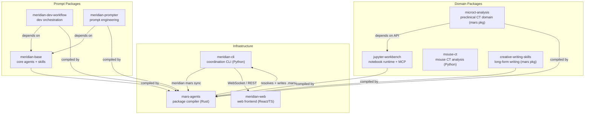
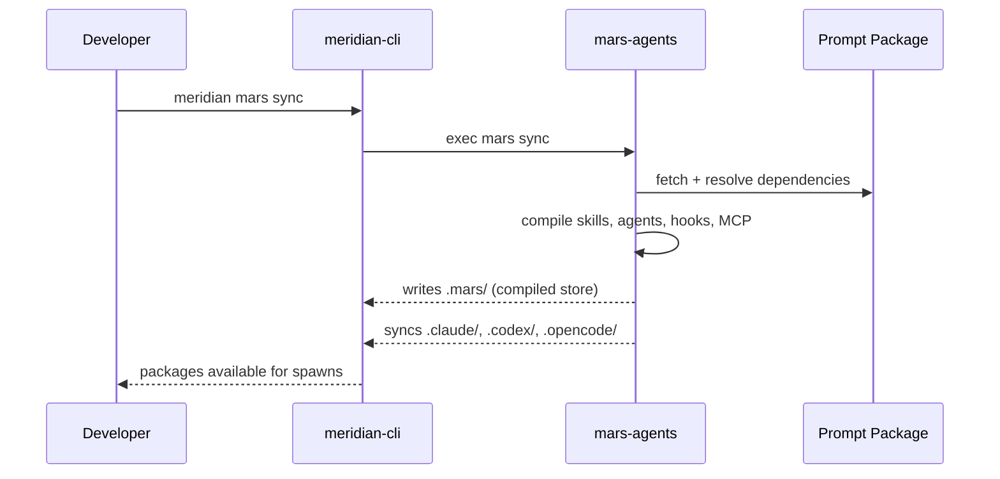

# Ecosystem Overview

The Meridian ecosystem is a set of repositories that together form the multi-agent coordination platform. Each repo has a distinct role; none duplicates another's responsibility.

## Repo Map

---

## Infrastructure Repos

### meridian-cli
**Role:** The core coordination layer. Provides the `meridian` CLI, spawn/session state management, harness adapters, launch composition, and the REST/WebSocket app server.

**Language:** Python (`uv`, `src/meridian/`)

**Key responsibilities:**
- Spawn lifecycle: `queued → running → finalizing → succeeded | failed | cancelled`
- Harness adapters for Claude, Codex, OpenCode, Direct
- JSONL event stores (atomic writes, crash-tolerant reads)
- Launch composition: resolves model, permissions, prompt, argv in one place (`build_launch_context`)
- REST + WebSocket app server consumed by meridian-web
- `meridian mars ...` commands that delegate to mars-agents

**Canonical local path:** `../meridian-cli/`

See [architecture/system-overview.md](../architecture/system-overview.md) for the internal subsystem map.

---

### mars-agents
**Role:** The package compiler. Reads `mars.toml`, resolves the dependency graph, compiles agent/skill packages into `.mars/` (the canonical compiled store), and syncs to native harness target directories (`.claude/`, `.codex/`, `.opencode/`).

**Language:** Rust (binary name: `mars`)

**Key responsibilities:**
- Reader → Compiler → Target sync pipeline
- Dependency resolution with semver, git tags, path sources
- Native target emission: `.claude/settings.json` + `.mcp.json`, `.codex/codex_hooks.json`, etc.
- Model alias catalog with per-harness routing and visibility
- Lock file (`mars.lock`) for reproducible resolution

**Canonical local path:** `../mars-agents/`

See [architecture/mars-compiler.md](../architecture/mars-compiler.md) and [architecture/mars-targeting.md](../architecture/mars-targeting.md) for compiler and targeting details.

---

### meridian-web
**Role:** The web frontend. An extension-based shell that connects to meridian-cli's WebSocket/REST server and renders the chat UI and agent interaction surface.

**Language:** TypeScript (React 19, Vite, Zustand, shadcn/ui)

**Key responsibilities:**
- Shell bootstrap: chat selection, service creation, extension loading
- Extension registry: manifest-driven contributions (views, commands, rail items, keybindings)
- WebSocket transport with reconnect, token batching (`content.delta` → `requestAnimationFrame`), and command queueing
- Event log as source of truth: UI reconstructs state from replayed backend events
- Chat extension: maps backend event stream to a timeline (messages, tools, approvals, spawns, checkpoints)

**Canonical local path:** `../meridian-web/`

See [ecosystem/meridian-web/overview.md](meridian-web/overview.md) for the shell and extension architecture.

---

## Prompt Packages

Prompt packages are distributed via mars. Each package defines agent profiles and skills in source repos, which mars resolves and compiles into `.mars/` for meridian-cli to load at spawn time.

### meridian-base
**Role:** The foundation layer for the Meridian agent ecosystem. Provides the infrastructure skills (spawning, KB conventions, shared-workspace safety) and utility agents (orchestrator, subagent, explorer, KB agents, session explorer) that other packages build on.

**Exports:**
- 6 agents: `meridian-default-orchestrator`, `meridian-subagent`, `explorer`, `kb-writer`, `kb-maintainer`, `session-explorer`
- 11 skills: `meridian-spawn`, `meridian-work-coordination`, `meridian-privilege-escalation`, `shared-workspace`, `kb-conventions`, `md-validation`, `decision-log`, `intent-modeling`, `llm-writing`, `agent-management`, `session-mining`
- Shared model alias catalog (`gpt55`, `opus`, `sonnet`, `codex`, `gpt`, etc.)

**Canonical source path:** `../prompts/meridian-base/`

See [ecosystem/prompt-packages/meridian-base.md](prompt-packages/meridian-base.md) for the full agent and skill inventory.

---

### meridian-dev-workflow
**Role:** Dev orchestration agents and skills for the full product development lifecycle — from requirements to shipped code with tests and docs.

**Depends on:** meridian-base (model aliases, core skills)

**Exports:**
- 26 agents organized into orchestrators (`product-lead`, `design-lead`, `planner`, `tech-lead`, `qa-lead`, `ux-lead`), builders (`coder`, `frontend-coder`, `refactor-coder`, `architect`, etc.), reviewers (`reviewer`, `refactor-reviewer`, `alignment-reviewer`), and testers (`smoke-tester`, `integration-tester`, `unit-tester`, `verifier`, `browser-tester`)
- 17 local skills: `agent-staffing`, `dev-artifacts`, `planning`, `design-principles`, `dev-principles`, `architecture`, `refactoring-principles`, `review`, `testing-principles`, and more

**Workflow topology:** `product-lead → design-lead → planner → tech-lead`, with `qa-lead + kb-writer + tech-writer` in parallel after implementation.

**Canonical source path:** `../prompts/meridian-dev-workflow/`

See [ecosystem/prompt-packages/meridian-dev-workflow.md](prompt-packages/meridian-dev-workflow.md) for the full agent and skill catalog.

---

### meridian-prompter
**Role:** Prompt engineering agents and skills. Treats prompt writing as an engineering discipline with research-backed principles, an iterative draft/review/test cycle, and explicit artifact conventions.

**Depends on:** meridian-base (core skills)

**Exports:**
- 5 agents: `prompt-dev`, `prompt-reviewer`, `prompt-tester`, `python-tool-writer`, `web-prompt-researcher`
- 4 skills: `prompt-principles` (the core doctrine, 4-level: prompt/skill/agent/system), `agent-artifacts`, `skill-artifacts`, `prompt-review`

**Canonical source path:** `../prompts/meridian-prompter/`

See [ecosystem/prompt-packages/meridian-prompter.md](prompt-packages/meridian-prompter.md) for the agent catalog and prompt engineering doctrine.

---

## Domain Packages

Domain packages apply the Meridian ecosystem to a specific problem domain. They may be Python libraries, mars prompt packages, or both.

### jupyter-workbench
**Role:** Reusable Python library, agent-facing CLI, and FastMCP adapter for persistent notebook-backed analysis. Owns the kernel session lifecycle, notebook lineage, snapshot observation, and visualization artifact conventions.

**Package form:** Python library + CLI + FastMCP server, also compiled as a mars prompt package (skills: `session-management`, `notebook-lineage`, `compaction-cleanup`, `pyvista-interactive`)

**Canonical local path:** `../jupyter-workbench/`

See [jupyter-workbench/overview.md](jupyter-workbench/overview.md) for the full architecture and package ownership.

---

### microct-analysis, mouse-ct, creative-writing-skills

See [ecosystem/domain-packages.md](domain-packages.md) for coverage of the remaining domain packages.

---

## How Packages Flow into meridian-cli

Every `meridian spawn -a <agent>` loads agent profiles and skills from `.mars/`. The compiled store is the read surface; source repos are the write surface. Never edit `.mars/` directly.

---

## Related

- [architecture/system-overview.md](../architecture/system-overview.md) — meridian-cli internals
- [concepts/package-management/overview.md](../concepts/package-management/overview.md) — mars package model concepts
- [architecture/mars-compiler.md](../architecture/mars-compiler.md) — compiler pipeline internals
- [ecosystem/meridian-web/overview.md](meridian-web/overview.md) — web frontend architecture
- [ecosystem/prompt-packages/overview.md](prompt-packages/overview.md) — prompt package composition model
- [jupyter-workbench/overview.md](jupyter-workbench/overview.md) — notebook runtime
