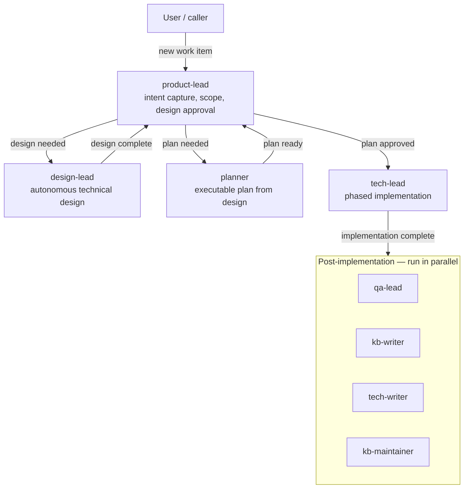
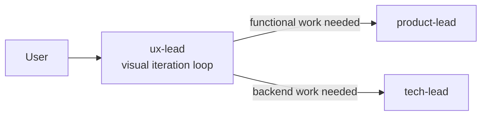
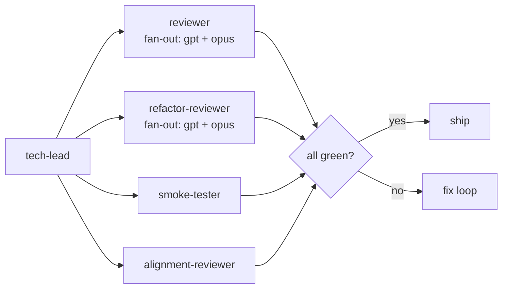

# meridian-dev-workflow

**meridian-dev-workflow** provides the full software development lifecycle as a multi-agent workflow. It adds design leads, planners, coders, reviewers, testers, and documentation writers on top of `meridian-base`.

**Package version:** 0.3.4  
**Source:** `../prompts/meridian-dev-workflow/`  
**Dependencies:** `meridian-base` v0.2.2, `meridian-prompter`, `frontend-design`, `playwright-cli`

## Workflow Topology

The primary workflow path follows a four-agent handoff chain:

The UX path diverges for visual/interactive work:

## Agent Catalog

### Leads and Orchestrators

**`product-lead`** — dev workflow entry point. Owns intent capture, scope sizing, design approval, plan review, and redesign routing. Harness: `claude`, approval: `yolo`. Must not investigate or implement directly — routes to specialists. After implementation, spawns `@qa-lead`, `@kb-writer`, `@tech-writer`, and `@kb-maintainer` in parallel, then ends.  
Skills: `intent-modeling`, `issues`, `dev-artifacts`, `meridian-work-coordination`, `session-mining`.

**`design-lead`** — autonomous technical design owner. Model: `claude-opus-4-6`, effort: `high`. Produces the full design package: behavioral spec (EARS statements), architecture, refactor agenda, feasibility evidence. Explores options via `@web-researcher`, `@architect`, `@smoke-tester`, `@explorer`. Spawns `@planner` only when the caller explicitly grants autonomous planning authority.

**`planner`** — converts a design package into an executable plan. Model: `gpt-5.4`, effort: `high`. Writes only to the `plan/` tree. Every requirement/EARS statement maps to a concrete phase/subphase. Returns one of: `plan-ready`, `probe-request`, or `structural-blocking`.

**`tech-lead`** — executes approved plans through phase/subphase loops. Model: `claude-opus-4-6`, effort: `high`, approval: `auto`. Does not implement directly — spawns `@coder`, `@refactor-coder`, `@frontend-coder`, `@verifier`, and `@smoke-tester`. Final gate includes `@reviewer` fan-out, `@refactor-reviewer`, `@smoke-tester`, and `@alignment-reviewer`.

**`qa-lead`** — post-implementation owner of the permanent test suite. Model: `gpt-5.4`, effort: `high`, approval: `auto`. Runs in parallel with `@kb-writer` and `@tech-writer`. Uses risk-based tiering, spawns `@unit-tester`, `@integration-tester`, `@smoke-tester`, reviews with `@reviewer`.

**`ux-lead`** — visual/UX entry point for user-facing iteration. Model: `claude-opus-4-6`, approval: `yolo`. Stays in the visual loop with the user, routes mockups/browser work, hands off to product/tech leads for functional or backend needs.

### Design and Research

**`architect`** — structural decision specialist. Model: `gpt-5.4`, effort: `high`. Writes hierarchical design docs, uses web research for external behavior validation. Does not write production code.

**`design-writer`** — lighter design-doc editor. Model: `sonnet`, effort: `medium`. Makes surgical updates in `design/`. Doesn't invent missing decisions. Commits completed changes before reporting.

**`web-researcher`** — external facts and ecosystem behavior. Model: `codex` (Codex harness). Produces a complete tradeoff report. Does not write files.

### Implementation

**`coder`** — general implementation agent. Model: `gpt55`, fanout: `[gpt55, codex]` with `codex` effort high. Scope-bound to the phase blueprint and claimed EARS IDs. Used for backend, frontend logic, CLI, infra, data flow, build systems.

**`frontend-coder`** — visual frontend implementation specialist. Model: `gpt55`, fanout: `[gpt55, codex]`. Used when design fidelity and UX polish are the primary concern. Loads `frontend-design`.

**`refactor-coder`** — behavior-preserving structural refactor executor. Model: `gpt55`, effort: `medium`. Owns one coherent structural move at a time. Verifies blast radius, reports residual risk.

**`frontend-designer`** — formal UI/UX spec writer. Model: `claude-opus-4-6`, effort: `high`. Produces specs only — mockups are `@mockup-gen`'s job.

**`mockup-gen`** — fast throwaway visual mockups using the real codebase and design system. Model: `gpt55`, fanout: `[gpt55, codex]`. Optimizes for speed over polish.

**`imagegen`** — image generation specialist. Model: `gpt55`. Requires `[features] image_generation = true` in `.codex/config.toml` (see `bootstrap/imagegen-setup/BOOTSTRAP.md`).

**`browser`** — general live-browser agent. Model: `gpt55`, fanout: `[gpt55, codex]`. Scraping, navigation, screenshots, forms, interactive annotation. Uses `playwright-cli`.

### Review and Verification

**`reviewer`** — adversarial review for correctness, regression risk, structural soundness, security, design alignment. Model: `gpt-5.4`, effort: `high`, fanout: `[gpt, opus]`. Read-only — returns severity-ranked findings.

**`refactor-reviewer`** — structural health review with a refactoring lens. Fanout: `[gpt, opus]`. Looks for coupling, mixed concerns, maintenance cost. Reports the smallest useful structural move.

**`alignment-reviewer`** — coverage verification between artifacts (plan vs design, implementation vs spec). Model: `gpt55`, effort: `medium`. Read-only. Reports `Covered`, `Gap`, `Partial`, or `Drift` with counts.

**`verifier`** — build-green baseline. Model: `gpt-5.4`. Runs tests/types/lint, fixes mechanical breakage, escalates substantive issues.

**`smoke-tester`** — real runtime probing and verification. Model: `gpt-5.4`, approval: `yolo`. Runs actual commands and requests, probes edge cases, reports exact outputs.

**`integration-tester`** — component composition testing with fakes at external boundaries. Model: `gpt-5.4`.

**`unit-tester`** — targeted unit tests for specific behaviors, edge cases, regressions. Model: `gpt-5.4`.

**`browser-tester`** — real-browser QA for frontend behavior. Model: `gpt55`, fanout: `[gpt55, codex]`. Uses `playwright-cli`.

**`investigator`** — root-cause diagnosis. Model: `gpt-5.4`. Can spawn `@smoke-tester`, `@explorer`, `@session-explorer`, `@web-researcher`, `@unit-tester` to narrow the problem. Files GitHub issues when that's the right resolution.

### Documentation

**`tech-writer`** — user-facing documentation. Model: `sonnet`. Gathers context via `@explorer` and conversation history. Follows Diátaxis. Verifies with `@reviewer`. Runs `meridian kg check` and `meridian mermaid check`.

## Local Skill Catalog

### Workflow and Artifact Management

**`agent-staffing`** — delegation is mandatory for leads. Scale effort to risk. Review until convergence. Distinguish fan-out (same role, parallel instances) from parallel lanes (different roles). `@smoke-tester` is mandatory for integration boundaries. Resources: `convergence.md`, `escalation.md`, `fan-out.md`, `parallelism.md`, `staffing.md`.

**`dev-artifacts`** — the work directory is durable authority. Defines the canonical layout:
- `requirements.md` — EARS behavioral spec
- `design/` — design package owned by `@design-lead`
- `plan/` — execution plan owned by `@planner`  
Resources: `ownership.md`, `plan-package.md`.

**`planning`** — a plan is an execution delta, not a design restatement. Phase/subphase structure, light vs full verification, probe/diagnosis lanes, fix-cycle routing. Resources: `execution-model.md`.

**`issues`** — GitHub issue filing with consistent label taxonomy. Tag issues with `work:<slug>`. Skip silently if `gh` is unavailable.

### Design and Implementation Principles

**`design-principles`** — spec-driven development, requirements as hypotheses, edge-case thinking, probe-before-commit, diagram-first communication.

**`dev-principles`** — refactor early, judge abstractions carefully, delete aggressively, depend deliberately, follow existing patterns, keep docs current, respect Chesterton's Fence.

**`architecture`** — boundary types, dependency direction, tradeoff dimensions, structural-risk framing.

**`refactoring-principles`** — behavior-preserving structural improvement. Smell families (bloaters, change preventers, couplers, dispensables, OO abusers), move families (composing methods, moving features, organizing data, simplifying conditionals, dealing with generalization), legacy/deprecation handling. Resources organized under `smells/` and `moves/`.

**`tech-docs`** — one concept per document, hierarchical structure, linked-web documentation, concrete/invariant-heavy prose, link and diagram verification.

### Testing and Verification

**`review`** — adversarial review methodology with severity handling. Security, concurrency, and architecture lenses.

**`testing-principles`** — risk-based tier selection, testing trophy guidance, behavior-over-implementation, hermetic tests, DAMP over DRY, LLM-generated test caveats.

**`unit-test`**, **`integration-test`**, **`smoke-test`**, **`verification`**, **`browser-test`** — per-tier testing methodology matching the agent of the same name.

**`ears-parsing`** — mechanical EARS statement parsing into `verified` / `falsified` / `unparseable` / `blocked` with per-ID evidence.

## Review and Testing Gate

The `tech-lead` runs a mandatory final gate before shipping:

## Related

- [overview.md](overview.md) — package model and composition
- [meridian-base.md](meridian-base.md) — foundation package
- [meridian-prompter.md](meridian-prompter.md) — prompt engineering tooling (dependency)
- [prompt-principles.md](prompt-principles.md) — 4-level prompt doctrine
