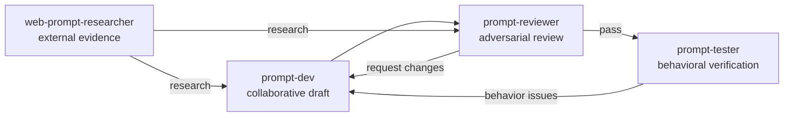

# meridian-prompter

**meridian-prompter** is the prompt engineering package. It provides agents and skills for writing, reviewing, testing, and grounding LLM prompts in research. It is a dependency of both `meridian-base` and `meridian-dev-workflow`, which means its `prompt-principles` skill is available throughout the Meridian agent layer.

**Source:** `../prompts/meridian-prompter/`  
**Primary agent:** `prompt-dev`  
**Dependencies:** `meridian-base` (for `meridian-spawn`, `intent-modeling`, `llm-writing`)

## Prompt Engineering Cycle

The three-stage cycle:

1. **Draft** — `@prompt-dev` writes collaboratively with the user. Draft first, pause for feedback. Iterative — expect corrections.
2. **Review** — `@prompt-reviewer` performs adversarial review. Checks principle adherence, structure, permission correctness (for Meridian prompts), and failure modes. Read-only; produces a findings report with verdict: pass / pass with notes / request changes.
3. **Test** — `@prompt-tester` runs the prompt against real tasks. Verifies behavior, constraints, and output quality in practice. The test is the final arbiter — review catches design issues, testing catches behavior issues.

**`@web-prompt-researcher`** feeds into any stage when a decision needs external grounding: papers, prompting studies, documented patterns with measured results.

## Agent Inventory

**`prompt-dev`** — collaborative prompt-writing session. Harness: `claude`. Handles agents and skills. Drafts first, asks clarifying questions when requirements are ambiguous, pushes back when structure is wrong. Loads `/prompt-principles` before drafting. For Meridian prompts, also loads `skills/prompt-principles/resources/meridian.md` and `skills/agent-artifacts/resources/meridian.md`.  
Skills: `prompt-principles`, `agent-artifacts`, `skill-artifacts`, `meridian-spawn`, `intent-modeling`, `llm-writing`.

**`prompt-reviewer`** — adversarial reviewer. Model: `gpt`, effort: `high`. Read-only. Returns a standalone findings report with severity (blocking / substantive / minor) and a final verdict. For Meridian prompts, checks permission correctness and spawn conventions.  
Skills: `prompt-principles`, `agent-artifacts`, `skill-artifacts`, `prompt-review`, `llm-writing`.

**`prompt-tester`** — behavioral verification. Model: `sonnet`, effort: `high`. Tests real tasks, not definitions. Designs happy-path, edge-case, and constraint-check scenarios. Spawns the target agent with concrete tasks, evaluates whether behavior matches intent. Reports what worked, what didn't, and what was surprising.  
Skills: `meridian-spawn`, `prompt-principles`.

**`python-tool-writer`** — writes deterministic Python tools when a library solves the problem. Model: `codex`, effort: `high`. Researches unfamiliar APIs via web tools. Prefers `mamba/conda` for scientific packages with native dependencies. Breaks larger scripts into functions/modules. Reviews and tests before reporting done.

**`web-prompt-researcher`** — external evidence gatherer for prompting decisions. Model: `sonnet`, effort: `medium`. Searches arXiv, Anthropic/OpenAI research blogs, and practitioner writeups with measured results. Read-only. Reports with citations, confidence level, and applicability assessment.  
Skills: `prompt-principles`.

## Skills

**`prompt-principles`** — the package's core doctrine. Four levels of prompt design, each with its own resource file. See [prompt-principles.md](prompt-principles.md) for the full content.

**`agent-artifacts`** — guidance for agent `.md` files. Agent definitions use YAML frontmatter; the body is the system prompt. Descriptions serve callers, not the agent itself. Managers/leads should coordinate, not implement. Use `disallowed-tools: [Agent]` to force `meridian spawn` and preserve spawn tracking.

**`skill-artifacts`** — guidance for `SKILL.md` files. Skills are directories under `skills/` with `SKILL.md` plus optional resources/scripts/assets. Descriptions should lead with when to load the skill. Most skills use `invocation: explicit`. Keep the body under 500 lines; move depth into `resources/`.

**`prompt-review`** — adversarial review methodology. Look for what's wrong, not what's right. Findings state what's wrong, why it matters, and what to fix. Severity: blocking, substantive, minor. Checks for prompt anti-patterns that weaken prompts.

## Design Philosophy

The package treats prompt engineering as an engineering discipline:

- **Prompts are designed artifacts**, not prose exercises.
- **Principles beat heuristics** — they transfer to novel cases; heuristics don't.
- **Short and structured beats long and mushy** — filler dilutes signal.
- **Review and testing must be separate from writing** — the author cannot evaluate their own work.
- **Research-backed** — principles are tied to evidence in `resources/research.md`, not stated as preferences.
- **Shared knowledge in skills** — when 2+ agents need the same knowledge, it lives in a skill, not duplicated across agent bodies.

## Related

- [prompt-principles.md](prompt-principles.md) — full 4-level doctrine
- [overview.md](overview.md) — package model and composition
- [meridian-base.md](meridian-base.md) — uses this package as a dependency
- [meridian-dev-workflow.md](meridian-dev-workflow.md) — uses this package as a dependency
