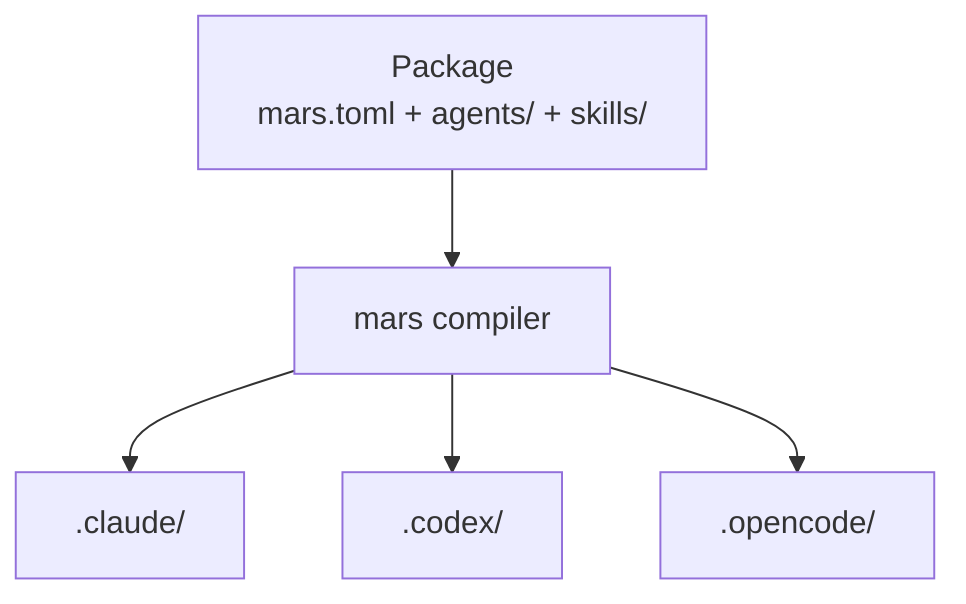
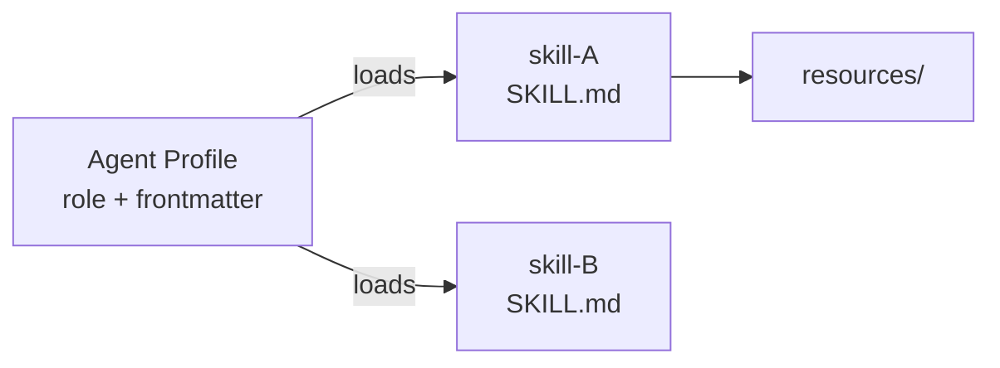

# Prompt Packages Overview

Prompt packages are the unit of agent distribution in the Meridian ecosystem. Each package bundles agent profiles, skills, and resource docs into a versioned, composable artifact that `meridian mars sync` materializes into the harness-native directories (`.claude/`, `.codex/`, `.opencode/`) a project uses.

## Package Model



A package's source layout:

```
mars.toml           — package metadata, dependencies, model aliases, generation targets
agents/             — agent profile .md files (YAML frontmatter + system prompt body)
skills/
  <skill-name>/
    SKILL.md        — skill body (loaded into agent context on trigger)
    resources/      — supplementary reference docs, loaded on demand
bootstrap/          — one-time setup scripts for harness-specific features
```

**`agents/` and `skills/` are source.** The generated `.mars/`, `.claude/`, `.codex/` trees are output — never edited directly.

## Composition: How Skills Shape Agent Behavior

Agent bodies are thin role shells. Reusable doctrine lives in skills and is loaded into an agent's prompt at launch time. This prevents duplication: when multiple agents need the same knowledge, it lives in one skill file, not copy-pasted across every agent body.



The composition pattern:

| Layer | Contains | Who reads it |
|---|---|---|
| Agent frontmatter | model, harness, approval, skills list | meridian at spawn time |
| Agent body | role, behavioral rules, output contract | the spawned agent |
| Skill body | reusable methodology or doctrine | the spawned agent (on load) |
| Skill resources | deep reference material | the agent (on demand) |

Skills use **progressive disclosure**:
- **Metadata** (~100 words in frontmatter) — always visible to callers via agent descriptions
- **Body** (<500 lines) — loaded when the skill is triggered
- **Resources** — only loaded when the agent needs them for depth

## Packages in the Ecosystem

Three packages compose the Meridian agent layer:

| Package | Role | Key dependency |
|---|---|---|
| `meridian-base` | Coordination primitives — orchestrator, subagent, KB agents, core skills | `meridian-prompter` |
| `meridian-dev-workflow` | Dev lifecycle agents — design, planning, implementation, review, QA | `meridian-base`, `meridian-prompter` |
| `meridian-prompter` | Prompt engineering — `prompt-dev`, `prompt-reviewer`, `prompt-tester`, principles doctrine | `meridian-base` |

`meridian-base` is the foundation. `meridian-dev-workflow` adds the full dev workflow on top. `meridian-prompter` adds prompt-specific tooling and is a dependency of both.

## Model Aliases

Model aliases are defined in `mars.toml` and centralized in `meridian-base`. They decouple agent profiles from concrete model names:

| Alias | Backend | Best for |
|---|---|---|
| `gpt55` / `gpt` | GPT-5.5 / GPT-5.4 (Codex harness) | Implementation, review, judgment |
| `opus` | Claude Opus 4.6 (Claude harness) | Orchestration, design, frontend, creative work |
| `sonnet` | Claude Sonnet (Claude harness) | Writing, documentation, balanced reasoning |
| `codex` | GPT-codex (Codex harness) | Backend implementation, faithful execution |
| `gptmini` | GPT-5.x-mini (Codex harness) | Bulk exploration, simple tasks |

Agent profiles reference aliases (`model: gpt55`), not concrete model strings. Aliases are resolved at launch time by the mars compiler.

## Release Workflow

Each package is independently versioned and released:

```bash
# From the package source repo root:
meridian mars version patch --push    # bump, commit, tag, push
```

Consuming projects update their package reference and re-sync:

```bash
meridian mars add <package>@<version>
meridian mars sync
```

## Related

- [meridian-base.md](meridian-base.md) — core agent and skill inventory
- [meridian-dev-workflow.md](meridian-dev-workflow.md) — dev orchestration topology
- [meridian-prompter.md](meridian-prompter.md) — prompt engineering cycle
- [prompt-principles.md](prompt-principles.md) — 4-level prompt doctrine
- [../../concepts/package-management/overview.md](../../concepts/package-management/overview.md) — package manager concepts
