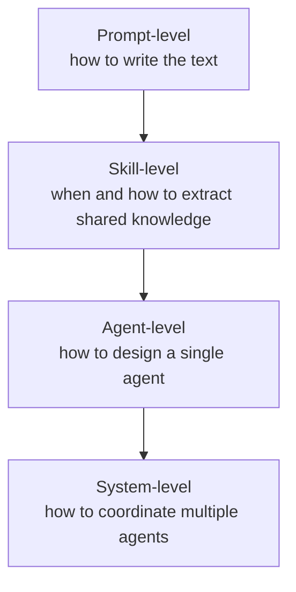

# Prompt Principles

The `prompt-principles` skill is the core prompt-engineering doctrine in `meridian-prompter`. It organizes principles across four levels, each with distinct concerns, and ties them to research evidence rather than stating them as preferences.

**Source:** `../prompts/meridian-prompter/skills/prompt-principles/`  
**Research citations:** `resources/research.md`

## Four Levels

Each level builds on the previous. Prompt-level mistakes compound at system level.

---

## Level 1: Prompt-Level

How to write the text of a prompt. Attention is finite.

| Principle | Rule |
|---|---|
| **Be concise, expand for emphasis** | Default to short what-and-why. Repeat or expand when something matters. |
| **Primacy and recency** | Beginning and end get strongest attention; middle gets lost. Put purpose and constraints up front, critical reminders at the end. |
| **Structure over emphasis** | XML tags, headers, and clear sections outperform ALL CAPS and "MUST". |
| **Positive framing** | Tell the model what TO do. Negative instructions keep prohibited behavior in attention — models often produce acknowledgments ("we won't do X") instead of omission. |
| **Hard boundaries are exceptions** | Negatives work for bright-line prohibitions: "Don't modify `.agents/`" or "Never commit secrets." |
| **Explain why** | Reasoning transfers to novel cases. The model applies principles to new situations when it understands the underlying logic. |
| **Right altitude** | Behavioral heuristics, not brittle if-then rules or vague hand-waving. Tell the model what to do, when, and why — trust it to sequence. |
| **Repetition improves compliance** | Restate key principles at opening and closing of the same artifact. Keep repetition within artifacts; skills are already in context. |
| **Escape hatches get used** | Optional easier paths become de facto defaults. If the hard path is right, don't offer an easier one. |
| **Every word carries decision weight** | If removing a word doesn't change behavior, cut it. Filler dilutes the words that matter. |

---

## Level 2: Skill-Level

When to extract shared knowledge into a skill vs keeping it in an agent body.

| Principle | Rule |
|---|---|
| **Reuse threshold** | If 2+ agents need the same knowledge, extract to a skill. If only one agent uses it, keep it in the body. |
| **Progressive disclosure** | Metadata (~100 words) always loaded; body (<500 lines) on trigger; bundled resources loaded on demand. |
| **Skills shape, agents act** | Skills provide knowledge and methodology. They don't run independently or make decisions. |
| **Domain organization** | When a skill supports multiple variants (frameworks, platforms), organize by variant with the body routing to the right reference. |
| **Separate mechanism from methodology** | A skill is either *how to operate a tool* or *what to do with it*, not both. Separation enables reuse. |

---

## Level 3: Agent-Level

How to design a single agent's role and prompt.

| Principle | Rule |
|---|---|
| **Single focus** | Each agent does one job well. Multiple responsibilities compete for the context window. |
| **No role identity** | Skip personas ("you are a senior engineer"). PRISM research shows personas interfere with knowledge retrieval. Describe behavior directly. |
| **Context engineering** | A focused window produces better attention than a sprawling one. Fresh spawn = fresh attention budget. |
| **Agent owns outputs** | The agent produces artifacts and decisions. Skills inform how; the agent decides what. |
| **3–5 function limit** | Single agents handle 3–5 distinct functions before multi-agent coordination helps. |
| **Descriptions serve callers** | Teach usage: when to use, how to invoke, what to pass, what to expect. |
| **Route by cognitive mode** | Decompose agents by thinking type (faithful execution vs aesthetic judgment vs ambiguity handling), not by file type or domain. |
| **Generic over specialized** | If specialization lives entirely in the caller's prompt, keep the agent generic. One `@browser` beats three domain-specific browser agents. |

**Discovering cognitive modes:** ask the user, research how professionals do the work, find where solo practitioners shift stance and where teams put person-boundaries.

---

## Level 4: System-Level

How to coordinate multiple agents.

| Principle | Rule |
|---|---|
| **Orchestrator pattern** | Coordinator routes and evaluates; workers execute. Orchestrator doesn't implement, workers don't coordinate. |
| **Context handoff is caller's job** | Pass structured briefing (objectives, constraints, decisions, evidence), not raw history. ~2% context loss per handoff with naive approaches. |
| **External verification required** | Self-critique without external tools (tests, compilers, search) doesn't work. Reviewer must be separate from implementer. |
| **Loop guards are external** | The system enforces termination, not the agent. Max iterations (15–25 typical), convergence detection, explicit deferral as a valid exit. |
| **Start simple** | Default to single agent. Add multi-agent only when evidence shows complexity delivers proportional value. |
| **Explicit handoff content** | Name specific artifacts (file paths) at every handoff, not categories. "Implement per `design/spec/auth.md`" beats "based on the design." |
| **Verify alignment at narrowings** | Pipeline hourglass: wide design → narrow plan → wide implementation. Verify coverage at each narrowing before scope loss compounds. |
| **Match model to cognitive mode** | Clear-goal execution, ambiguity handling, and nuanced judgment need different models. Mismatches waste cost or produce shallow output. |

---

## Meridian-Specific Extensions

The `resources/meridian.md` file extends these principles for Meridian multi-agent workflows.

### Subagent design
- Subagents should be caller-agnostic — don't embed assumptions about who spawned you
- Each spawn starts with a fresh attention budget; pass only what the agent needs
- Prefer artifacts over transient chat — in-memory reasoning evaporates on compaction
- Discover workspace roots via CLI: `meridian work current`, `meridian context work`, `meridian context kb`
- `MERIDIAN_*` env vars are internal propagation; CLI commands are the user-facing discovery API

### Context handoffs
- `-f` is for concrete files; `--from` is for prior spawn reasoning
- `--from $MERIDIAN_CHAT_ID` preserves the top-level session frame for any descendant spawn
- Name specific file paths, not categories: "pass `design/spec/auth.md`", not "pass the design"
- Materialize critical context to files when it needs to survive session boundaries

### Manager/lead principles
- Managers/leads coordinate; they do not implement
- Workers execute focused tasks; orchestrators route and evaluate
- External loop guards and convergence criteria are required — agents don't self-terminate reliably
- Even trivial work should be delegated when the role is coordination

---

## Research Backing

Key findings behind these principles (source: `resources/research.md`):

| Principle | Evidence |
|---|---|
| Primacy/recency | Empirical attention distribution studies |
| Persona harm | PRISM research: personas interfere with knowledge retrieval |
| Repetition improves compliance | Instruction tuning and prompt repetition studies |
| External verification required | Self-reflection without tools is weak; ReAct vs pure CoT findings |
| Multi-agent can outperform single agent | Breadth-first query studies; orchestration patterns |
| Context loss at handoffs | ~2% context loss per naive handoff |
| Tool set size | Too many tools hurts selection quality |
| Loop termination | 15–25 iterations as common effective guardrail |

---

## Related

- [meridian-prompter.md](meridian-prompter.md) — agents that apply these principles
- [overview.md](overview.md) — package model and composition
