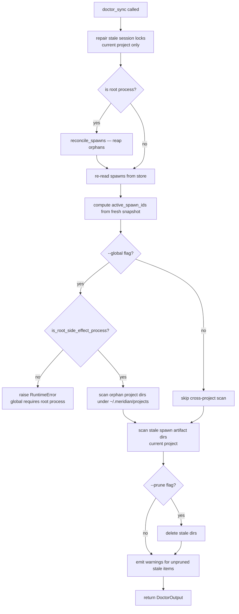

# operations/health-checks — Doctor, Pruning, and Background Repairs

`meridian doctor` is the single-entry health-check command. It repairs orphaned state, scans for stale artifacts, and optionally deletes them. The command has two tiers: a cheap per-project default and an explicit cross-project global mode.

## The Core Distinction: Stale vs. Live

After reconciliation, every active spawn is in one of two states:

| After reconcile | Artifact prunable? | Appears in warning? |
|---|---|---|
| Terminal (succeeded/failed/cancelled) | Yes, subject to TTL | No |
| Just repaired (orphan → terminal this run) | Yes (same-run prune) | No — listed in `repaired` |
| Still live (reaper confirmed alive) | Never | Yes — `live_active_spawns_remain` |

`live_active_spawns_remain` is informational, not a failure. It means: "doctor checked, the reaper left these alive intentionally."

## Two-Tier Design

| Command | Scope | Allowed state | Cost |
|---|---|---|---|
| `meridian doctor` | Current project only | Current project runtime root, config surface, spawn/session state | Cheap default |
| `meridian doctor --global` | Cross-project maintenance | Everything in local + `~/.meridian/projects/` orphan scan | Expensive, explicit, opt-in |

Local doctor does NOT traverse `~/.meridian/projects` for sibling projects. It does NOT read or write any global cache file. It does NOT launch background global scans. These were deliberate deletions: see [doctor-cache deletion rationale](../decisions/startup-health-sandbox.md#doctor-cache-deleted--global-scan-moved-to-explicit-opt-in).

## `meridian doctor` Flow

Order matters. The authoritative active-spawn set is computed **after** reconciliation.



**Why re-read after reconcile?** Before this pattern was established, step F used a *pre-reconcile* snapshot. Orphaned rows that were just repaired to terminal would still appear in `active_spawn_ids` — their artifact dirs were excluded from pruning and they could appear in live-session warnings, falsely implying cleanup had failed.

### Root-Process Gating

Reconciliation (`reconcile_spawns`) runs only when `MERIDIAN_DEPTH` is absent, empty, or `0`. Nested spawns never trigger reaper side effects — the parent process owns that responsibility. When reconciliation is skipped (nested depth), all active rows remain; warnings will fire for them on the next root-depth doctor invocation.

Global maintenance (`--global`) requires `is_root_side_effect_process()` to return true. The guard lives in `doctor_sync()` itself, not just the CLI layer — nested callers that try to pass `global_=True` get a `RuntimeError` before any cross-project traversal begins.

## Two-Tier Pruning

| Tier | Location | Scope | Flag |
|---|---|---|---|
| Spawn artifact dirs | `~/.meridian/projects/<uuid>/spawns/<id>/` | Current project | always scanned |
| Orphan project dirs | `~/.meridian/projects/<uuid>/` | Machine-wide | `--global` only |
| Claude overlay dirs | `~/.meridian/projects/<uuid>/claude-config/<spawn-id>/` | Current project | always scanned |
| Telemetry segments | `~/.meridian/projects/<uuid>/telemetry/` | Current project | always scanned |

**Orphan project dirs** are project-level state dirs with no active spawns and no recent activity. Each UUID corresponds to one past project. Machine-wide pruning requires `--global` to avoid accidentally walking other active projects.

**Spawn artifact dirs** are per-spawn working dirs: `prompt.md`, `report.md`, `history.jsonl`, `stderr.log`, `params.json`, `tokens.json`, `heartbeat`, etc.

**Claude overlay dirs** are isolated `CLAUDE_CONFIG_DIR` overlays created for each Claude primary and child spawn. See [Claude overlay pruning](#claude-overlay-pruning) below.

**Telemetry segments** are per-process JSONL event files under the current project's `telemetry/` directory. Local doctor scans them for retention cleanup: expired non-live segments are removed first, then older closed segments may be removed to enforce the total-size cap. Global orphan-project scanning is separate.

### Claude Overlay Pruning

Each Claude primary and child spawn runs with an isolated `CLAUDE_CONFIG_DIR`
overlay at `~/.meridian/projects/<uuid>/claude-config/<spawn-id>/`. On normal
completion, Meridian materializes the session transcript to the canonical Claude
`projects/` tree (usually `~/.claude/projects/`)
and then removes the overlay. If Meridian crashes before the cleanup `finally`
block runs, the overlay is orphaned.

`meridian doctor --prune` detects orphaned overlays via
`scan_stale_claude_overlays()` and removes them with best-effort transcript
preservation:

1. For each stale overlay in the current project's `claude-config/` tree:
   a. Attempt `materialize_overlay_transcripts()` to copy session JSONLs to
      the canonical Claude `projects/` tree (usually `~/.claude/projects/`).
   b. Delete the overlay directory with `shutil.rmtree`.
2. Only overlays for inactive (non-running) spawns are removed. Active spawns'
   overlays are never touched.
3. Retention-day semantics are consistent with spawn artifact pruning — an
   overlay that was recently active is not pruned even if the spawn record
   is gone.

If materialization fails, doctor logs a warning and continues prune handling so
cleanup progress is not blocked by a single failed copy.

**Why transcript materialization matters here:** A crash-orphaned overlay may
contain the only copy of the session transcript (normal-exit materialization
never ran). Doctor attempts to preserve transcripts before deleting, so
`meridian --continue` usually remains functional even for sessions that ended
in a crash.

For the full isolation model, see
[../architecture/claude-session-isolation.md](../architecture/claude-session-isolation.md).

### TTL Logic

Controlled by `config.state.retention_days` in `meridian.toml`, `meridian.local.toml`, or `~/.meridian/config.toml`:

```toml
[state]
retention_days = 30   # -1 = never prune, 0 = prune immediately, N = days
```

Environment override: `MERIDIAN_STATE_RETENTION_DAYS`.

Staleness check uses the latest mtime across all files in the artifact tree. If any file was touched within the retention window, the directory is not stale. The TTL clock starts from the terminal transition (when `report.md` or `heartbeat` was last written), not from spawn creation.

### Windows-Safe Deletion

Pruning uses `shutil.rmtree` with an `onexc` hook that restores write bits before retrying. This handles Windows read-only files that would otherwise block tree deletion. A `FileNotFoundError` is treated as success (idempotent).

## Background Per-Project Repairs

On `PRIMARY_LAUNCH` startup paths, cheap per-project repairs run in a non-blocking background daemon thread:

- **Stale session lock cleanup** — clears abandoned lock files under the current project's sessions directory
- **Orphan run reconciliation** — detects and repairs abandoned spawn rows (same logic as `reconcile_spawns()` in the reaper)

These repairs touch only the **current project's runtime root** (`~/.meridian/projects/<uuid>/`). They never enumerate sibling project directories. They run as a daemon thread and never block process exit.

The former global background scan (which ran `doctor_sync(global_=True)` and wrote `doctor-cache.json`) was deleted. Users discover cross-project stale state through explicit `meridian doctor --global`. See [startup/health decisions](../decisions/startup-health-sandbox.md#doctor-cache-deleted--global-scan-moved-to-explicit-opt-in) for rationale.

## `DoctorOutput` Key Fields

| Field | Meaning |
|---|---|
| `repaired` | Categories repaired this run: `orphan_runs`, `stale_session_locks`, `spawn_artifacts`, `claude_overlays`, `telemetry_segments`, `orphan_project_dirs` |
| `pruned_spawn_artifacts` | Count of artifact dirs deleted |
| `pruned_claude_overlays` | Count of stale Claude overlay dirs deleted |
| `pruned_orphan_dirs` | Count of orphan project dirs deleted |
| `telemetry_counts` | Current-project telemetry summary, including expired segment count |
| `warnings` | Issues surviving reconciliation and not pruned — genuine attention needed |
| `ok` | `True` iff `warnings` is empty |

Warning codes emitted from `warnings` include:

- `stale_spawn_artifacts`
- `stale_claude_overlays`
- `stale_telemetry_segments`
- `stale_orphan_project_dirs` (`--global` only)
- `live_active_spawns_remain`

`stale_telemetry_segments` is not age-only. It can mean either:

- expired non-live telemetry segments were found, or
- total telemetry bytes exceeded the hard cap and cleanup would delete older closed segments

## Warning Semantics

Do not key automation or docs on a specific two-line prose rendering. Treat
doctor warnings as structured categories:

- `stale_spawn_artifacts` — prunable with `meridian doctor --prune`
- `stale_claude_overlays` — prunable with `meridian doctor --prune`
- `stale_telemetry_segments` — prunable with `meridian doctor --prune`
- `stale_orphan_project_dirs` — prunable with `meridian doctor --prune --global`
- `live_active_spawns_remain` — informational; active rows remained live after reconcile

`--prune` only helps for stale-state categories. If the only warning is
`live_active_spawns_remain`, there is nothing to delete.

Claude overlay warnings are first-class and separate from spawn artifact
warnings: each category has its own count, prune path, and reporting code.

Before doctor deletes stale Claude overlays, cleanup attempts to rescue overlay
transcripts and preserve known mutable auth/config files (`.claude.json`,
`.credentials.json`) back to the durable Claude config root. Both steps are
best-effort: failures are logged as warnings and pruning continues.

## Diagnostic Commands

```bash
# Check health (per-project, no side effects)
meridian doctor

# Check + prune current project
meridian doctor --prune

# Full cross-project check + prune (explicit, root-only)
meridian doctor --prune --global

# Kill processes for orphaned spawns (explicit, destructive)
meridian doctor --kill-orphans

# JSON output for scripting
meridian doctor --format json
```

### `--kill-orphans` Flag

`meridian doctor --kill-orphans` extends the normal reconcile pass with
**explicit process termination** for spawns that the reaper marks as orphaned.

Without `--kill-orphans`, the reaper finalizes generic orphaned spawn rows
(writes `status: failed`) but does not terminate arbitrary worker processes —
the passive reconciliation path is intentionally conservative. Managed-primary
finalization is narrower: when metadata safely identifies backend/TUI runtime
children, finalize-as-failed cleanup may call
`terminate_managed_primary_processes()` as a safety net. With `--kill-orphans`,
doctor additionally sends `SIGTERM` to the process groups of orphaned worker
PIDs and runs managed-primary cleanup for orphaned spawns identified during that
doctor run.

This flag is useful when:
- Orphaned browser/backend child processes have accumulated after spawn cleanup
- A managed-primary launcher died and its runtime children are still running
- `meridian doctor` reports rows repaired to `failed/orphan_*` but `ps` shows
  related processes are still alive

**Safety:** `--kill-orphans` targets only spawns already classified as orphaned
by the reconciler (dead runner PID, no recent activity, past startup grace
window). Live spawns with alive runner processes are not touched.

For managed primaries, `--kill-orphans` is the recommended cleanup path after
`meridian spawn cancel <id>` if the cancel completed but runtime children
remain. See [../architecture/managed-primary-lifecycle.md](../architecture/managed-primary-lifecycle.md)
for the explicit/passive cleanup boundary.

## Cross-References

- [../principles/design-principles.md](../principles/design-principles.md) — crash-only design and why artifacts accumulate
- [../architecture/state-system.md](../architecture/state-system.md) — spawn artifact directory layout
- [../architecture/claude-session-isolation.md](../architecture/claude-session-isolation.md) — Claude overlay lifecycle, transcript materialization, and isolation rationale
- [../architecture/sandbox-projection.md](../architecture/sandbox-projection.md) — why `~/.meridian/` is not globally projected into sandboxes
- [../concepts/spawn-lifecycle.md](../concepts/spawn-lifecycle.md) — reaper reconciliation logic
- [../decisions/startup-health-sandbox.md](../decisions/startup-health-sandbox.md#doctor-and-health-checks) — doctor cache deletion rationale, tier split decision
- [troubleshooting.md](troubleshooting.md) — recovery procedures for orphan runs
- [../lessons/arch-refactor-pitfalls.md](../lessons/arch-refactor-pitfalls.md) — process-group cleanup and managed-primary cleanup pitfalls from PR #184
