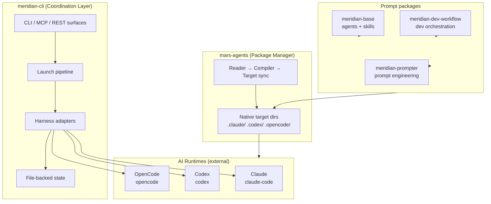
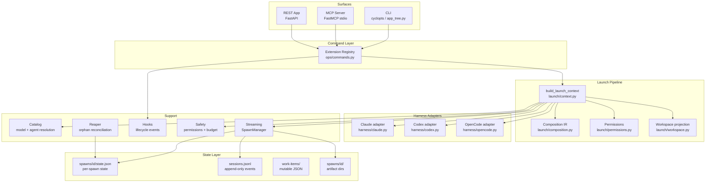
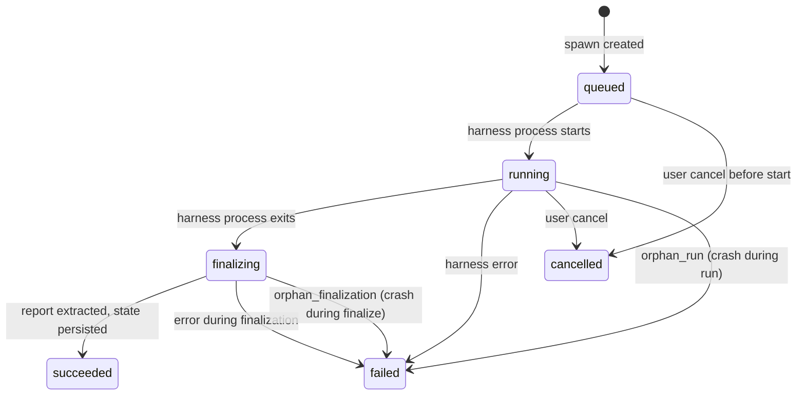

# Meridian — System Overview

Meridian is a **harness-agnostic multi-agent coordination CLI**. It launches delegated AI agent processes (spawns), tracks their state, and lets orchestrators observe and steer them — without knowing which underlying AI harness is executing the work.

## Mental Model

Think of Meridian as a **dispatcher and ledger**:

1. An orchestrating agent or human asks Meridian to spawn a child agent for a task.
2. Meridian resolves which model and harness to use, applies policy (permissions, prompt composition, workspace projection, budget), and launches a harness subprocess.
3. Every state transition is appended as an event to a JSONL ledger on disk.
4. If anything crashes, the ledger survives. The reaper reconciles orphaned records on the next read.
5. The spawning agent can poll, wait, inject messages, or read the output transcript at any time.

The spawning agent never needs to know whether the child is running Claude, Codex, or OpenCode.

Meridian is not:
- An execution engine — it does not run model inference
- A database — all state is files on disk, inspectable with standard tools
- A workflow orchestrator — it does not define DAGs or pipelines
- A harness — it does not implement any AI model interface

## Ecosystem

Meridian is a family of repos with distinct roles:



### meridian-cli

The coordination core. A Python CLI that:
- Resolves model and harness from config, profile, and CLI flags
- Assembles and launches harness subprocesses
- Tracks spawn and session state in append-only JSONL ledgers
- Exposes CLI, MCP, and REST surfaces over a single extension registry
- Manages work items, hooks, workspace projection, and safety policies

Source: `src/meridian/`

### mars-agents

A Rust package manager for agent prompt files. It:
- Reads `mars.toml` / `mars.local.toml` project config
- Resolves versions from git sources or local paths
- Compiles a canonical `.mars/` store
- Emits native harness target directories (`.claude/`, `.codex/`, `.opencode/`, etc.)
- Maintains `mars.lock` for reproducible resolution

Meridian invokes it via `meridian mars ...`. Source: `mars-agents/src/`

### Prompt packages

YAML+Markdown packages defining agent roles and reusable skills:

| Package | Contents | Role |
|---|---|---|
| **meridian-base** | 6 agents, 11 skills | Core orchestration, KB work, session mining |
| **meridian-dev-workflow** | dev orchestration agents | coder, reviewer, architect, planner, tech-lead |
| **meridian-prompter** | prompt engineering agents | prompt design, review, test cycles |

Agent profiles are thin role shells. Skills carry reusable behavioral doctrine, loaded into prompts at spawn time. Source packages live in sibling repos; `.agents/` is generated output.

## Major Subsystems (meridian-cli)



### State subsystem (`src/meridian/lib/state/`)

File-backed state for spawns and sessions. Spawn state uses per-spawn `state.json`; session state remains event-sourced JSONL. Key types:
- `SpawnRecord` — loaded from `spawns/<id>/state.json` and updated through the spawn store
- `SessionRecord` — materialized from `SessionStartEvent` → `SessionUpdateEvent` → `SessionStopEvent`
- `state/spawn/terminal_policy.py` — terminal-write authority for concurrent spawn finalization
- `reaper.py` — reconciliation logic that runs on read paths to close orphaned spawns

### Launch subsystem (`src/meridian/lib/launch/`)

Single composition seam for every kind of spawn. `build_launch_context()` in `launch/context.py` is the one place where model, harness, permissions, prompt, workspace, and environment are resolved. All spawn entry points — CLI, streaming, REST — call this factory.

### Harness subsystem (`src/meridian/lib/harness/`)

Mechanism layer, not policy. Each adapter owns:
- Command building (`build_command()`)
- Prompt projection into harness-native channels
- Session detection and ownership logic
- Connection transport (WebSocket for Claude/Codex, HTTP for OpenCode)
- Event extraction and report extraction

Adding a harness requires one adapter file, one extractor, one connection class, and one registry entry.

### Streaming subsystem (`src/meridian/lib/streaming/`)

Live event delivery for connected spawns. `SpawnManager` manages the drain loop, observer fanout, heartbeat writes, injection, and cancellation. Drain policy is explicit: `SingleTurnDrainPolicy` stops after one turn; `PersistentDrainPolicy` allows continued streaming.

### Extension system (`src/meridian/lib/extensions/`)

Every user-facing operation is declared once as an `ExtensionCommandSpec` in `ops/commands.py`. The CLI, MCP server, and REST API consume the same registry. Specs declare which surfaces (`cli`, `mcp`, `http`) they appear on, whether they require an app server, and what capabilities they need.

### Ops layer (`src/meridian/lib/ops/`)

Policy over library primitives. The CLI is thin — it parses args and calls sync ops. Ops are structured into: `spawn/` (query / prepare / execute / api), `work_lifecycle.py`, `session_log.py`, `diag.py`, and ~43 registered command specs.

## Key Properties

**Files as authority.** State lives in two filesystem roots: repo-local `.meridian/` for committed scaffolding, and user-level `~/.meridian/projects/<uuid>/` for runtime state and artifacts. No database, no hidden in-memory state. `cat ~/.meridian/projects/<uuid>/spawns/<id>/state.json | jq` shows one spawn's state; `sessions.jsonl` shows session events. See [concepts/state-model.md](concepts/state-model.md).

**Crash-only design.** Every write is atomic (tmp+rename). JSONL readers skip malformed lines, and per-spawn `state.json` writes replace whole files atomically. The reaper runs on read paths — `meridian spawn list` is also the recovery trigger. No graceful shutdown path is needed. See [principles/design-principles.md](principles/design-principles.md).

**Harness-agnostic.** `HarnessAdapter` / `SubprocessHarness` declare what each harness supports. Launch composition is harness-agnostic. Adapters handle only harness-specific channel assignments. See [concepts/harness-abstraction.md](concepts/harness-abstraction.md).

**Single composition seam.** `build_launch_context()` is the one place where policy, permissions, prompt, argv, and environment are resolved. No adapter re-derives what the factory already decided. See [architecture/launch-system.md](architecture/launch-system.md).

**Extension system as single source of truth.** Every user-facing operation is declared once in `ops/commands.py`. CLI, MCP, and REST all consume the same registry. See [concepts/extension-system.md](concepts/extension-system.md).

**Windows is first-class.** Path handling, process launch, locking, signals, shell invocation, and spawn control paths all have explicit Windows branches. Cross-platform primitives live in `src/meridian/lib/platform/`.

## State Root Layout

```
.meridian/                          ← repo-local, committed
  id                                  project UUID
  kb/                                 agent knowledge base
  work/                               active work scratch dirs
  archive/work/                       archived work
  work-items/                         mutable work item JSON (gitignored)

~/.meridian/projects/<uuid>/        ← user-local, never committed
  spawns/<id>/state.json              authoritative per-spawn state
  sessions.jsonl                      session event ledger
  spawns/<id>/                        per-spawn artifacts
    prompt.md
    report.md
    history.jsonl                     harness output events
    heartbeat                         touched every 30s for liveness
  cache/models.json                   model list cache (24h TTL)
```

The UUID in `.meridian/id` links the two roots. Projects can be moved or renamed without losing runtime state.

For path resolution: `get_user_home()` in `state/user_paths.py` resolves the user root from `MERIDIAN_HOME`, then Windows `%LOCALAPPDATA%\meridian`, then POSIX `~/.meridian`.

See [concepts/state-model.md](concepts/state-model.md) for the full layout and dual-root rationale.

## Spawn Lifecycle

A spawn transitions through these statuses:



`finalizing` is transient — polling callers treat it as active, not terminal. The reaper in `state/reaper.py` distinguishes `orphan_run` from `orphan_finalization` based on whether the harness process exited before the reaper ran. The reducer in `state/spawn/events.py` is the authoritative state machine.

See [concepts/spawn-lifecycle.md](concepts/spawn-lifecycle.md) for the full state machine, heartbeat semantics, and reaper behavior.

## Where to Go Next

| Goal | Start here |
|---|---|
| New to the codebase | [codebase/guide.md](codebase/guide.md) |
| Debugging a spawn failure | [operations/troubleshooting.md](operations/troubleshooting.md) |
| Adding a harness | [concepts/harness-abstraction.md](concepts/harness-abstraction.md) |
| Understanding the launch pipeline | [architecture/launch-system.md](architecture/launch-system.md) |
| Understanding state persistence | [concepts/state-model.md](concepts/state-model.md) |
| Understanding why something was built this way | [decisions.md](decisions.md) |
| Looking up a term | [vocabulary.md](vocabulary.md) |
| Understanding mars package management | [concepts/package-management/overview.md](concepts/package-management/overview.md) |
| Understanding the web frontend | [ecosystem/meridian-web/overview.md](ecosystem/meridian-web/overview.md) |
| Understanding prompt packages | [ecosystem/prompt-packages/overview.md](ecosystem/prompt-packages/overview.md) |
