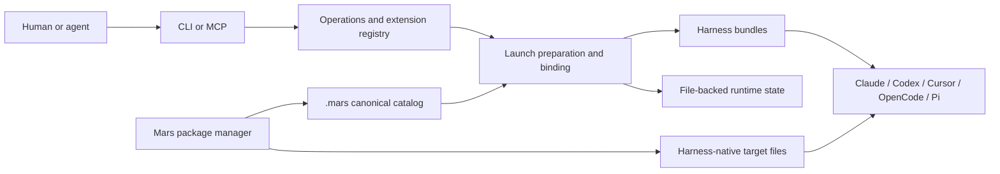

# Meridian — System Overview

Meridian is a harness-agnostic coordination CLI. It resolves launch policy,
starts AI-harness subprocesses, and persists enough state for other processes to
observe, steer, and recover them. It does not perform inference, define workflow
DAGs, or require a database.

## Current System

```mermaid
graph LR
    U[Human or agent] --> S[CLI or MCP]
    S --> O[Operations and extension registry]
    O --> L[Launch preparation and binding]
    L --> H[Harness bundles]
    H --> R[Claude / Codex / Cursor / OpenCode / Pi]
    L --> ST[File-backed runtime state]
    M[Mars package manager] --> C[.mars canonical catalog]
    M --> N[Harness-native target files]
    C --> L
    N --> R
```

The two active external surfaces are the CLI and MCP server. They share an
extension registry and operations layer; the archived HTTP app server is
[history, not a third current surface](concepts/extension-system.md).

A launch follows one policy path:

1. Resolve the project, agent, model route, permissions, work attachment, and
   workspace projection.
2. Prepare a harness-neutral launch surface, then bind it to one registered
   `HarnessBundle`.
3. Start the harness subprocess and publish output while the spawn is active.
4. Persist the authoritative spawn row and artifacts under the project's
   user-local runtime root. Read-time projection reports stale work without
   mutating it; explicit repair paths reconcile durable state.

See [the launch architecture](architecture/launch-system.md) for the prepare /
bind mechanism and [the harness concept](concepts/harness-abstraction.md) for
the bundle boundary.

## Files and Ownership

Meridian and Mars own different files:

- **`meridian.toml`** is committed project configuration. `[project].id` is the
  authoritative project identity.
- **`~/.meridian/projects/<project-id>/`** is Meridian's uncommitted runtime
  root for spawn rows, session events, locks, caches, and artifacts.
- **The configured context work root** holds mutable work-item state and work
  artifacts; it is not repo-local Meridian state.
- **`.mars/`** is Mars's canonical compiled catalog consumed by Meridian.
- **Harness-native directories** such as `.claude/`, `.codex/`, `.cursor/`,
  `.opencode/`, and `.pi/` are Mars target projections consumed by harnesses.

Repo-local `.meridian/id` is a legacy identity input only: reads may recognize
it, and the first identity write migrates its value into `meridian.toml`.
`.agents/` is not a Meridian catalog fallback. The exact layouts and migration
rules belong to [the state architecture](architecture/state-system.md) and
[the Mars targeting architecture](architecture/mars-targeting.md).

## Major Seams

| Concern | Current owner | Start here |
|---|---|---|
| Launch policy and composition | `lib/launch/` prepare/bind pipeline | [Launch system](architecture/launch-system.md) |
| Harness-specific behavior | Registered `HarnessBundle` objects | [Harness abstraction](concepts/harness-abstraction.md) |
| Spawn and session persistence | `lib/state/` and store-specific locked mutation seams | [State system](architecture/state-system.md) |
| User-facing operations | Shared extension registry and ops layer | [Extension system](concepts/extension-system.md) |
| Agent/model/package materialization | Mars compiler, ownership retention, and target adapters | [Package management](concepts/package-management/overview.md) |
| Filesystem access beyond the task root | Workspace resolution and harness projection | [Workspace architecture](architecture/workspace/overview.md) |
| Durable diagnostic events | Telemetry sinks and readers | [Telemetry architecture](architecture/telemetry/overview.md) |

## Design Properties

**Files are authority.** Process memory is a cache or projection, never the
only copy of coordination state. Writes use atomic replacement, durable JSONL
append, or atomic directory publication as appropriate.

**Recovery is explicit and derivable.** Ordinary reads can project a reconciled
view without terminating processes. Root-level repair paths make durable
terminal writes and process-scope cleanup.

**Harness policy is centralized.** Harness bundles project already-resolved
launch intent. They do not independently re-resolve model, permission, work, or
prompt policy.

**POSIX-first.** Linux and macOS are supported. Existing native-Windows branches
are legacy best effort and are not a design target.

## Ecosystem Boundary

`meridian-cli` coordinates processes. `mars-agents` resolves prompt packages,
compiles the `.mars/` catalog, and projects native harness files. Prompt-package
manifests are the authority for their current inventories; the KB documents
roles and composition boundaries rather than copying counts. See the
[ecosystem map](ecosystem/overview.md) and [prompt-package overview](ecosystem/prompt-packages/overview.md).

## Where to Go Next

| Goal | Page |
|---|---|
| Orient in the source | [Codebase guide](codebase/guide.md) |
| Understand current state persistence | [State model](concepts/state-model.md) |
| Trace a spawn | [Spawn lifecycle](concepts/spawn-lifecycle.md) |
| Add or change a harness | [Harness abstraction](concepts/harness-abstraction.md) |
| Understand why a choice was made | [Decision index](decisions.md) |
| Diagnose runtime behavior | [Troubleshooting](operations/troubleshooting.md) |
| Look up a term | [Vocabulary](vocabulary.md) |
