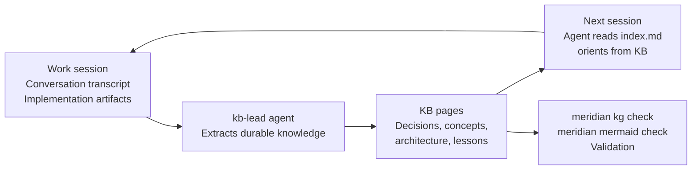

# research/llm-wiki-pattern — The LLM Wiki Pattern

## What the Pattern Is

Andrej Karpathy's "LLM Wiki" concept (articulated in his micro-essay on LLM collaboration) describes treating knowledge capture as a continuous, compounding workflow rather than a one-time documentation effort.

The core insight: LLMs produce large volumes of reasoning and output during work sessions. Most of it evaporates when the session ends. A persistent, structured wiki captures the durable fraction — decisions, domain knowledge, architectural invariants — and makes it available for all future sessions. Over time the wiki becomes the repository's institutional memory: richer than any individual's recall, more accurate than inferring intent from code.

**Key characteristics of the pattern:**

1. **Separate raw sources from synthesized wiki.** Raw work (exploration sessions, research dumps, conversation transcripts) lives in work directories. Synthesized, durable understanding lives in the wiki. Never conflate the two — raw sources rot; the wiki compounds.

2. **Index + log for navigation and evolution.** An `index.md` catalogs every page with a one-line summary and domain grouping. A `log.md` (or equivalent) tracks how the wiki itself has evolved — what was added, what was revised, what was archived. Without these, the wiki becomes an undiscoverable pile.

3. **Ingest/query/lint as first-class operations.** The wiki is only valuable if agents can find what they need quickly. This requires ingest workflows (structured capture after each work session), query workflows (navigating the wiki before making decisions), and lint workflows (catching broken links, stale claims, orphaned pages).

4. **Agent-maintainable.** The wiki must be written in a format that LLMs can read, extend, and restructure without human intervention at every step. Markdown with cross-links is the practical choice: readable by humans for audit, parseable by LLMs for synthesis.

## Why This Matters for Meridian

Meridian is multi-session by design. Work items span interruptions, restarts, and multiple agents. Context compaction is a real constraint — long session transcripts get compressed, losing nuance.

Without a persistent wiki:
- Each new session re-derives architectural decisions from code
- Design rationale evaporates from conversation context
- Agents make locally reasonable choices that contradict earlier decisions
- "Why is it built this way?" has no answer

With the LLM wiki pattern applied:
- Architectural decisions are explicit and linked to their rationale
- New agents orient from the wiki before reading source
- Compaction is less costly — durable understanding is in the wiki, not in transcript context
- Drift is visible — a stale wiki entry is a concrete artifact to update, not an invisible gap

## How Meridian's KB Implements This Pattern

**Separation of raw and synthesized:**
- Work directory (`meridian context work`) — active work items, explorations, in-progress designs
- KB (`meridian context kb`) — synthesized, durable knowledge

**Index + log:**
- `kb/index.md` — page catalog with one-line summaries by domain
- `kb/decisions.md` — decision index with dates and links to rationale

**Ingest workflow:**
- `kb-lead` agent — the KB's writer: extracts durable knowledge, reconciles against canonical decisions, writes pages inline, then hands structure to kb-maintainer. See [AGENTS.md](../AGENTS.md) for the full KB maintenance guide.
- `kb-maintainer` agent — structural health: splits/merges/renames pages, fixes cross-references, flags contradictions. Pass exactly one writable documentation tree per spawn.
- Invoked at work-item boundaries, after research sessions, after significant decisions

**Query workflow:**
- Agents start by reading `index.md`, then domain overviews, then specific pages
- `meridian kg graph` shows link topology for navigating relationships
- `meridian session search` for recovering context from specific sessions

**Lint workflow:**
- `meridian kg check` — broken cross-references (run before committing KB changes)
- `meridian mermaid check` — diagram validation
- `> [!FLAG]` markers — inline flags for uncertain claims, searchable with `rg '\[!FLAG\]'`

## Implications for KB Maintenance

### When to Add

- After a decision is made (especially a non-obvious one with rejected alternatives)
- After domain research produces lasting insights (not raw notes)
- When a pattern emerges from implementation that will recur
- After a postmortem or debugging session where root cause was surprising

### When to Revise

- When implementation diverges from the documented architecture (the doc is wrong, or the code is wrong — either way, update the doc to reflect truth)
- When vocabulary drifts — code starts using a term differently than the KB defines it

**When content is superseded:** the treatment depends on the page type. Concept, architecture, and operations pages hold current truth — remove or rewrite the stale claim rather than layering corrections. Decision records are the exception: preserve superseded decisions when they explain why the system changed, mark them as superseded, and link to the replacement.

### When to Remove

- When a concept no longer applies (a subsystem was removed, a pattern abandoned)
- Remove the page and update all inbound links. For concept, architecture, and operations pages, the KB holds current truth — dead pages don't belong.
- Decision records that are no longer the canonical choice are preserved (marked superseded, linked to replacement) rather than removed, because they explain the system's evolution.

### What Does NOT Go in the KB

- In-progress design documents (work directory until decided)
- Raw session transcripts (work directory or session store)
- Per-function API documentation (source docstrings)
- Module file listings (stale immediately on refactor)
- Implementation details that are derivable from reading code in 5 minutes

The test: would you want this context if you were reading the codebase for the first time, six months from now? If yes, it belongs in the KB. If it's derivable from code or temporal, it doesn't.

## Cross-References

- [index.md](../index.md) — KB catalog (the index artifact this pattern requires)
- [decisions.md](../decisions.md) — decision index (the log artifact this pattern requires)
- [principles/design-principles.md](../principles/design-principles.md) — knowledge-in-data principle
